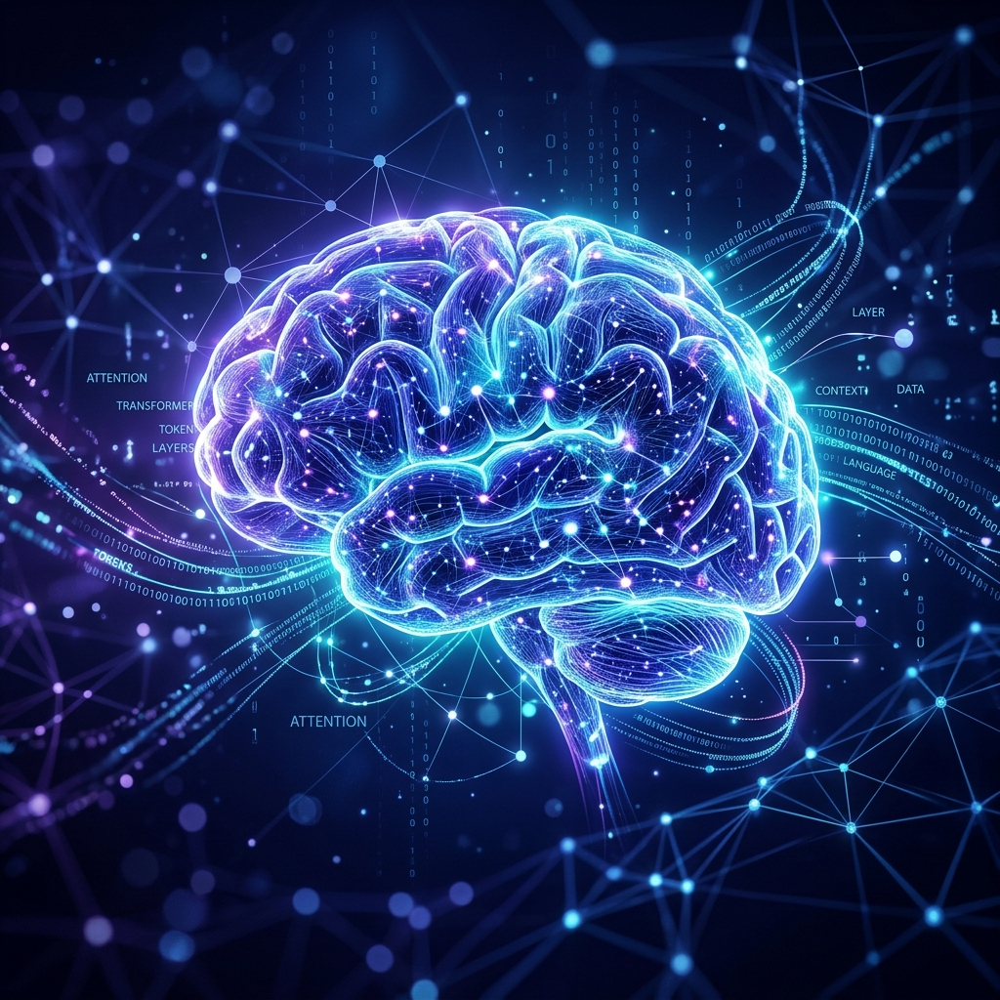

# 🧠 LLM Mastery: From Prediction to Production

  

Welcome to the **LLM Mastery Course**, a comprehensive, 34-chapter deep dive into the world of Large Language Models. This course is designed using the **Richard Feynman Technique**—bridging intuitive metaphors with rigorous technical engineering to ensure you don't just "use" AI, but truly master it.

---

## 📚 Curriculum Overview

| Chapter | Title | Key Topic |
| :--- | :--- | :--- |
| 1 | [The Magic of Prediction](chapters/chapter_1.md) | Next-Token Logic & Softmax |
| 2 | [Speaking in Numbers](chapters/chapter_2.md) | Embeddings & Vector Space |
| 3 | [The Attention Revolution](chapters/chapter_3.md) | Self-Attention & QKV Math |
| 4 | [Building a Brain](chapters/chapter_4.md) | Transformer Architectures |
| 5 | [The Training Ground](chapters/chapter_5.md) | Backpropagation & Gradient Descent |
| 6 | [Teaching Old Models New Tricks](chapters/chapter_6.md) | Fine-tuning & LoRA |
| 7 | [Learning From Humans](chapters/chapter_7.md) | RLHF & DPO Alignment |
| 8 | [The Art of Asking](chapters/chapter_8.md) | Prompt Engineering & ICL |
| 9 | [Thinking Step by Step](chapters/chapter_9.md) | Chain of Thought Reasoning |
| 10 | [Giving LLMs a Library Card](chapters/chapter_10.md) | RAG Fundamentals |
| 11 | [Your First LLM App](chapters/chapter_11.md) | LangChain & Orchestration |
| 12 | [Smart Assistants](chapters/chapter_12.md) | Agents & ReAct Loops |
| 13 | [Conversations That Remember](chapters/chapter_13.md) | Memory & State Management |
| 14 | [Chat With Your Documents](chapters/chapter_14.md) | Advanced RAG Pipelines |
| 15 | [The LLM Twin](chapters/chapter_15.md) | Personalization & Data Identity |
| 16 | [The LLM Factory](chapters/chapter_16.md) | LLMOps & Production Stacks |
| 17 | [Making It Fast](chapters/chapter_17.md) | Quantization & KV Caching |
| 18 | [Is It Any Good?](chapters/chapter_18.md) | Evaluation & Benchmarks |
| 19 | [The Guardrails](chapters/chapter_19.md) | AI Security & Safety |
| 20 | [What's Next?](chapters/chapter_20.md) | AGI & Multimodality |
| 21 | [The Computation Behind Language](chapters/chapter_21.md) | Math Foundations |
| 22 | [The Transformer Blueprint](chapters/chapter_22.md) | Architecture Deep Dive |
| 23 | [Advanced Prompt Patterns](chapters/chapter_23.md) | Few-Shot & CoT |
| 24 | [Structured Outputs & Function Calling](chapters/chapter_24.md) | Tool Use & JSON |
| 25 | [Transfer Learning & Model Adaptation](chapters/chapter_25.md) | LoRA & Adapters |
| 26 | [Data Preparation & Curation](chapters/chapter_26.md) | Cleaning & Deduplication |
| 27 | [The LLM API Bridge](chapters/chapter_27.md) | Integration & Architecture |
| 28 | [Beyond Text: Multimodal AI](chapters/chapter_28.md) | Vision & Audio Fusion |
| 29 | [LLMOps: From Lab to Launch](chapters/chapter_29.md) | Deployment & Monitoring |
| 30 | [Local-First AI](chapters/chapter_30.md) | Privacy & Edge Inference |
| 31 | [AI Agents: The Autonomous Revolution](chapters/chapter_31.md) | Planning & Tool Use |
| 32 | [Multi-Agent Systems: Digital Collaboration](chapters/chapter_32.md) | Orchestration & MAS |
| 33 | [Co-Intelligence: The Partnership Era](chapters/chapter_33.md) | Human-AI Partnership |
| 34 | [The Common Sense Gap: The Path to Robust AI](chapters/chapter_34.md) | Trust & Deep Understanding |
| 35 | [The AI Lifecycle: Engineering the Foundation Model](chapters/chapter_35.md) | Pipeline Engineering |
| 36 | [The LLM Engineer's Blueprint: From Data to RLHF](chapters/chapter_36.md) | Training Architecture |
| 37 | [Building the Brain: Architecting Transformers from Scratch](chapters/chapter_37.md) | Architecture Foundations |
| 38 | [The Secure Frontier: Guarding the Gateways of Intelligence](chapters/chapter_38.md) | LLM Security |

---

## 📖 Pedagogy: Simplicity Before Depth
This course follows a standardized three-tier learning path for every chapter:
1.  **💡 The Simple Explanation**: A relatable narrative analogy (Feynman style).
2.  **🔍 Going Deeper**: Technical deep dives into math, architecture, and code.
3.  **🌐 Real-World Connection**: How this specific concept is used in industry today.

---

## 🛠️ References
Content is synthesized from the top 10 technical textbooks in the field, including works by **Sebastian Raschka**, **Jay Alammar**, and **Paul Iusztin**. See the bibliography at the end of each chapter for specific details.
