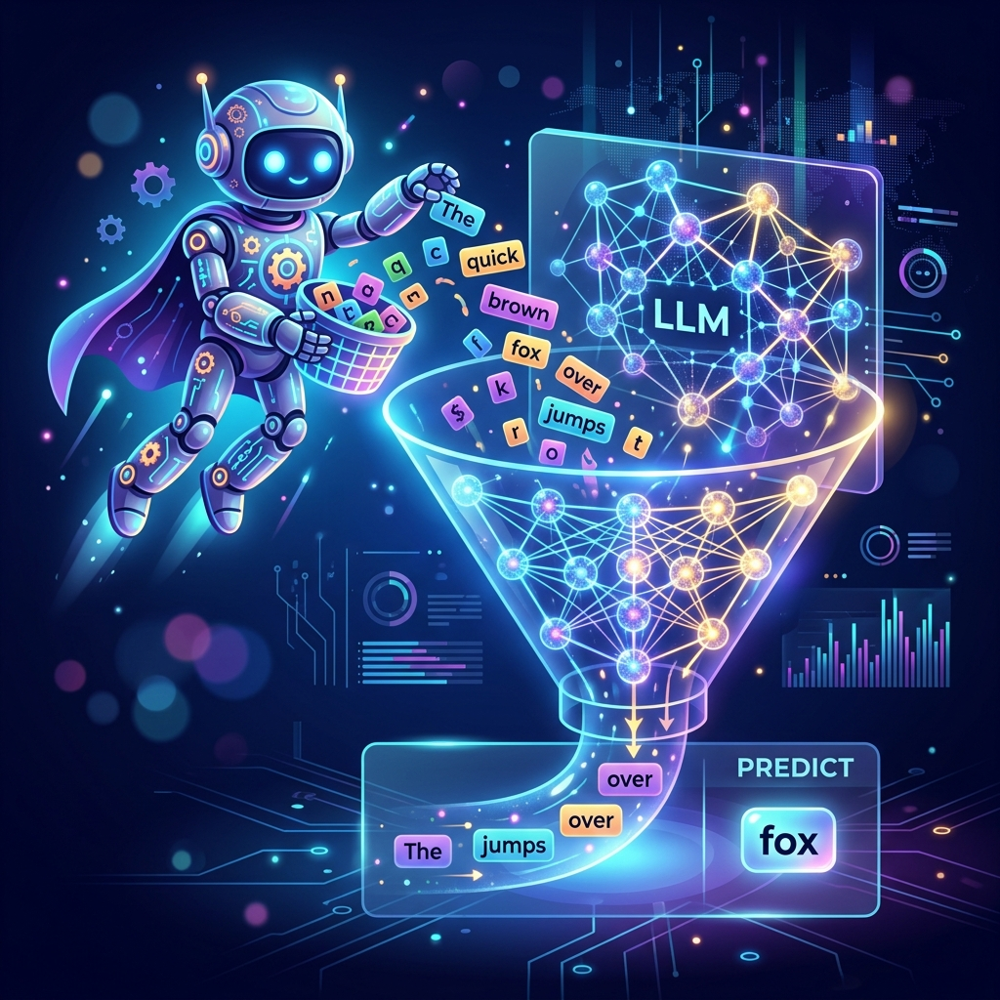
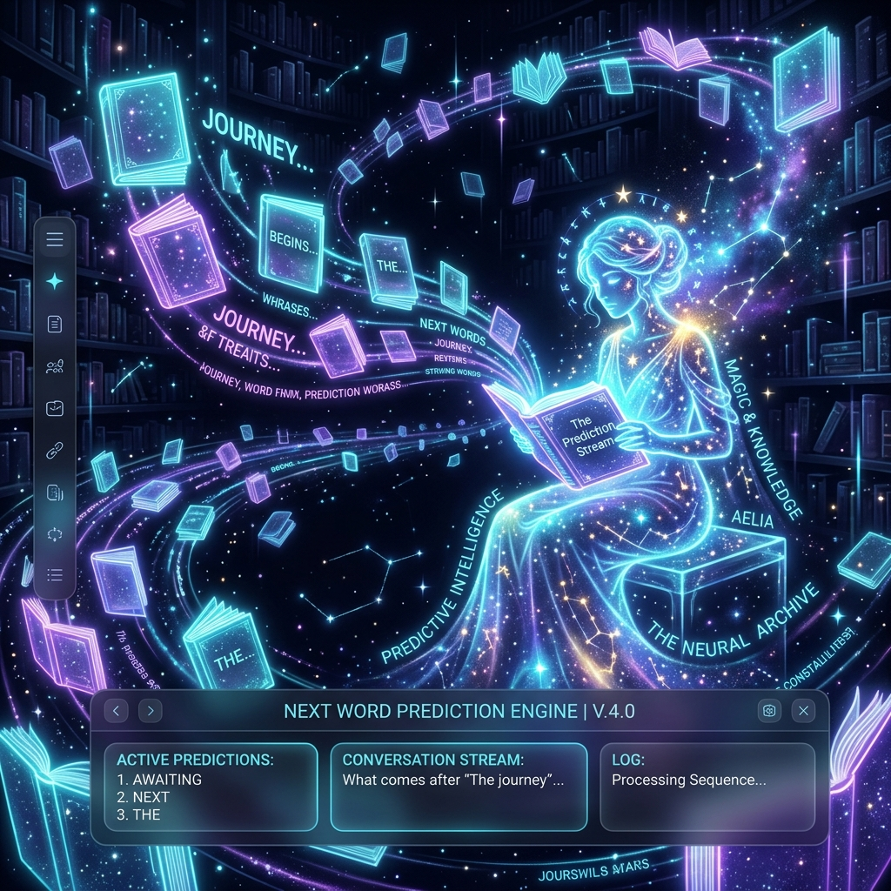

# Chapter 1: The Magic of Prediction

  

## 🎯 Objective
In this chapter, we will demystify the core engine of Large Language Models. We will move past the hype of "Artificial Intelligence" and "Chatbots" to understand the fundamental mathematical reality: **Next-Token Prediction**. By the end of this lesson, you will grasp how a machine that only understands numbers can give the startlingly perfect illusion of a human consciousness.

---

## 💡 The Simple Explanation: The Magical Library Friend

  

Imagine you have a friend who has been locked inside a massive, infinite library since the day they were born. This library contains every book, every news article, every Reddit comment, every text message, and every lines of code ever written by humanity. 

Your friend hasn't actually "lived" in the real world. They've never seen a sunset, tasted an apple, or felt the sting of a breakup. However, they have spent every waking second reading. They have noticed patterns. They've noticed that when a sentence starts with *"The quick brown fox jumps over the..."*, the next word is almost always *"lazy"*. They've noticed that in certain types of books called "Code," the string `def main():` is usually followed by a new line and four spaces.

Now, imagine you walk up to the door of this library and slide a piece of paper under it. It says: *"Once upon a..."*.

Your friend doesn't spend a single second thinking about the "meaning" of your sentence. They don't wonder who is in the story or where they are going. Instead, they look at their internal records and see that in billions of pages of text, the word *"time"* followed that exact sequence 90% of the time, while the word *"midnight"* appeared 5% of the time, and *"point"* appeared 2% of the time.

Your friend picks the most likely card—**"time"**—and slides it back under the door. You take that card, add it to your sentence (*"Once upon a time"*), and slide it back under the door. Your friend looks at the *new* pattern and slides back the word *"there"*. 

**This is a Large Language Model.** It is not a brain; it is the world's most sophisticated statistical mirror of human communication. It doesn't "know" facts; it knows the *probability* of how humans arrange their symbols.

---

## 🔍 Going Deeper: The Technical Reality

  

To turn a library of books into a functioning "friend," we must translate the chaos of language into the precision of mathematics. This process happens in three distinct, rigorous steps:

### 1. Tokenization: Breaking the Symbol
A computer cannot "read" words like humans do. Before any prediction can happen, the text must be converted into **Tokens**. While you might think of a token as a word, modern models use a more efficient system called **Sub-word Tokenization** (typically Byte Pair Encoding or BPE).

As noted in *Hands-On Large Language Models (Alammar & Grootendorst)*, BPE allows the model to handle rare words and technical jargon by breaking them into smaller chunks. The word *"unbelievable"* might be broken into `un`, `believ`, and `able`. This ensures that even if the model has never seen a specific word, it can still predict its components based on their individual frequencies in the training data.

### 2. The Logits Layer: The Unprocessed Vote
Once the text is tokenized and passed through the billions of parameters of the neural network, the model reaches its final layer. This layer outputs a **Logit** for every single token in its vocabulary (which can be 50,000 to 100,000 unique tokens).

A Logit is a raw, unnormalized score. A high logit for the token "dog" means the model strongly suspects "dog" is next. However, these numbers are hard to work with—some might be 15.4, while others are -2.1. 

### 3. The Softmax Function: Turning Scores into Probabilities
To make sense of these logits, we pass them through the **Softmax Function**. This is a mathematical formula that takes all the raw logit scores and squashes them into a probability distribution between 0 and 1, where the sum of all probabilities equals exactly 100%.

For the prompt *"The cat sat on the..."*, the Softmax output might look like this:
*   **mat**: 0.85 (85%)
*   **floor**: 0.10 (10%)
*   **pizza**: 0.01 (1%)
*   ... (rest of the 100,000 tokens): 0.04 (4%)

### 4. Sampling: The Roll of the Dice
The LLM doesn't always have to pick the #1 most likely word. If it did, it would be repetitive and boring. We use **Sampling Parameters** to control the "creativity" of the model:
*   **Temperature**: High temperature flattens the Softmax curve, making less likely words (like "pizza") more probable. Low temperature makes the curve steeper, forcing the model to be more deterministic.
*   **Top-P (Nucleus Sampling)**: The model only considers the top tokens whose cumulative probability exceeds `P`. This cuts off the "long tail" of nonsensical guesses.

---

## 🎯 The "Aha!" Moment
Intelligence in an LLM is an **Emergent Property**. By simply getting better and better at predicting the single next symbol, the model accidentally "learns" grammar, logic, coding, and history. It doesn't have a database of facts; it has a statistical map of how humans speak about facts. When it predicts correctly, it looks like it understands. When it predicts a likely word that happens to be false, we call it a **Hallucination**.

---

## 🌐 Real-World Connection

  

You carry a primitive ancestor of an LLM in your pocket every day. When you type a text message on your smartphone and see three suggestions above your keyboard, you are looking at a **Small Language Model**. 

Your phone's model is trained only on your personal typing history. If you type *"I am going to the..."*, it suggests *"gym"* or *"store"* because that's what *you* usually type. GPT-4 is the exact same fundamental technology, but instead of being trained on your text messages, it was trained on the collective digital exhaust of the human race.

---

## 📚 References
*   **Hands-On Large Language Models** (Alammar & Grootendorst, 2024) - *Chapter 1: Large Language Models: A Bird's Eye View*.
*   **Build a Large Language Model (From Scratch)** (Sebastian Raschka, 2024) - *Chapter 1: Understanding LLM Architecture*.
*   **Large Language Models: A Deep Dive** (Stephan Raaijmakers, 2024) - *Chapter 1: Paradigms of Large Language Models*.
*   **LLMs in Production** (Brousseau & Sharp, 2024) - *Chapter on Inference and Scaling*.
