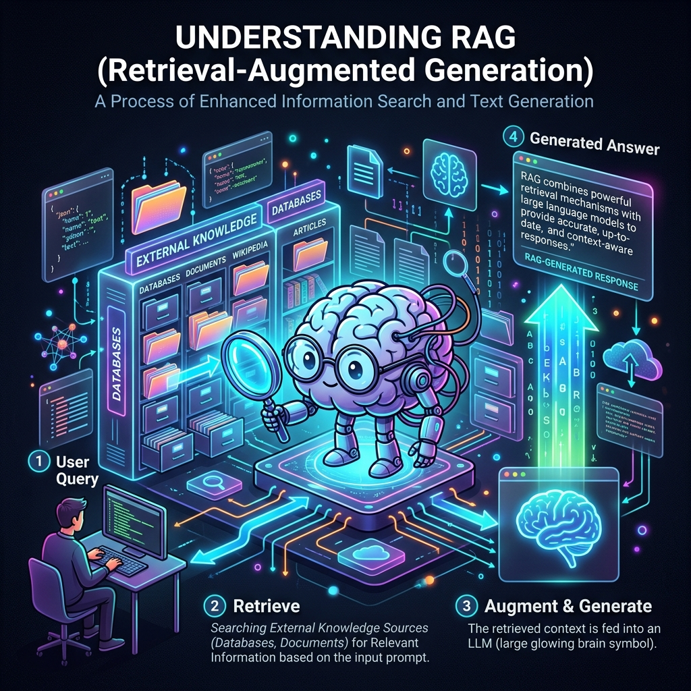
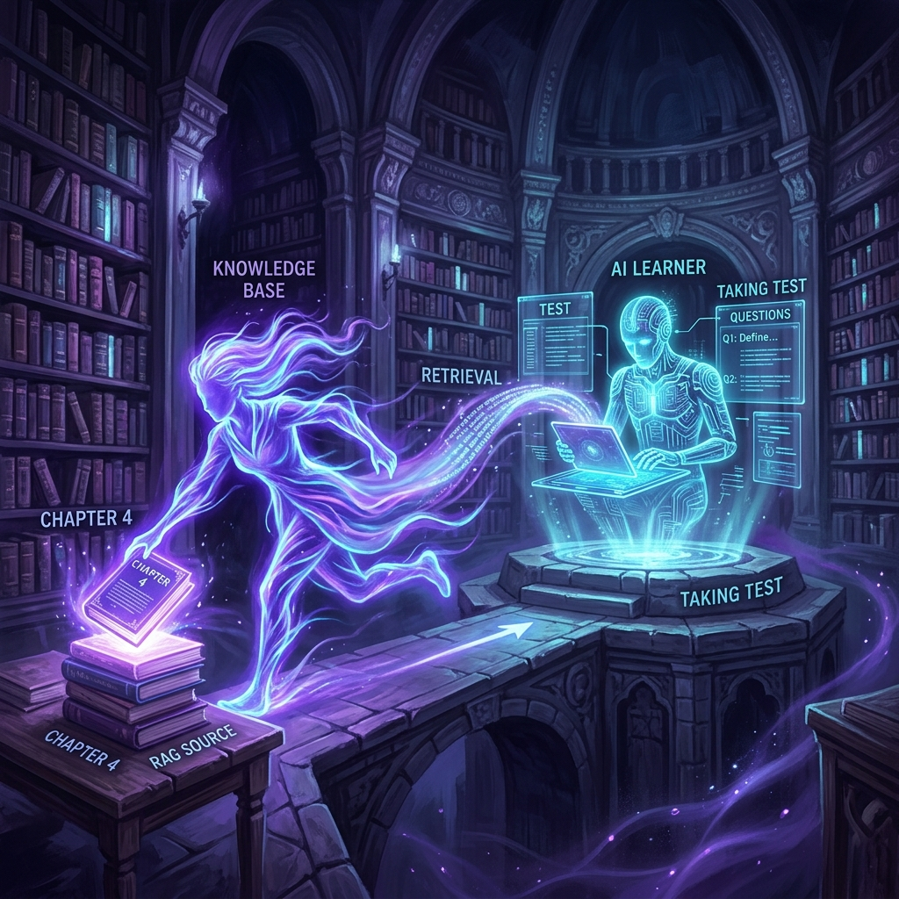
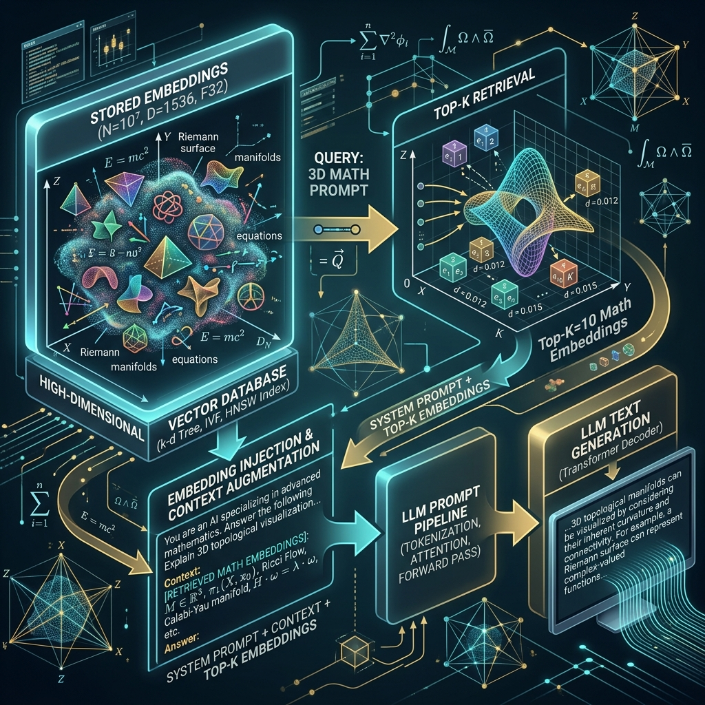
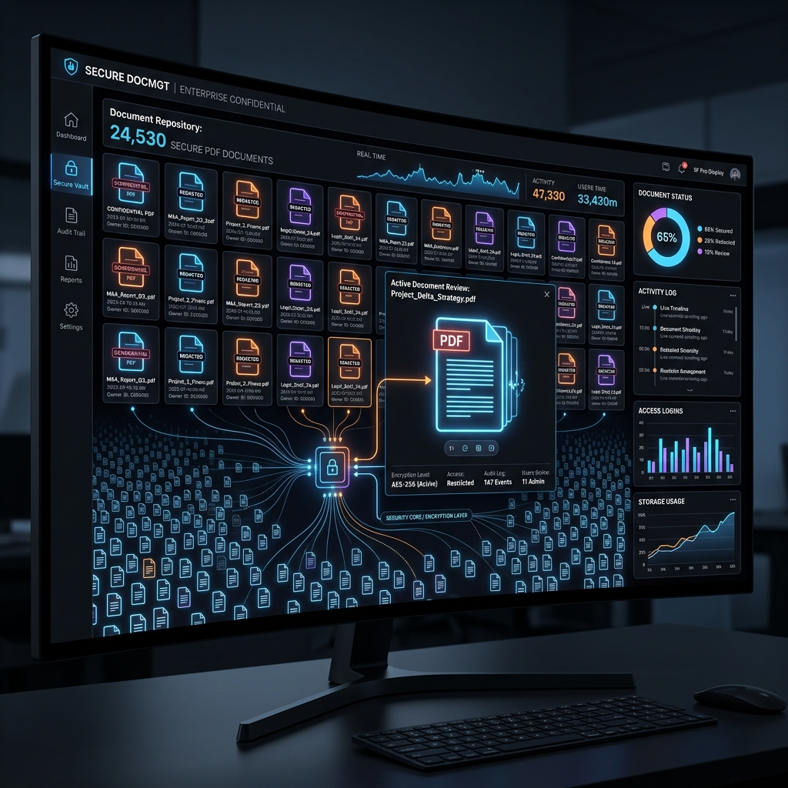

# Chapter 10: Giving LLMs a Library Card

---
[⬅️ Previous](chapter_9.md) | [🏠 Home](../README.md) | [Next ➡️](chapter_11.md)

  

## 🎯 Objective
In this chapter, we will solve the single biggest problem with Large Language Models: **Hallucinations**. We will learn how to move past relying on the model's "flaky memory" and instead build an architecture that allows the AI to search through private documents in real-time. This is the foundation of **Retrieval-Augmented Generation (RAG)**.

---

## 💡 The Simple Explanation: The Brilliant Student with No Memory

  

Imagine you hire a world-class historian to help you write a book. This historian is a literal genius—they have read every history book published before 2023. However, there is a medical condition: **they can no longer form new long-term memories.** 

If you ask them about a news event from 2024, they don't want to admit they don't know (because they are trained to be helpful). So, they "hallucinate." They use their vast general knowledge to invent a very convincing story about what *might* have happened in 2024. This is dangerous.

Now, imagine you give this historian a **Library Card** and a desk inside your private archives.

When you ask a question, the historian stops. They don't guess. Instead, they walk to the shelves, pull out the specific folder containing your private 2024 documents, read the pages, sit back down, and answer your question using the facts they just read. 

**This is RAG.** Instead of expecting the LLM to "memorize" your company's data during training, we treat the AI as a brilliant "reasoning machine" that reads context and explains it to you. We move from a **Closed-Book Exam** (memorization) to an **Open-Book Exam** (retrieval).

---

## 🔍 Going Deeper: The Technical Reality

  

RAG is a "System Level" architecture, not a model level change. It decouples the **Language Intelligence** from the **Knowledge Base**. As detailed in the *LLM Engineer’s Handbook (Iusztin & Labonne)*, a standard RAG pipeline has three rigid stages.

### 1. The Ingestion Phase (The Librarian's Filing System)
Before you can chat with your data, you must transform your PDFs, websites, and emails into a format the AI can search:
*   **Chunking**: You don't store 500-page books. You "shred" them into 500-word chunks.
*   **Embedding**: You pass every chunk through an embedding model (Chapter 2) to get its mathematical coordinates.
*   **Vector Database**: You save these vectors in a specialized database (like Pinecone or Chroma) along with the original text.

### 2. The Retrieval Phase (Searching the Shelves)
When the user asks, *"What is our company's refund policy?"*:
*   The system turns the question into a **Vector**.
*   It performs a **Similarity Search** in the Vector Database, finding the Top-3 text chunks whose math closest matches the question's math.
*   **The Result**: The "Librarian" has successfully found the exact paragraphs in the employee handbook.

### 3. The Augmentation Phase (The Open-Book Test)
The system doesn't just send the question to the LLM. It "augments" the prompt by pasting the retrieved paragraphs directly into it:
`"Context: [Paragraph A, Paragraph B]. Question: Based ONLY on the context above, what is the refund policy?"`

The LLM now acts as a **Summarizer**. It reads the provided text and generates an answer. Because the facts are right in front of it, the chance of hallucination drops dramatically.

---

## 🎯 The "Aha!" Moment
RAG solves the **"Memory Decay"** of AI. You don't need to spend $1,000,000 to "re-train" a model every time your company's policy changes. You simply delete an old PDF from your Vector Database and upload a new one. The "Brain" (the LLM) stays the same—only the "Library" changes.

---

## 🌐 Real-World Connection

  

RAG is currently the single most important technology for corporate AI. 

If you go to a major bank's website and talk to their AI assistant about your specific account balance, the bank is **not** training a model on your personal data. That would be a security nightmare and impossibly expensive. Instead, they use RAG. The assistant retrieves your recent transactions from a private database, pastes them into an invisible prompt, and asks the AI to summarize them for you. RAG allows for **Personalized, Private, and Real-Time** AI interactions.

---

## 📚 References
*   **LLM Engineer’s Handbook** (Paul Iusztin & Maxime Labonne, 2024) - *Chapter 1: The RAG Pattern and Deployment Strategy*.
*   **Building LLMs for Production** (Louis-François Bouchard, 2024) - *Section on Preventing Hallucination through Retrieval*.
*   **Hands-On Large Language Models** (Jay Alammar, 2024) - *Chapter 8: Retrieval and Vector Databases*.
*   **Large Language Models: A Deep Dive** (Stephan Raaijmakers, 2024) - *Chapter 10: External Knowledge Integration*.

---
[⬅️ Previous](chapter_9.md) | [🏠 Home](../README.md) | [Next ➡️](chapter_11.md)
