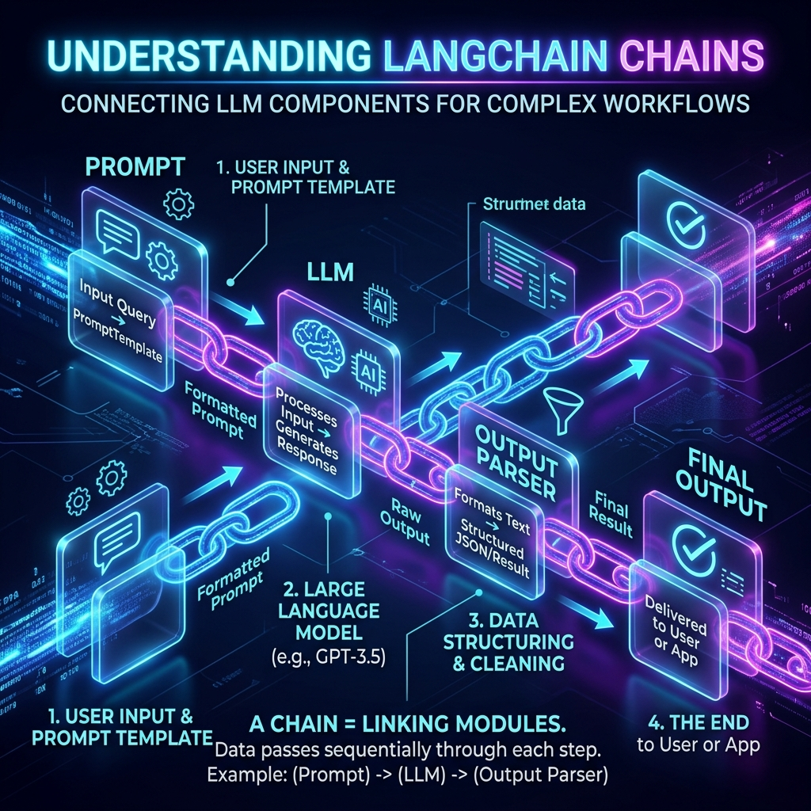
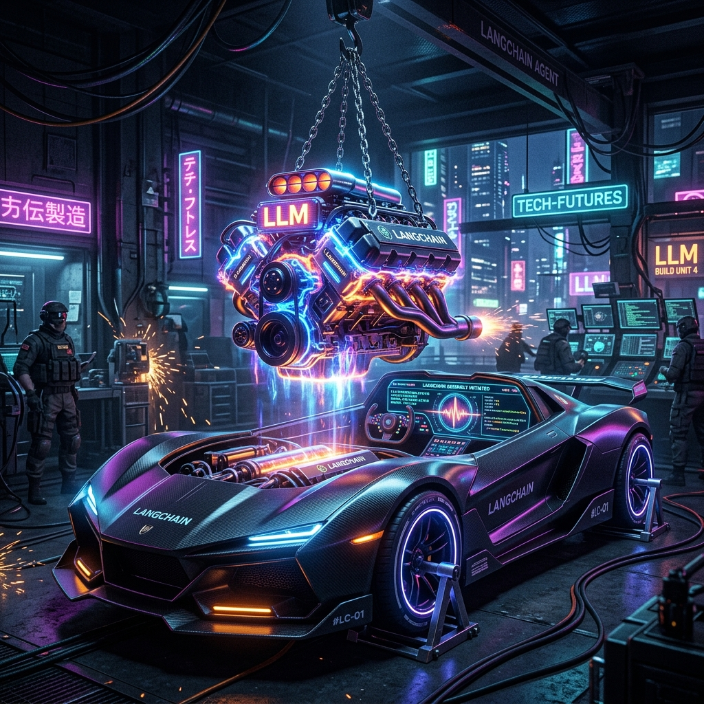
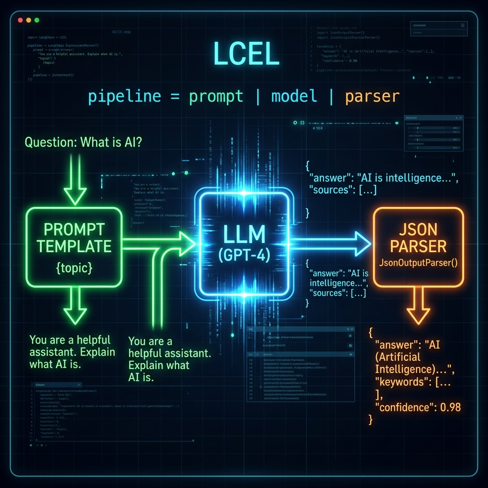
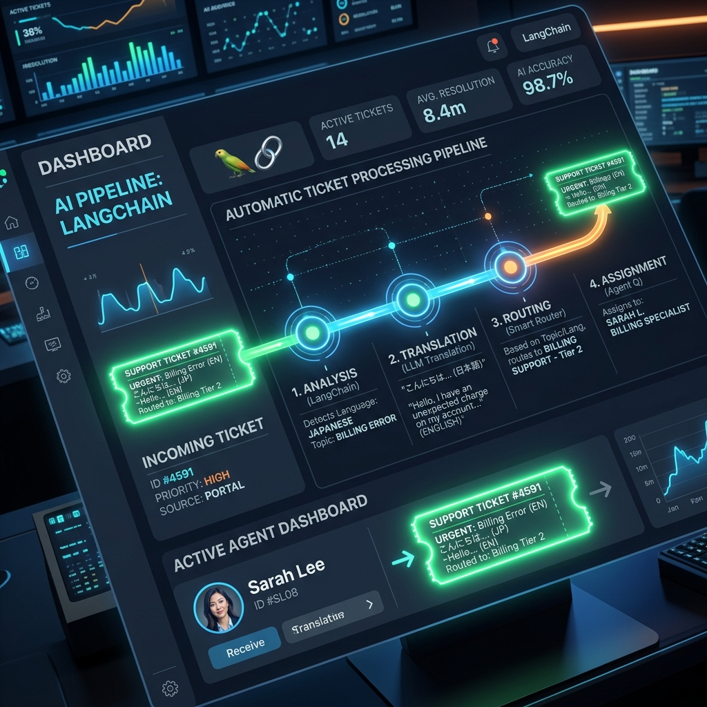

# Chapter 11: Your First LLM App

  

## 🎯 Objective
In this chapter, we will transition from AI theory to AI engineering. We will learn why interacting with a "raw" LLM API is insufficient for complex tasks and how to use orchestration frameworks like **LangChain** to build structured, reliable applications. We will explore the concept of **Chains** and the **LangChain Expression Language (LCEL)**.

---

## 💡 The Simple Explanation: The Engine and the Chassis

  

Imagine you are a genius inventor and you have just built the most powerful V8 engine in human history (the LLM). It is a marvel of engineering—it can rotate at incredible speeds and generate massive amounts of power. 

However, right now, the engine is just sitting on a concrete floor in your garage. If you want to use it to go to the grocery store, an engine isn't enough. If you just sit on the engine and turn it on, it will vibrate violently, roar loudly, and then probably explode or spin you off.

To make the engine useful, you need a **Chassis**. 
*   You need a **Fuel Tank** to hold the data (the Prompt).
*   You need a **Steering Wheel** to guide the power (the System Prompt).
*   You need a **Transmission** to translate the engine's rotation into wheel movement (the Output Parser).
*   You need a **Dashboard** to see how fast you are going (the Analytics).

**LangChain is the Chassis.** It is a framework that allows you to take the raw power of an LLM and "hook it up" to the other mechanical parts of a software application. It turns a "Chat Box" into a "Program."

---

## 🔍 Going Deeper: The Technical Reality

  

Building an application with an LLM requires standardizing how data flows from the user to the model and back again. As detailed in *Learning LangChain* (Oshin & Campos), we use **Orchestration** to manage this complexity.

### 1. The Components of a Chain
A basic "Chain" in LangChain consists of three main parts:
1.  **Prompt Templates**: Instead of having the user type everything, you define a template with variables: `"Translate the following {text} into {language}."`
2.  **LLM Interface**: A standardized wrapper that allows you to swap out models (e.g., swapping OpenAI's GPT-4 for Anthropic's Claude-3) without changing your code.
3.  **Output Parsers**: LLMs output strings, but programs need data. A parser takes a string like *"The price is 40 dollars"* and converts it into a Python integer: `40`.

### 2. LCEL: LangChain Expression Language
LangChain uses a unique syntax called **LCEL** based on the Unix Pipe operator (`|`). 
A typical application looks like this:
`chain = prompt | model | output_parser`

*   **The Pipeline**: The prompt is formatted, "piped" into the model, and the result is "piped" into the parser. This creates a declarative, readable flow of data.
*   **Parallelism**: LCEL allows you to run multiple chains at the same time. If you want a model to summarize a document in five different languages simultaneously, LCEL can split the "pipe" and combine the results at the end.

### 3. Sequential and Router Chains
Real applications are rarely a single step. We use **Chains of Chains**:
*   **Sequential**: The output of Chain A (e.g., writing a summary) becomes the input for Chain B (e.g., translating the summary).
*   **Router**: A "routing" model reads the user's input and decides which specific chain should handle it. If the user asks for help with a bug, it sends them to the "Code Chain"; if they ask about a refund, it sends them to the "Billing Chain."

---

## 🎯 The "Aha!" Moment
Software engineering is about **Control**, but LLMs are **Stochastic** (random). LangChain is the "wrapper" that tries to make the unpredictable AI predictable. By wrapping the model in rigid templates and parsers, you are turning a "statistical guessing machine" into a reliable, functional building block for a professional software stack.

---

## 🌐 Real-World Connection

  

Imagine a modern customer service ticket system. When you click "Submit Ticket," the system doesn't just send your text to an agent. 

1.  **Step 1 (Chain 1)**: An LLM reads your ticket and "tags" it with an urgency level (1-5).
2.  **Step 2 (Chain 2)**: If urgency is 5, it triggers a chain that looks up your account history in the CRM.
3.  **Step 3 (Chain 3)**: It drafts a personalized apology in your native language, citing your specific problem.

By the time the human agent sees the ticket, it is already categorized, researched, and has a professional draft ready. The human is no longer a "writer"—they are a "reviewer." This is **LLM Orchestration** at scale.

---

## 📚 References
*   **Learning LangChain** (Mayo Oshin & Nuno Campos, 2024) - *Chapter 1: Getting Started with LangChain*.
*   **LangChain Crash Course** (Lim, Greg, 2024) - *Section on PromptTemplates and LCEL*.
*   **LLM Engineer’s Handbook** (Paul Iusztin, 2024) - *Chapter 2: Structuring LLM Applications*.
*   **Building LLMs for Production** (Louis-François Bouchard, 2024) - *Section on Orchestration Frameworks*.
