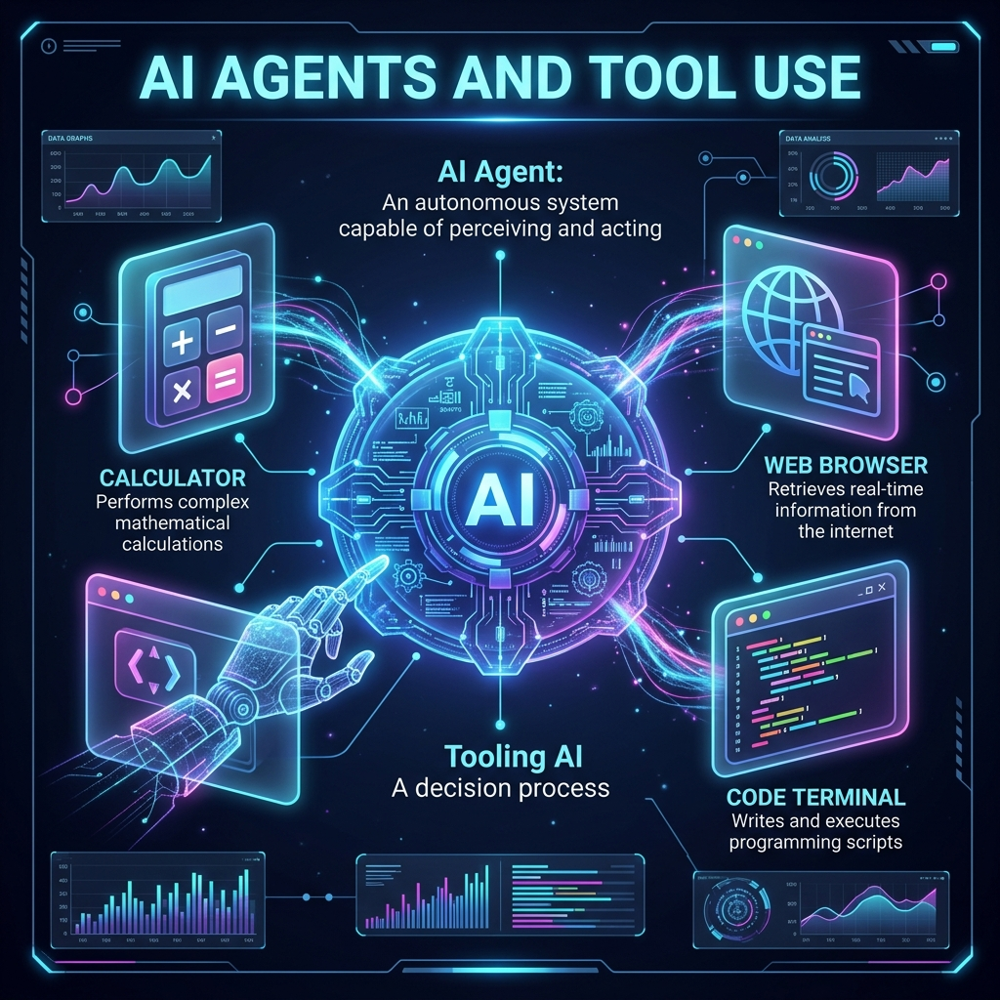
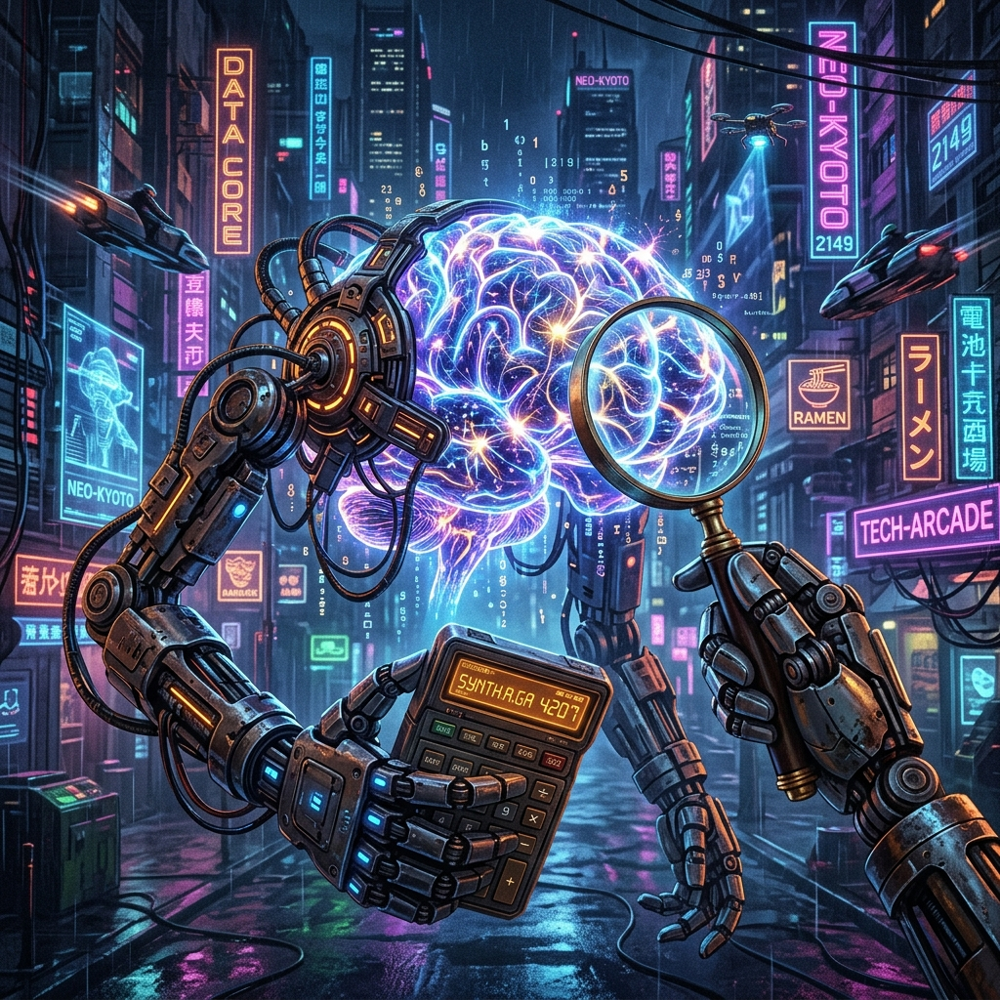
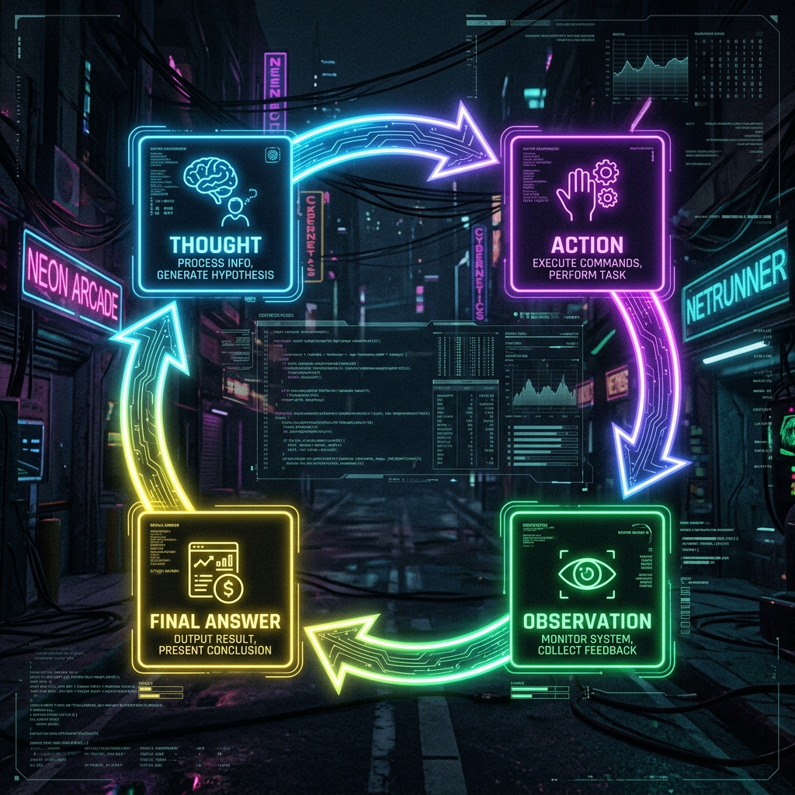

# Chapter 12: Smart Assistants

---
[⬅️ Previous](chapter_11.md) | [🏠 Home](../README.md) | [Next ➡️](chapter_13.md)

  

## 🎯 Objective
In this chapter, we will learn how to give an LLM "Agency." We will move from passive chatbots to autonomous **Agents** that can use tools, browse the internet, and execute code. We will explore the **ReAct** (Reason + Act) loop and understand how a text-generator can become a problem-solver.

---

## 💡 The Simple Explanation: The Brain in a Jar

  

Imagine you have a family member who is a world-class genius. They know everything about physics, law, and history. However, there is a catch: **They are just a disembodied brain sitting in a glass jar.** 

If you ask the brain: *"What is the current price of Bitcoin?"*, the brain gets frustrated. It knows *what* Bitcoin is, it knows how markets work, but it literally cannot look at the internet to see today's price. It has no hands, no eyes, and no way to interact with the world.

To fix this, you give the jar some **Robotic Hands** and a **Smart-Screen**. 
1.  You give the brain a **Calculator**.
2.  You give the brain a **Web Browser**.
3.  You give the brain a **Python Terminal**.

But hands aren't enough—the brain needs to know *how* to use them. You teach the brain a simple loop: *"First, **Think** about what you need. Second, perform an **Action** with a tool. Third, **Observe** the result on the screen. Then, repeat until the job is done."*

**This is an AI Agent.** It is no longer just a passive writer; it is an active "doer" that uses logic to decide which digital tools will solve your problem.

---

## 🔍 Going Deeper: The Technical Reality

  

An Agent is an LLM configured to act as a **Reasoning Engine** that controls the flow of its own application. As detailed in *Learning LangChain* (Oshin & Campos), this is achieved through the **ReAct** (Reasoning and Acting) framework.

### 1. The Tool Definition
Before an agent can start, you must define its "Tools" using a precise schema (usually JSON or a Pydantic model). 
*   **Tool Name**: `get_stock_price`
*   **Description**: *"Use this to find the current price of a stock. Input should be a ticker like AAPL."*
The LLM reads these descriptions and "learns" during the prompt what its capabilities are.

### 2. The Agent Loop
When you give an agent a task (*"Buy 5 shares of Apple if the price is under $180"*), it enters a recursive loop:
1.  **Thought**: The LLM generates text for itself: *"I need to check the current price of Apple first. I will use the get_stock_price tool."*
2.  **Action**: The LLM outputs a special string (e.g., `Action: get_stock_price(AAPL)`). The software framework (LangChain) stops the LLM, reads that string, and executes the *actual* Python code to call the Stock API.
3.  **Observation**: The result of the API call (e.g., `Price: $175`) is pasted back into the LLM's context window.
4.  **Final Response**: The LLM reads the observation and concludes: *"The price is $175, which is under $180. I will now call the buy_stock tool."*

### 3. Native Tool Calling
Originally, agents relied on "parsing" text to find tool names. Modern models (like GPT-4o and Claude 3.5) have been fine-tuned for **Function Calling**. They can output perfectly formatted JSON that maps directly to your code's functions, making the interaction between the "Brain" and the "Hands" much more reliable.

---

## 🎯 The "Aha!" Moment
An Agent is the transition from **Chatting** to **Computing**. We stop treating the LLM as a database of static knowledge and start treating it as a **Reasoning-Controller**. It is the "Glue" that allows a messy, unstructured human request to be translated into a rigid, structured API call.

---

## 🌐 Real-World Connection

  

The most famous example of an AI Agent in 2024 is **Devin**, the AI Software Engineer. 

When you give Devin a ticket to *"Fix the bug in the login page,"* it doesn't just write a code snippet. Devin is an agent with access to a terminal, a code editor, and a browser. 
1.  Devin **Thinks**: *"I should run the tests to find the error."*
2.  Devin **Acts**: It types `npm test` into its virtual terminal.
3.  Devin **Observes**: It reads the error message.
4.  Devin **Acts**: It opens the `login.js` file, finds the bug, and rewrites the code.
Devin continues this loop until the tests pass. It is an autonomous employee, not just a chatbot.

---

## 📚 References
*   **Learning LangChain** (Mayo Oshin & Nuno Campos, 2024) - *Chapter 6: Building Autonomous Agents*.
*   **Creating Custom GPT with OpenAI GPT Builder** (Noelle Russell, 2024) - *Section on Tool Integration and API Actions*.
*   **Building LLMs for Production** (Louis-François Bouchard, 2024) - *Chapter on ReAct and Agentic workflows*.
*   **LLM Engineer’s Handbook** (Paul Iusztin, 2024) - *Section on Model-as-a-Controller patterns*.

---
[⬅️ Previous](chapter_11.md) | [🏠 Home](../README.md) | [Next ➡️](chapter_13.md)
