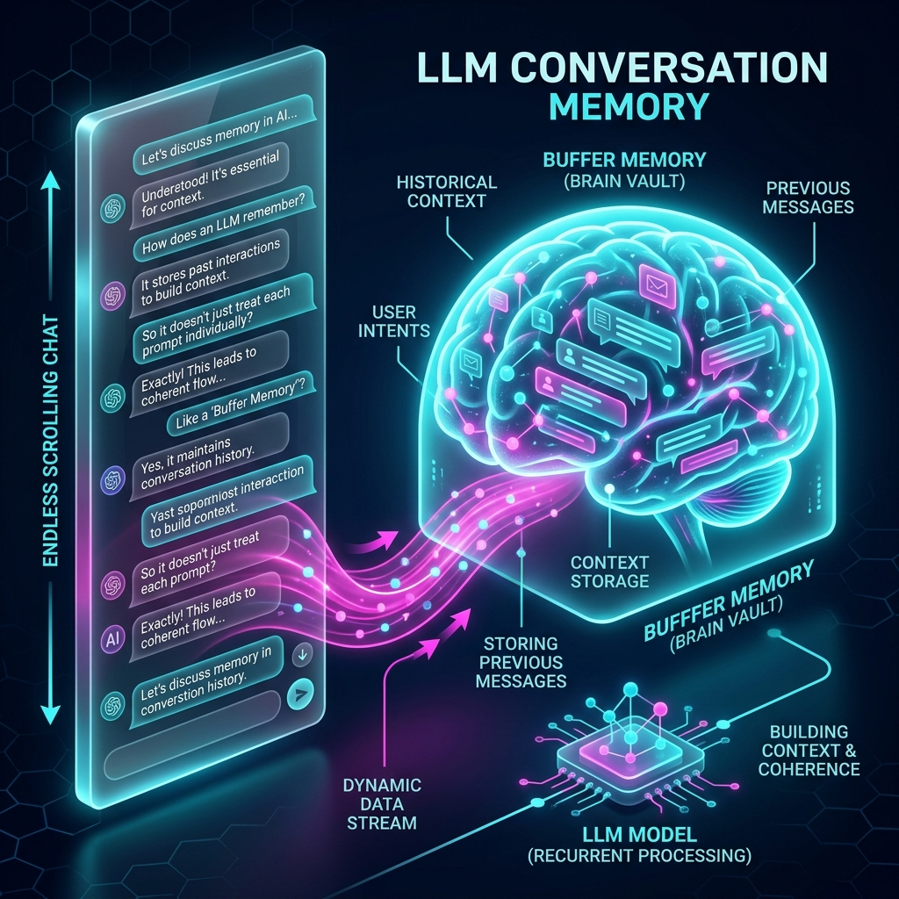
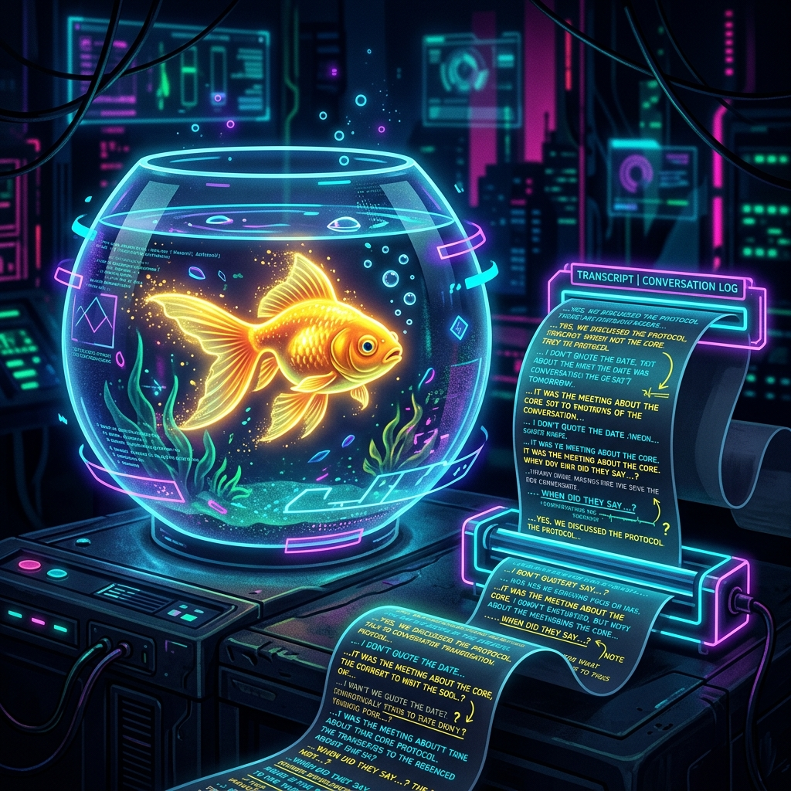
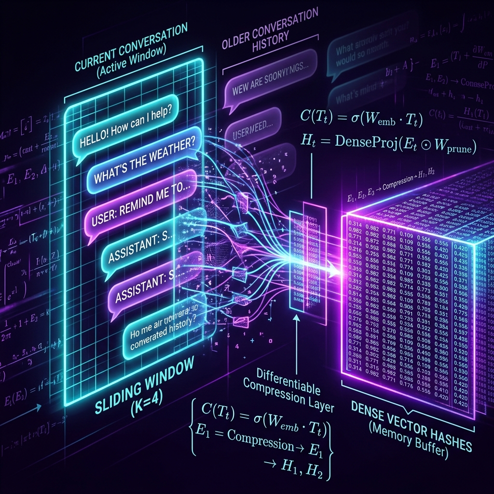
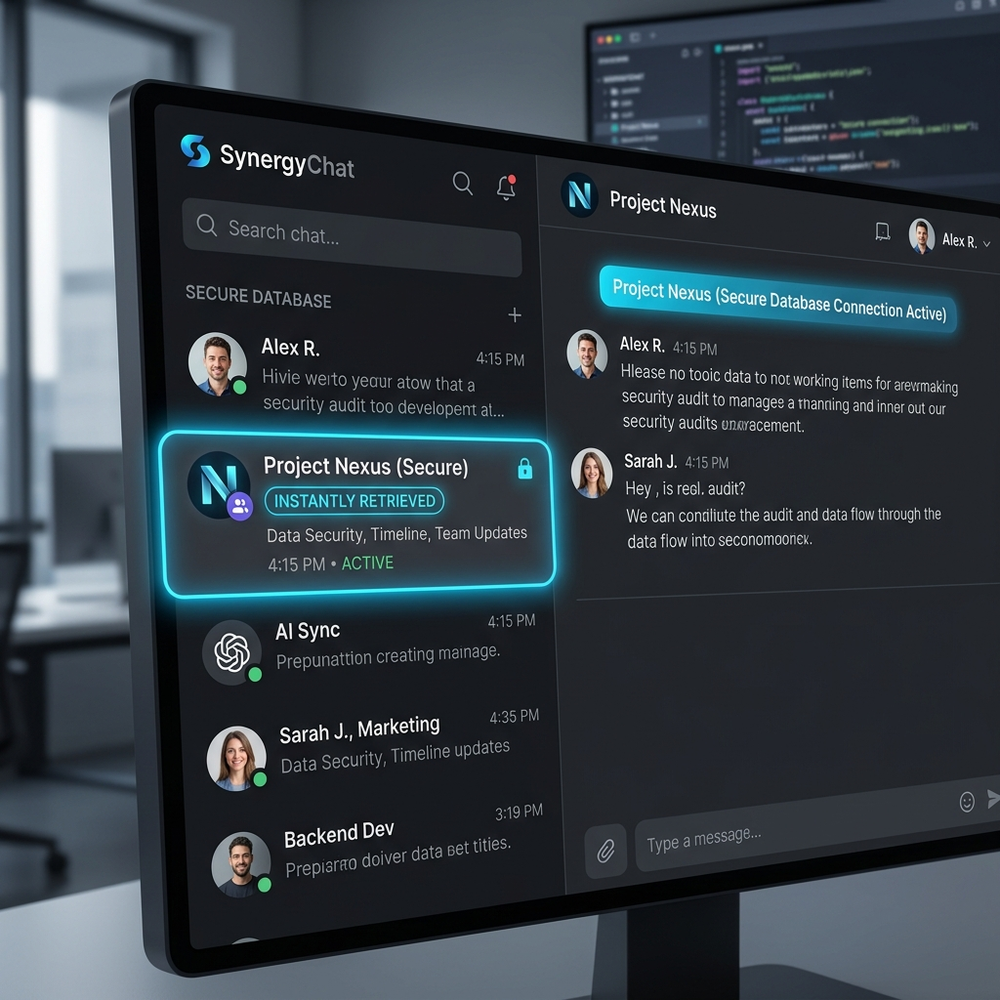

# Chapter 13: Conversations That Remember

---
[⬅️ Previous](chapter_12.md) | [🏠 Home](../README.md) | [Next ➡️](chapter_14.md)

  

## 🎯 Objective
In this chapter, we will solve the mystery of AI "Memory." We will learn why Large Language Models are naturally stateless (forgetful) and explore the engineering techniques—such as **Window Memory**, **Summary Memory**, and **Vector Stores**—that allow us to have deep, long-term conversations with a machine.

---

## 💡 The Simple Explanation: The Goldfish and the Post-It Notes

  

Imagine you are having a conversation with a brilliant friend who has the memory of a **Goldfish**. Every time they blink (every time you hit "send"), they completely forget everything that was just said. They forget who you are, what you're talking about, and even what they just said themselves.

How would you ever have a meaningful conversation?

You would have to use a **Post-It Note**. 
*   Before you say "Hello," you write "Hello" on a note and hand it to them.
*   When you want to say "My name is Bob," you take a *new* piece of paper, write "Hello" (the past) and then "My name is Bob" ( the present). 
*   For the third sentence, you have to write the first two sentences again.

**This is how LLM Memory works.** The model doesn't actually "remember" you inside its brain. Instead, your software framework (like LangChain) is the secretary. It meticulously copies and pastes every single thing you've ever said in the chat and "re-feeds" it to the AI every time you speak. The AI isn't remembering; it's just reading a transcript that is growing longer and longer.

---

## 🔍 Going Deeper: The Technical Reality

  

LLMs are **Stateless**. The internal weights of the model (Chapter 4) never change during a conversation. "Memory" is managed entirely through the **Context Window**. As detailed in *Learning LangChain* (Oshin & Campos), we use different "Memory Buffers" to manage the limited space in that window.

### 1. ConversationBufferMemory (The Full Transcript)
This is the simplest method. We keep a list of every user and assistant message.
`[User: Hi, AI: Hello, User: What's my name?, AI: You said your name is Bob]`
*   **Pros**: Perfect memory.
*   **Cons**: As the chat gets longer, you start using thousands of tokens. Eventually, you hit the "Token Limit," and the model crashes or becomes incredibly expensive to run.

### 2. ConversationBufferWindowMemory (The Sliding Window)
We only keep the last $K$ messages (e.g., the last 5 turns).
*   **Intuition**: It's like only being able to see the most recent 5 Post-It notes. The AI remembers what you just said, but it will forget what you said 20 minutes ago.

### 3. ConversationSummaryMemory (The Executive Summary)
This is a brilliant engineering trick. Instead of storing raw text, we use a *secondary* LLM to "watch" the conversation. Every few turns, that model writes a dense summary: *"The user introduced themselves as Bob and asked about space travel."*
We then replace the old transcript with this tiny summary. This allows for a 100-page conversation to be compressed into a single paragraph, saving massive amounts of money and token space.

### 4. VectorStore-Backed Memory (Semantic Recall)
For truly long-term memory (across days or weeks), we turn past messages into **Vectors** (Chapter 2). When you speak, the system "searches" your entire chat history for similar topics. 
*   If you say *"Tell me more about my dog,"* the system retrieves only the messages where you previously mentioned your dog and pastes them into the current prompt.

---

## 🎯 The "Aha!" Moment
AI memory is a **Prompt-Engineering Trick**. The model's "brain" is frozen in time. What feels like memory is actually just the systematic organization of past data, automatically injected into the present moment. We aren't building a brain that "remembers"; we are building a system that **reminds** the brain what it was doing.

---

## 🌐 Real-World Connection

  

Every time you open ChatGPT and see your chat history in the left sidebar, you are seeing a **Vector-Based Memory System**. 

OpenAI isn't keeping a "personalized" version of the GPT-4 model running just for you. They have one massive, stateless model that millions of people use simultaneously. When you click on a past chat, their database fetches the text logs, organizes them into a context-window-friendly format, and "warmed-up" the stateless model with your specific history right before you type your first word. It is the ultimate illusion of personal connection.

---

## 📚 References
*   **Learning LangChain** (Mayo Oshin & Nuno Campos, 2024) - *Chapter 3: Managing Conversation State and Memory*.
*   **LangChain Crash Course** (Lim, Greg, 2024) - *Section on Buffer and Summary Memory Types*.
*   **Hands-On Large Language Models** (Jay Alammar, 2024) - *Chapter 7: Managing Long Contexts*.
*   **LLM Engineer’s Handbook** (Paul Iusztin, 2024) - *Section on State Management in Production*.

---
[⬅️ Previous](chapter_12.md) | [🏠 Home](../README.md) | [Next ➡️](chapter_14.md)
