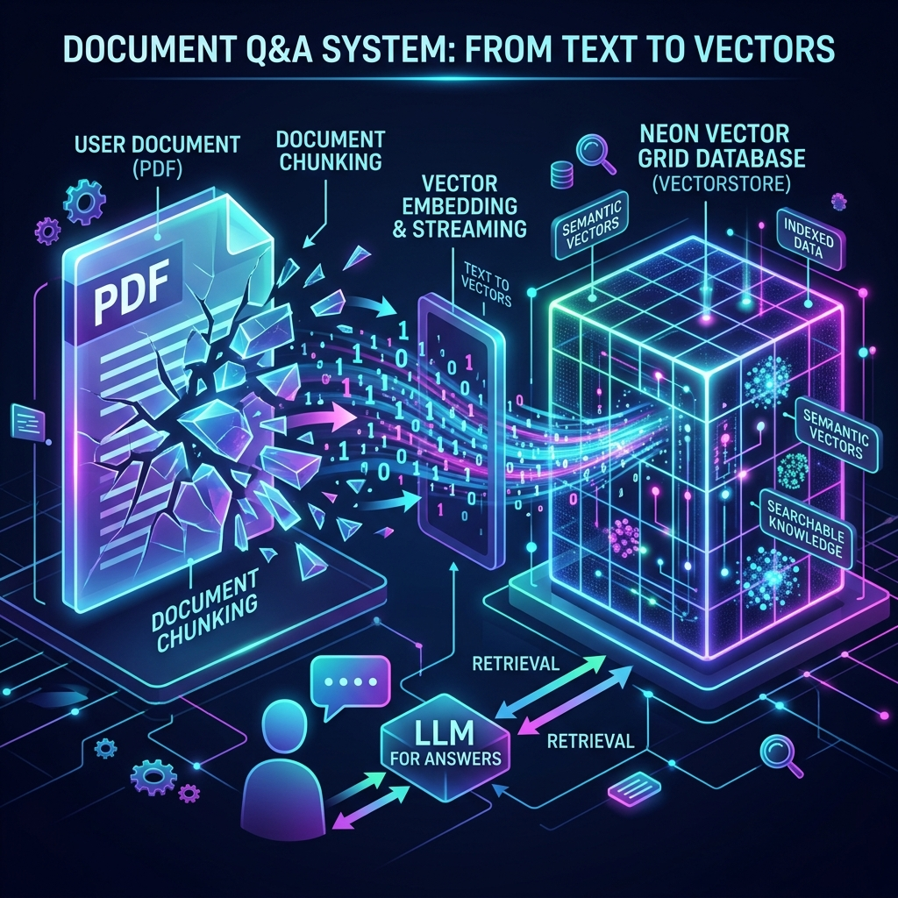
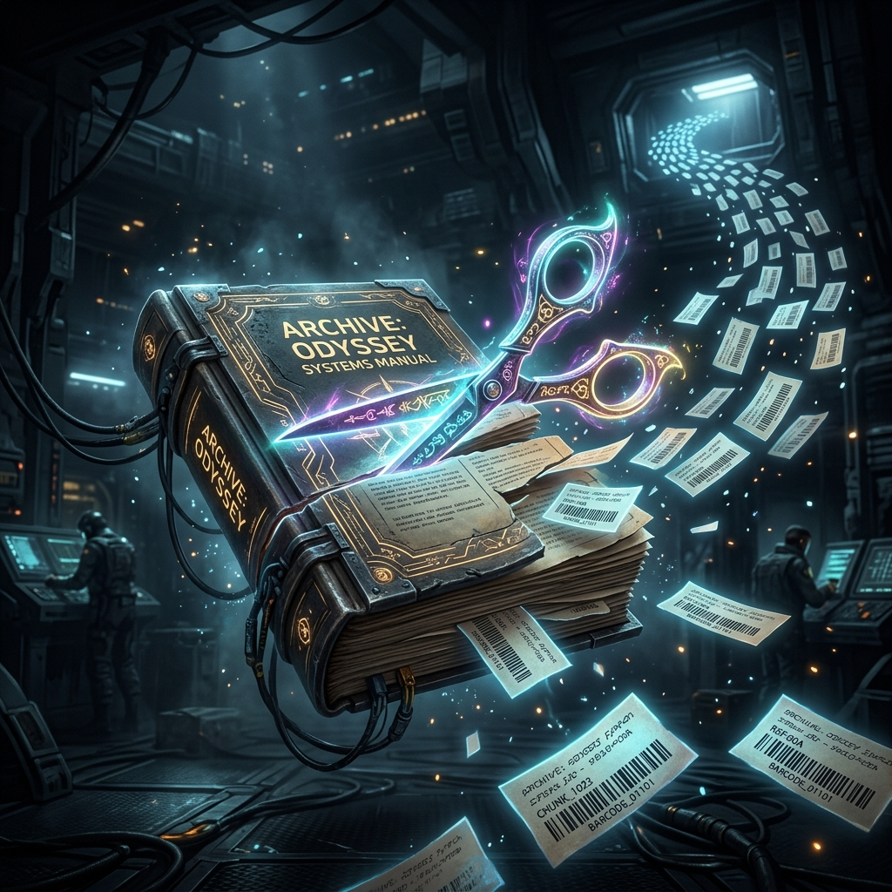
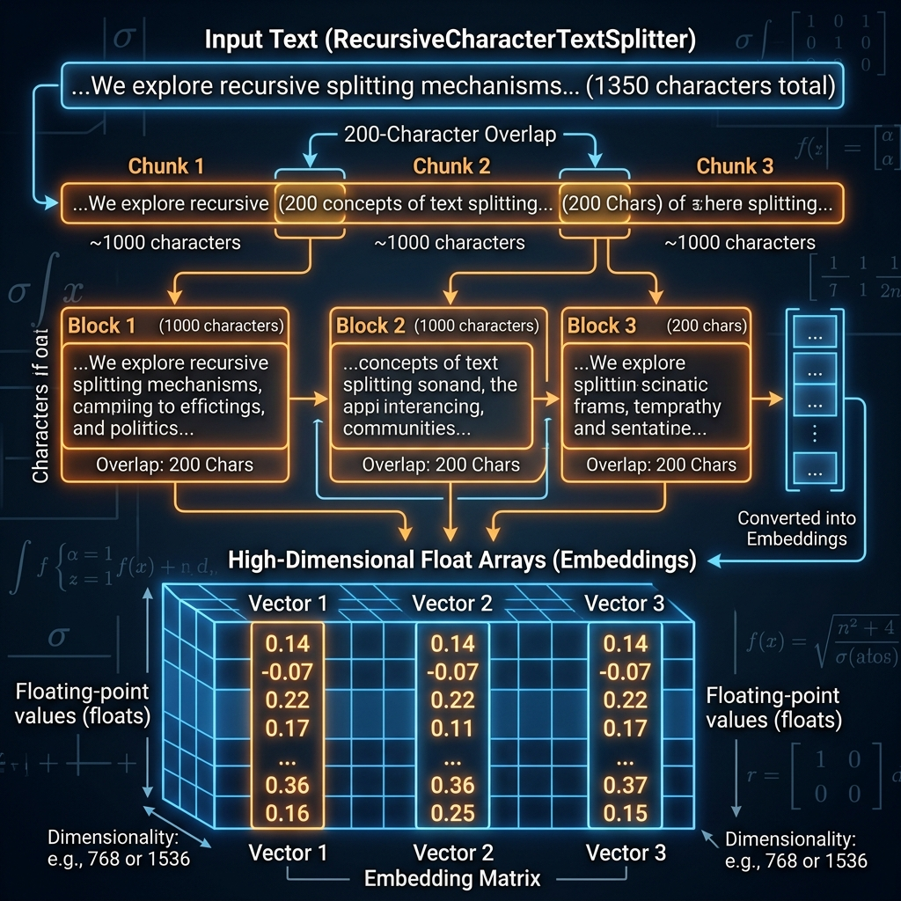
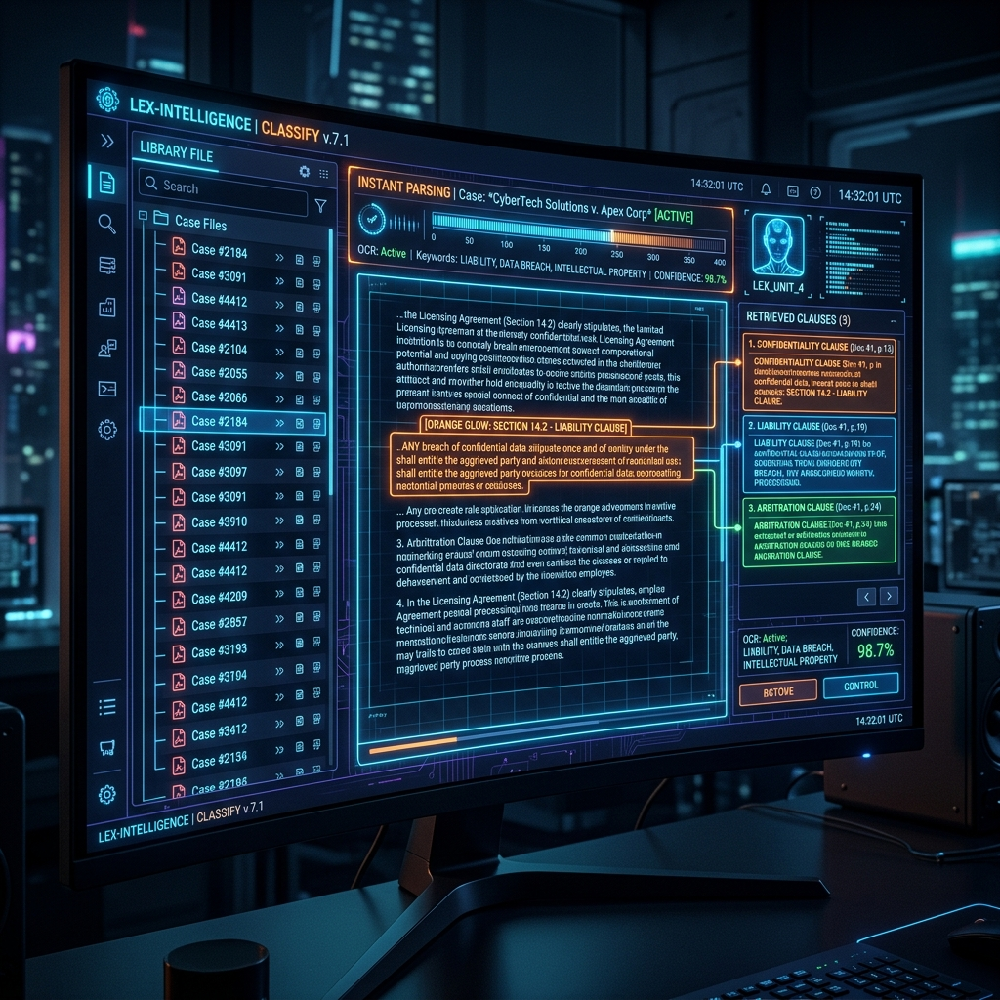

# Chapter 14: Chat With Your Documents

---
[⬅️ Previous](chapter_13.md) | [🏠 Home](../README.md) | [Next ➡️](chapter_15.md)

  

## 🎯 Objective
In this chapter, we will master the engineering pipeline of **Retrieval-Augmented Generation (RAG)**. We will move past the theory (Chapter 10) and learn the specific data-engineering mechanics—**Loading**, **Chunking**, **Indexing**, and **Retrieving**—required to build a professional "Chat with your Data" system.

---

## 💡 The Simple Explanation: The Librarian and the Gold Leaves

  

Imagine you have a private collection of 10,000 ancient historical scrolls. You want to be able to ask any question about these scrolls and get an answer instantly. You hire a **Master Librarian** (the LLM). 

The problem? The Librarian has a tiny table—they can only read one or two small pieces of paper at a time. If you hand them a 500-page book, it simply falls off the table.

To solve this, you perform a rigorous four-step process:
1.  **The Scissor Stage**: You take a pair of heavy-duty scissors and cut every single scroll into small, paragraph-sized strips.
2.  **The Labeling Stage**: You write a very short, very accurate summary "barcode" on the back of each strip. 
3.  **The Grid Stage**: You organize these strips on a massive, glowing wall grid. Strips about "Cooking" are pinned together on the left; strips about "War" are pinned on the right.
4.  **The Sprints**: When you ask a question, an assistant (the Retrieval System) looks for the strips on the wall with the barcode that matches your question. They grab the **top 3 strips** and race to the Librarian's table.

The Librarian reads those 3 strips, combines the information with their own genius knowledge, and gives you your answer.

---

## 🔍 Going Deeper: The Technical Reality

  

Building a RAG pipeline is 90% **Data Engineering** and 10% **AI**. As detailed in *Learning LangChain* (Oshin & Campos) and the *LLM Engineer’s Handbook* (Iusztin & Labonne), the pipeline must be perfectly tuned for accuracy.

### 1. Document Loaders: Cleaning the Noise
Files are messy. A PDF isn't just text; it contains metadata, images, and weird tables. We use **Loaders** (like `PyPDFLoader` or `Unstructured`) to intelligently strip away the "non-text" garbage, leaving only clean strings for the model to process.

### 2. The Art of Chunking: The Right Size
If your text strips are too short, the Librarian doesn't have enough context. If they are too long, they won't fit on the desk. 
*   **Chunk Size**: Typically 500 to 1,000 characters.
*   **Chunk Overlap**: You might set a 10% overlap (e.g., 100 characters). This ensures that if a critical sentence is cut in half by the "scissors," it appears at the end of Chunk 1 and the beginning of Chunk 2, so the meaning isn't lost.

### 3. Vector Databases and Hybrid Search
We store the vectors (Chapter 2) in a **VectorDB**. But simple vector search (Semantic Search) isn't always enough.
*   **Hybrid Search**: Modern systems combine Vector Search (meaning) with **BM25 Search** (literal keyword matching). This is critical if the user is looking for a specific part number like *"X-245"* that doesn't have a "semantic meaning."

### 4. The Re-Ranker: The Final Judge
Retrieval often returns "false positives"—paragraphs that look mathematically similar but are actually irrelevant. We pass the top 10 results through a **Cross-Encoder (Re-Ranker)**. This model is slow but extremely accurate. It re-scores the results and only sends the absolute "Gold" paragraphs to the LLM's context window.

---

## 🎯 The "Aha!" Moment
RAG is the "Glue" between **Proprietary Data** and **General Intelligence**. The LLM is just a highly articulate speaker. The true "smartness" of a RAG app comes from the engineering of the search grid. If your librarian (LLM) is handed the wrong strips of paper (data), it will give you a "perfect" answer to the wrong question. **Retrieval quality is generation quality.**

---

## 🌐 Real-World Connection

  

If you have ever used **Notion Q&A** or **Dropbox Dash**, you are using a world-class RAG pipeline. 

When you ask Notion: *"What did the team decide about the launch date?"*, Notion isn't reading every page in your workspace. It uses a high-speed retrieval engine to identify the specific meeting notes from Tuesday, extracts the "Decision" paragraph, and asks an LLM to summarize it for you. This allows you to "talk" to 10,000 private documents as if you had memorized them all yourself.

---

## 📚 References
*   **Learning LangChain** (Mayo Oshin & Nuno Campos, 2024) - *Chapter 4: Retrieval Augmented Generation (RAG)*.
*   **Building LLMs for Production** (Louis-François Bouchard, 2024) - *Section on Advanced Chunking and Overlap Strategies*.
*   **LLM Engineer’s Handbook** (Paul Iusztin & Maxime Labonne, 2024) - *Chapter 1: The RAG Pattern Architecture*.
*   **Hands-On Large Language Models** (Jay Alammar, 2024) - *Chapter 8: Building a Retrieval System*.

---
[⬅️ Previous](chapter_13.md) | [🏠 Home](../README.md) | [Next ➡️](chapter_15.md)
