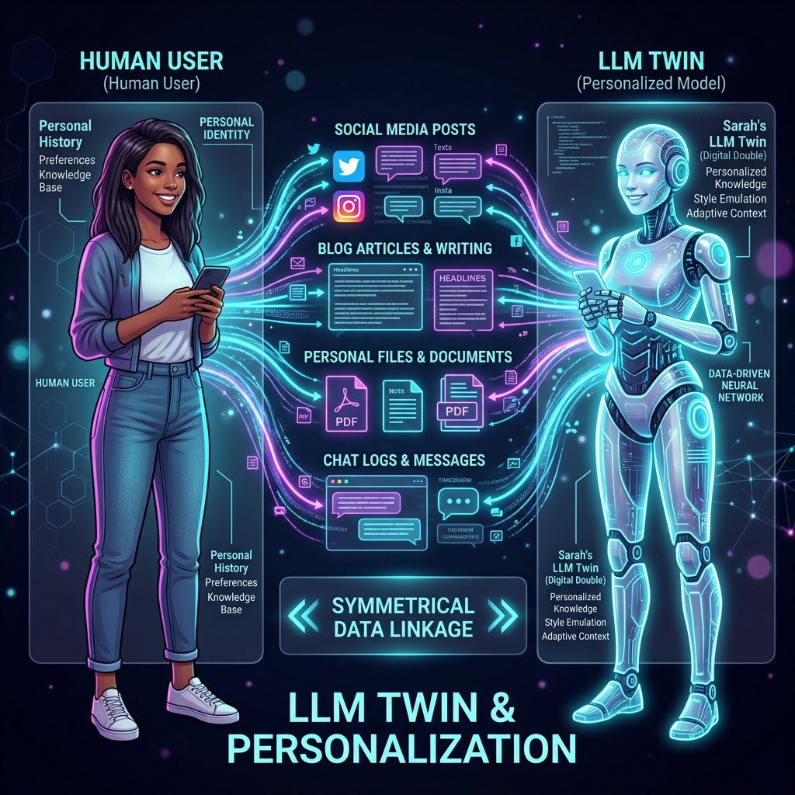
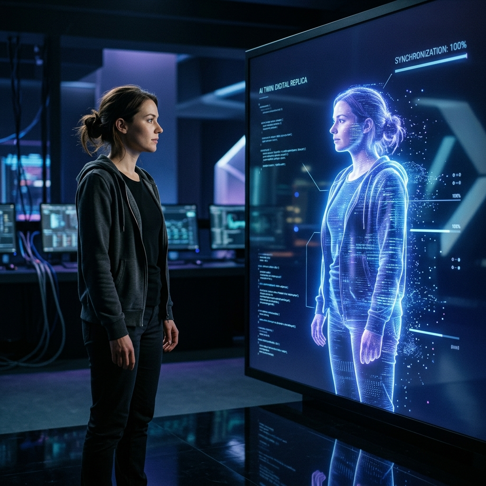
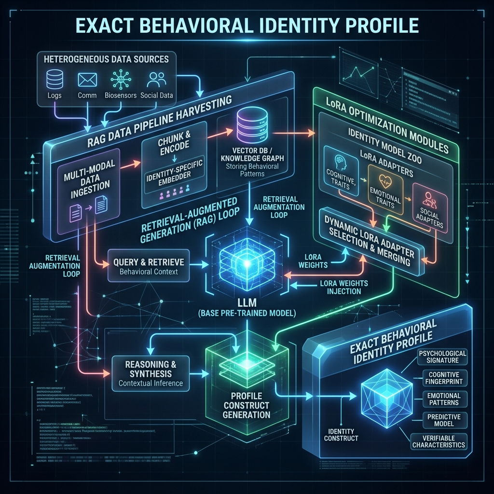
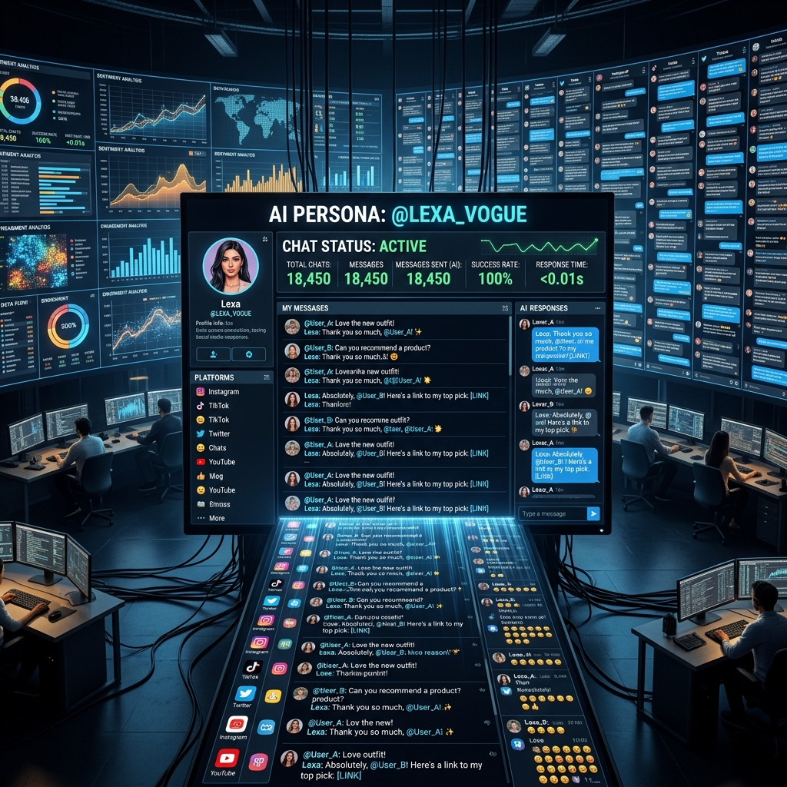

# Chapter 15: The LLM Twin

---
[⬅️ Previous](chapter_14.md) | [🏠 Home](../README.md) | [Next ➡️](chapter_16.md)

  

## 🎯 Objective
In this chapter, we will build the ultimate synthesis of everything we have learned: **The LLM Twin**. We will explore how to combine **Data Pipelines**, **RAG**, and **Fine-Tuning** to create a digital replica of a specific person's knowledge, writing style, and voice. 

---

## 💡 The Simple Explanation: The Shadow Assistant

  

Imagine you have been working as a visionary writer for 20 years. Every day, you write essays, send thousands of emails, and record hours of thinking out loud. Now, imagine you hire a dedicated **Shadow Assistant**. 

This assistant doesn't just do "work"—they spend the first six months reading every single thing you have ever written. They learn your favorite analogies, they learn which words you hate, and they learn exactly how you would answer a complicated question about your field of expertise.

Eventually, the assistant becomes so attuned to you that when an email arrives, they can write a draft that is so perfectly "You" that your own mother wouldn't know you didn't write it yourself.

**The LLM Twin is that Shadow Assistant.** Up until now, we have used LLMs as generic tools. But by feeding a model your "Digital Exhaust"—your blogs, tweets, and LinkedIn posts—you are essentially downloading your human "Vibe" into a machine. You are turning a world-class engine into a **Personalized Mirror**.

---

## 🔍 Going Deeper: The Technical Reality

  

Creating an LLM Twin is the "Grand Finale" of LLM Engineering. As documented in the *LLM Engineer’s Handbook* (Iusztin & Labonne), it is not a single model—it is a **Stacked Architecture**.

### 1. Stage 1: The Data Lake (Your Digital History)
A Twin is only as good as its data. You must build an automated pipeline that scrapes your own digital life:
*   **Source Connectors**: Python scripts that pull data from your Twitter API, your Substack, and your local obsidian notes.
*   **Normalization**: Turning messy social media posts into clean, searchable Markdown text.

### 2. Stage 2: Fact-Memory (Advanced RAG)
You cannot "Fine-tune" a model to remember millions of specific facts perfectly. Facts belong in a **Vector Database** (Chapter 14). We build a RAG pipeline that searches your past writings to answer specific questions: *"What did I say about Bitcoin in 2017?"*

### 3. Stage 3: Voice-Fine-Tuning (LoRA)
RAG gives the Twin your **Facts**, but LoRA (Chapter 6) gives the Twin your **Tone**. 
*   We curate a dataset of 1,000 "Instruction-Response" pairs from your actual history. 
*   We fine-tune an open-source model (like Llama-3) on this data. 
*   **The Result**: The model's weights physically align with your specific syntactic quirks—like your tendency to use bullet points, your level of formality, or your favorite emojis.

### 4. Stage 4: Self-Correction (Reflection)
Finally, we wrap the Twin in an **Agentic Loop** (Chapter 12). Before it outputs a message, it "Reflects": *"Does this sound too much like a robot? Is this something I would actually say?"* This acts as the final "Identity Guardrail."

---

## 🎯 The "Aha!" Moment
Identity is a **Statistical Distribution of Symbols**. To a computer, what makes you "You" is just a high-probability pattern of certain tokens following other tokens. When we build a Twin, we aren't "copying a soul"—we are mathematically mapping a human writing style into a multi-dimensional vector space.

---

## 🌐 Real-World Connection

  

We are entering the era of the **Scaling Creator**. 

Top-tier influencers and "solopreneurs" are already building Twins to handle their community interaction. A creator with 1 million followers can't possibly answer every DM. But a fine-tuned "LLM Twin" that sounds exactly like them can answer thousands of fans at once, referencing specific things the creator has actually said in past videos or podcasts. This allows a human voice to work **24/7/365** across every language on Earth.

---

## 📚 References
*   **LLM Engineer’s Handbook** (Paul Iusztin & Maxime Labonne, 2024) - *Fully Detailed Capstone Project: The LLM Twin Architecture*.
*   **Build a Large Language Model (From Scratch)** (Sebastian Raschka, 2024) - *Section on Specialized Dataset Curation*.
*   **Creating Custom GPT with OpenAI GPT Builder** (Noelle Russell, 2024) - *Chapter on Creating Personalized Knowledge Bases*.
*   **Hands-On Large Language Models** (Jay Alammar, 2024) - *Section on Adapting Models to Personal Contexts*.

---
[⬅️ Previous](chapter_14.md) | [🏠 Home](../README.md) | [Next ➡️](chapter_16.md)
