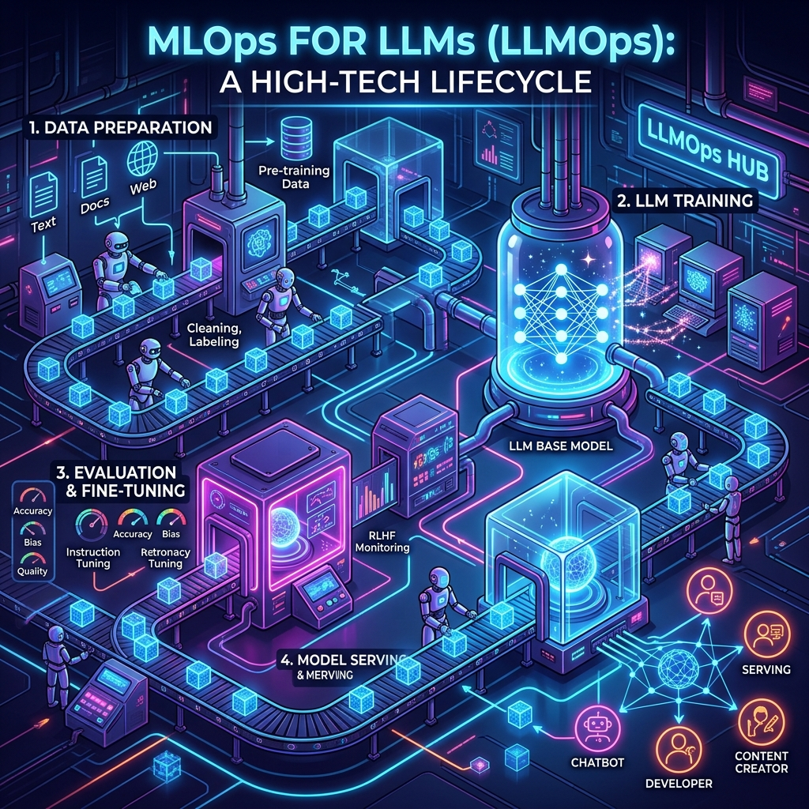
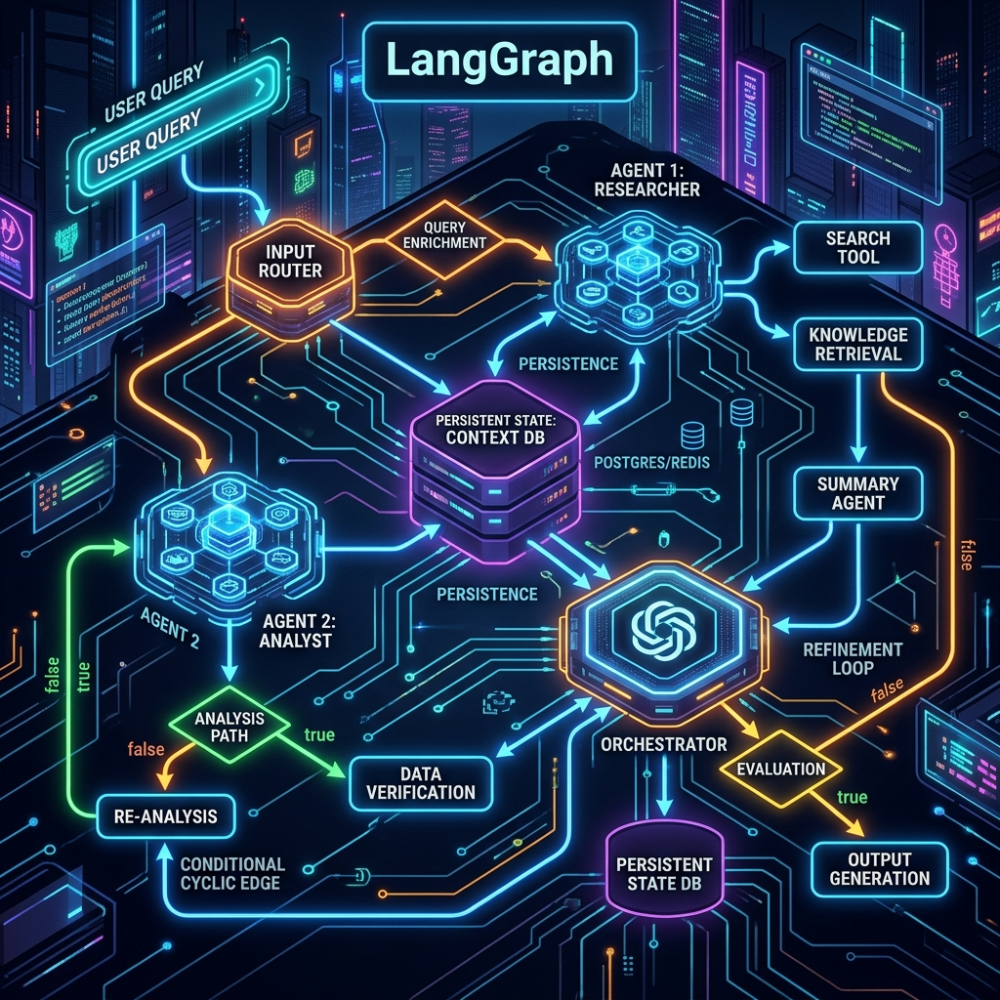

# Chapter 16: The LLM Factory

  

## 🎯 Objective
In this chapter, we will learn how to move from a single prototype to a global product. We will explore **LLMOps (Large Language Model Operations)**—the engineering science of building the massive, automated infrastructures required to serve billions of AI tokens to millions of users without the system melting down.

---

## 💡 The Simple Explanation: The Hobby Shop vs. The Gigafactory

  

Imagine you are a brilliant mechanic and you've spent the last six months in your tiny garage building a one-of-a-kind supercar. It works perfectly! It's fast, it's beautiful, and it's a masterpiece.

However, your neighbor sees the car and says: *"I want one. Also, 100,000 other people just signed up on your website. They all want this car delivered by next Tuesday."*

Your garage can't handle that. Building one car is about **Innovation** (the Model). Building 100,000 cars is about **Logistics** (The Factory). 
*   You need a supply chain for parts.
*   You need a robotic assembly line that never sleeps.
*   You need a quality-control team to catch errors in real-time.
*   You need a 24/7 maintenance crew to fix machines when they break.

**LLMOps is that factory.** It is the invisible, unglamorous, but absolutely vital machinery that surrounds an LLM. It's the difference between a "Cool Demo" and a "Real Business."

---

## 🔍 Going Deeper: The Technical Reality

  

Deploying a Large Language Model is an order of magnitude harder than traditional software. As detailed in *LLMs in Production* (Brousseau & Sharp), a production LLM stack requires four key engineering pillars.

### 1. Model Serving and Orchestration
LLMs are massive. You cannot host GPT-4 on a single web server. You must use **Model Orchestrators** (like Kubernetes and Ray Serve) to manage clusters of GPUs. 
*   **The Problem**: A single GPU (A100/H100) only has 80GB of memory. A large model might need 140GB. 
*   **The Solution**: We use **Model Parallelism** (splitting the model across different GPUs) and **Pipeline Parallelism** (processing different layers of the model on different machines). LLMOps ensures these machines talk to each other fast enough to keep the generation latency low.

### 2. Experiment Tracking and Versioning
During the fine-tuning phase (Chapter 6), researchers run hundreds of experiments. We use tools like **MLflow** or **Weights & Biases** to act as a "Black Box Flight Recorder." We log every learning rate, every dataset version, and every weight update. This ensures that if the model suddenly starts hallucinating "nonsense," we can perfectly roll back to last Tuesday's version.

### 3. Monitoring and Data Drift
Standard software code is "Static"—if it works today, it works tomorrow. But AI is "Dynamic." 
*   **Data Drift**: If you train a model on data from 2022, but suddenly the world starts talking about a 2024 news event, the model's accuracy will drop (hallucination). 
*   **Observability**: We use monitoring tools (like Arize or WhyLabs) to constantly "listen" to the model's outputs. If the model starts sounding too robotic, or if the "Common Sense" score drops, the factory automatically alerts the developers to re-collect data.

### 4. Continuous Integration for AI (CI/CD)
The LLMOps pipeline must be automated. When an engineer updates the "System Prompt" (Chapter 8), the system should automatically run a suite of **Evals** (Chapter 18) to ensure the change didn't accidentally break the model's safety guardrails. If the Evals pass, only then is the new version "deployed" to the servers.

---

## 🎯 The "Aha!" Moment
The model is just 10% of the product. The other 90% is the **Reliability Pipeline**. An LLM without LLMOps is just an expensive toy. An LLM *with* LLMOps is an industrial-grade intelligence that can be trusted with millions of customers and billions of dollars in transactions.

---

## 🌐 Real-World Connection

  

The most incredible example of LLMOps in history was the launch of **ChatGPT**. 

ChatGPT grew to 100 million users faster than any app in history. Behind the simple "Chat" screen was a massive, global infrastructure orchestrated by Microsoft Azure and OpenAI. They successfully routed millions of requests per second to tens of thousands of GPUs across the world. There were zero data leaks, very few "server down" messages, and they were able to update the model weekly without the users even noticing. That wasn't just "good AI"—it was world-class **Industrial LLMOps**.

---

## 📚 References
*   **LLMs in Production** (Christopher Brousseau & Matthew Sharp, 2024) - *Chapter 1: The Lifecycle of LLM-Powered Products*.
*   **LLM Engineer’s Handbook** (Paul Iusztin & Maxime Labonne, 2024) - *Chapter 6: Building an Automated Fine-Tuning Pipeline (LLMOps)*.
*   **Building LLMs for Production** (Louis-François Bouchard, 2024) - *Section on Scalable Inference and Serving*.
*   **Large Language Models: A Deep Dive** (Stephan Raaijmakers, 2024) - *Section on Bias Detection and Data Drift*.
