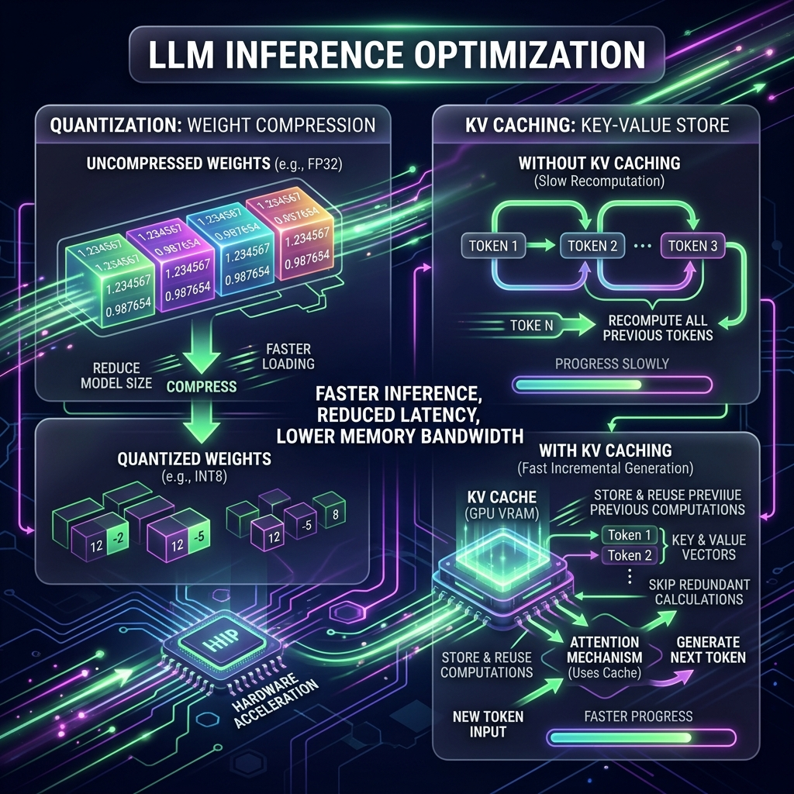
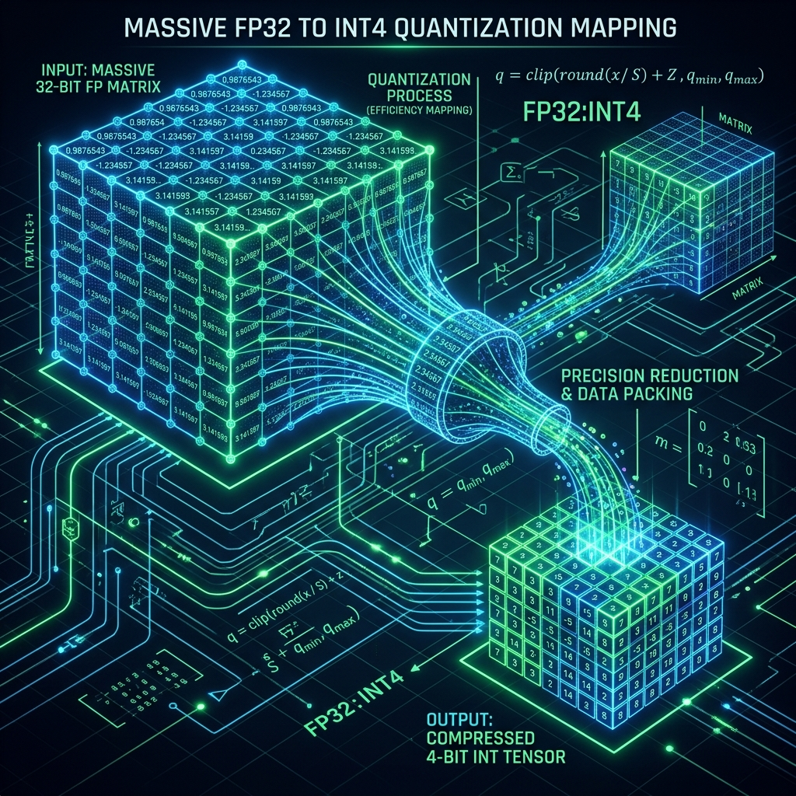

# Chapter 17: Making It Fast

  

## 🎯 Objective
In this chapter, we will learn the engineering secrets behind the speeds we see in modern AI. We will explore **Quantization**, **KV Caching**, and **Speculative Decoding**—the optimization techniques that allow multi-gigabyte neural networks to run on standard consumer hardware and output text faster than a human can read.

---

## 💡 The Simple Explanation: The Semi-Truck on a Bicycle Path

  

Imagine you have a massive, fully-loaded semi-truck (the LLM) carrying a billion books worth of knowledge. You want to get this truck across town. However, there is a major problem: the only roads in town are tiny, winding bicycle paths (normal computer hardware).

If you try to drive the truck on the bike path, you will crash, or you will move at exactly 1 inch per hour.

To solve this, you have to do two things:
1.  **Lighten the Load (Quantization)**: You realize that the truck's cargo is packed in heavy lead boxes. You decide to unpack everything and put it into tiny, lightweight plastic bags. You lose a *tiny* bit of information (one or two pages get crinkled), but the overall weight of the truck drops by 75%. 
2.  **The Memory Lane (KV Caching)**: When the truck is driving, it keeps checking its map for every single turn. You decide to hire a navigator who remembers every turn they've already taken. Now, the truck doesn't have to stop and re-calculate the entire route for every new street—it just looks at the navigator's notes for the past 100 turns and keeps moving.

**These are the secrets of Inference Optimization.** We aren't making the computers "smarter"—we are making the math lighter and the redundant work disappear.

---

## 🔍 Going Deeper: The Technical Reality

  

Generating a single word with an LLM is a "Memory Bound" task. The bottleneck isn't how fast the chip can calculate; it's how fast the chip can pull massive weight matrices from the RAM. As detailed in *LLMs in Production* (Brousseau & Sharp), we use three core engineering hacks to solve this.

### 1. Quantization: The Art of Rounding
During training (Chapter 5), models use high-precision 16-bit or 32-bit floats (e.g., `0.12345678`). This is incredibly precise but huge. 
*   **Post-Training Quantization (PTQ)**: We "round down" these numbers to 8-bit (INT8) or even 4-bit (INT4) (e.g., `0.12`). 
*   **The Result**: The model size in RAM shrinks from 140GB to 35GB. Because neural networks are naturally "fuzzy," this aggressive rounding results in almost zero loss in intelligence, but a **4x speedup** in generation.

### 2. KV (Key-Value) Caching: No Repeat Math
Because an LLM predicts word-by-word, it has to look at the *entire past context* for every new word. Without a cache, for the 100th word, the model would have to re-calculate the attention math for the first 99 words.
*   **The KV Cache**: Once the mathematical "Keys" and "Values" (Chapter 3) for a word are calculated, we store them in a fast GPU buffer. When the model generates the 101st word, it only does the math for that *one* word and "points" to the cache for everything else. This reduces computation costs from quadratic ($O(n^2)$) to linear ($O(n)$).

### 3. Speculative Decoding: The Fast Guess
What if we use a tiny, lightning-fast "Draft Model" (e.g., a tiny 1B parameter model) to guess the next 5 words? 
*   The tiny model is usually right about simple words like *"the"* or *"at"*. 
*   The massive "Oracle Model" (e.g., GPT-4) then checks the draft's work in a single operation. If the draft is right, we keep the words. If not, the Oracle corrects it. This allows the big model to "skip" thinking for simple parts of the sentence.

---

## 🎯 The "Aha!" Moment
High-speed AI is a **Waste Management** problem. We realize that most of the math the model is doing is redundant (calculating the same context) or excessively precise (carrying 16 decimals where 4 would do). By identifying and eliminating this waste, we can make the "Impossible" (running a super-brain on a laptop) not only possible, but instantaneous.

---

## 🌐 Real-World Connection

  

This is how **On-Device AI** (like Apple Intelligence or Google Gemini Nano) is possible. 

Your smartphone doesn't have the cooling or the RAM of a massive server farm. Apple and Google engineers use aggressive **4-bit Quantization** and **Apple Neural Engine (ANE)** optimization to shrink a massive language model so it fits into your phone's memory. When you ask your phone to summarize an email, it isn't sending your data to the cloud; it's using these optimization tricks to run the math locally on your own silicon, keeping your data private and the response immediate.

---

## 📚 References
*   **LLMs in Production** (Christopher Brousseau & Matthew Sharp, 2024) - *Chapter 3: Optimizing Inference for Speed and Cost*.
*   **LLM Engineer’s Handbook** (Paul Iusztin & Maxime Labonne, 2024) - *Section on Model Compression (Quantization & Distillation)*.
*   **Build a Large Language Model (From Scratch)** (Sebastian Raschka, 2024) - *Appendix: Making Models Run Faster*.
*   **Learning LangChain** (Mayo Oshin, 2024) - *Section on Streaming and Low-Latency Architectures*.
