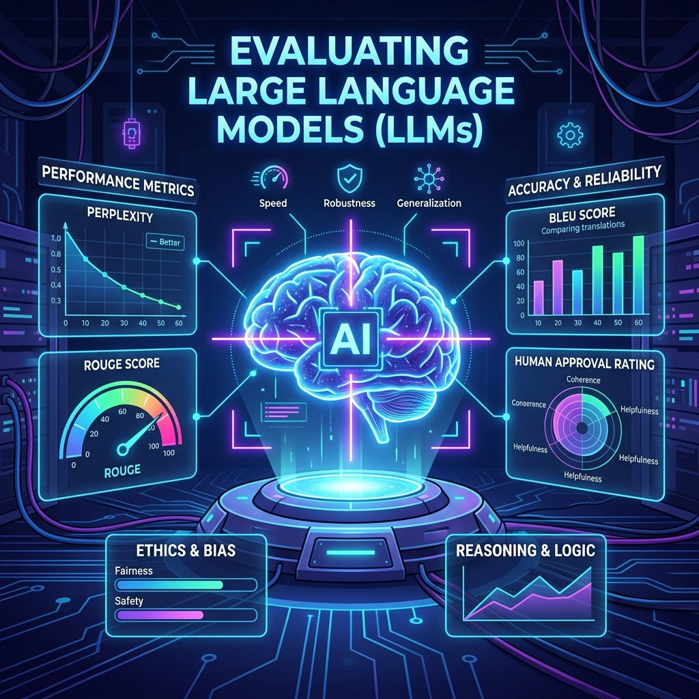
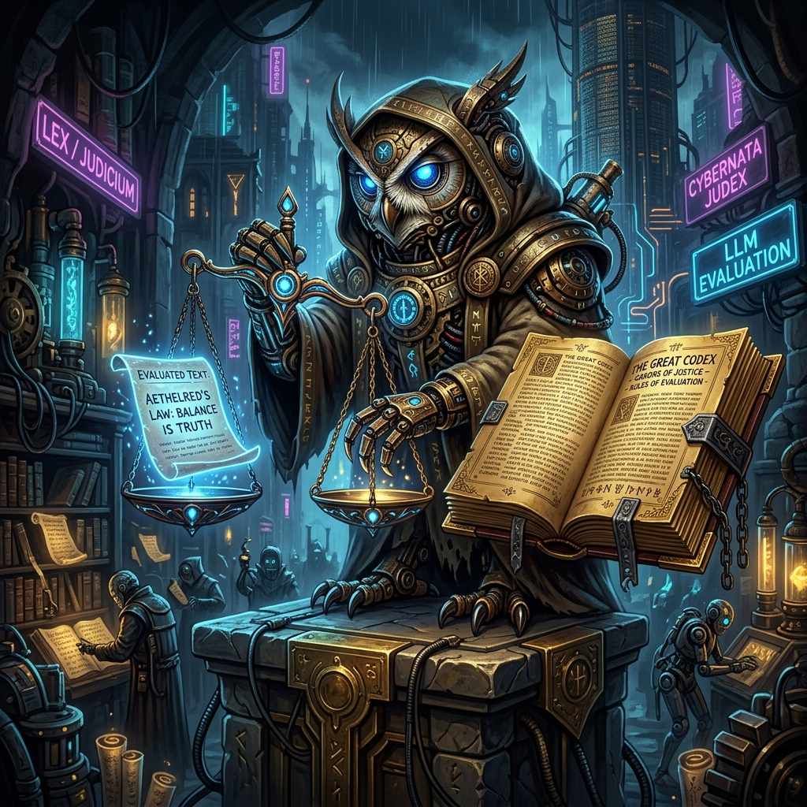
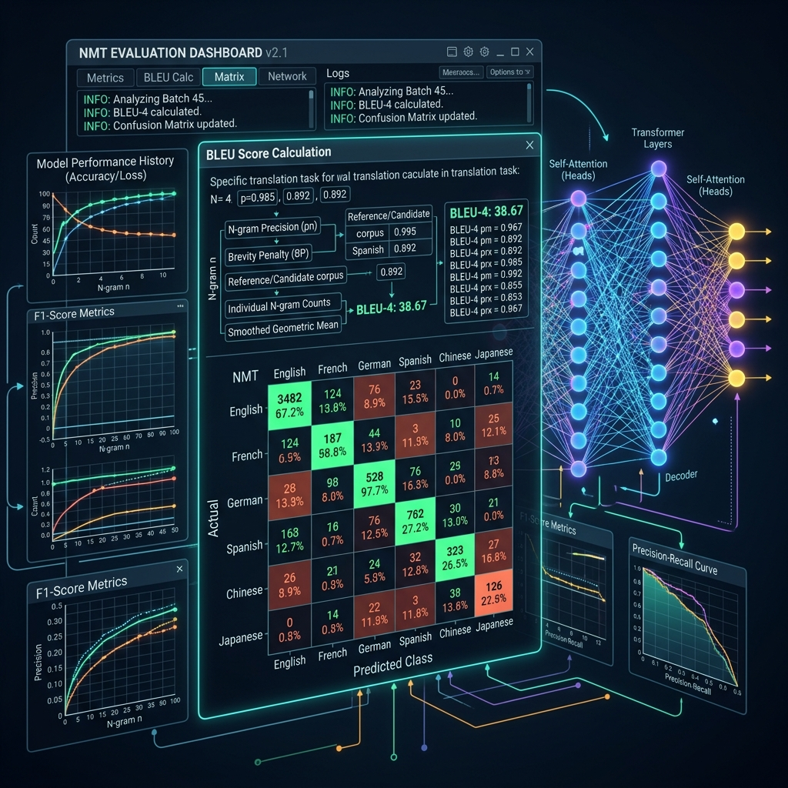

# Chapter 18: Is It Any Good?

---
[⬅️ Previous](chapter_17.md) | [🏠 Home](../README.md) | [Next ➡️](chapter_19.md)

  

## 🎯 Objective
In this chapter, we will learn how to measure the "intelligence" of a machine. We will explore the rigorous world of **Model Evaluation**, moving past "vibes" to understanding the mathematical benchmarks like **MMLU**, the logic of **LLM-as-a-Judge**, and why it is harder to grade a poet than a calculator.

---

## 💡 The Simple Explanation: The Art Teacher vs. The Math Teacher

  

If you are a Math Teacher, your job is easy. If a student says 2 + 2 = 5, they are wrong. If they say 4, they are right. There is no debate, no "feeling," and no subjectivity.

But what if you are an **Art Teacher**? 

If a student paints a sunset, how do you grade it? Some people will find it beautiful; others will find it boring. One judge might love the colors, while another hates the technique. There is no "Correct" answer key for a piece of art.

**LLMs are like the Art Student.** Because they generate creative, open-ended text, you can't just use a simple "Right/Wrong" answer key. If you ask an AI to write a story, how do you mathematically prove it is a *good* story? To solve this, AI researchers have to build a panel of "Expert Judges" (both human and machine) and create standardized "Olympic Decathlons" for the AI to compete in.

---

## 🔍 Going Deeper: The Technical Reality

  

Evaluating an LLM requires a multi-layered approach because the model is used for different things. As detailed in *Building LLMs for Production* (Louis-François Bouchard), we use three main categories of testing.

### 1. Hard Benchmarks (The Standardized Tests)
We give the model thousands of multiple-choice questions it has never seen before:
*   **MMLU (Massive Multitask Language Understanding)**: Tests general knowledge across 57 subjects (Law, Biology, History).
*   **GSM8K**: Tests grade-school math and multi-step reasoning.
*   **HumanEval**: Tests the model's ability to write functional, bug-free Python code.
The percentage score on these tests gives us a rough "IQ" for the model.

### 2. Traditional NLP Metrics (The Lexical Lap)
For translation or summarization, we used to use **BLEU** or **ROUGE** scores. 
*   **The Problem**: These metrics only check if the AI's words match a human's words exactly. If the AI uses a synonym (e.g., "Happy" vs "Glad"), these old metrics would say the AI was "Wrong." 
Because of this, these metrics are becoming less useful for modern, creative LLMs.

### 3. LLM-as-a-Judge (The Teacher)
This is the modern breakthrough. Since evaluating text is a "Reasoning" task, we use a much larger, smarter model (the "Judge") to grade a smaller model (the "Student").
*   We give the Judge a rubric: *"Score this answer from 1 to 10 based on helpfulness, formatting, and tone."*
*   Research has shown that a high-end model (like GPT-4o) actually correlates with human judges 80-90% of the time, allowing us to run thousands of tests for a fraction of the cost of hiring humans.

---

## 🎯 The "Aha!" Moment
Evaluation is the process of turning **Vibes into Data**. We stop saying "I think this model is smarter" and start saying "This model had a 15% improvement in MMLU Biology scores." Without rigorous evaluation, you aren't doing engineering—you are just guessing. **Benchmarks are the scales upon which AI progress is weighed.**

---

## 🌐 Real-World Connection

  

If you want to see who is winning the AI war, you don't look at commercials—you look at the **LMSYS Chatbot Arena**. 

This is a global "Blind Taste Test." Users are shown two different AI answers to the same question, but the names of the models are hidden. The user just picks which one they like better. This creates an **Elo Rating** system (like in Chess) for AI. Every time a new model from Google, Meta, or OpenAI is released, the "Arena" determines within a week if it is truly the new "Smartest AI on Earth" based on actual human preference.

---

## 📚 References
*   **Building LLMs for Production** (Louis-François Bouchard, 2024) - *Chapter 10: Evaluating Generative AI Systems*.
*   **LLMs in Production** (Christopher Brousseau & Matthew Sharp, 2024) - *Chapter 4: Testing and Validating LLMs*.
*   **Large Language Models: A Deep Dive** (Stephan Raaijmakers, 2024) - *Chapter 8: Metrics and Benchmarks*.
*   **LLM Engineer’s Handbook** (Paul Iusztin, 2024) - *Section on LLM-as-a-Judge and Retrieval Evals*.

---
[⬅️ Previous](chapter_17.md) | [🏠 Home](../README.md) | [Next ➡️](chapter_19.md)
