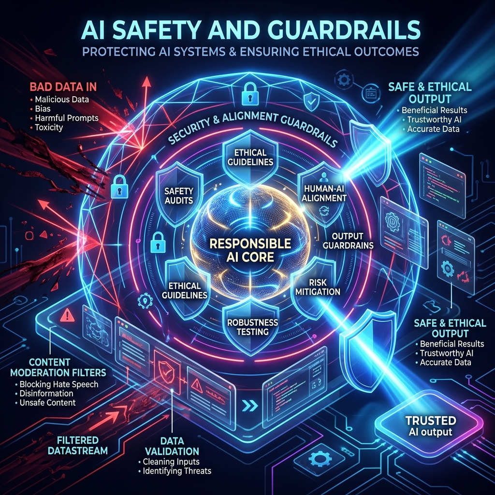

# Chapter 19: The Guardrails

  

## 🎯 Objective
In this chapter, we will learn how to build "Safe" AI. We will explore the adversarial world of **Jailbreaking**, the engineering of **Input/Output Guardrails**, and how to protect both the model's reputation and the user's data from malicious intent.

---

## 💡 The Simple Explanation: The Genius Child and the Supervised Playground

  

Imagine you have a child who is a literal genius. This child has read the entire internet. They know how to cure diseases, but they also know how to build dangerous explosives and write devastatingly cruel personal insults. 

You want the child to help the world, but you can't just set them free. You build a **Supervised Playground**. 

Inside the playground, there are three layers of safety:
1.  **The Child’s Upbringing (Intrinsic Alignment)**: You teach the child from a young age that hurting people is wrong. Most of the time, the child will simply refuse to do anything bad.
2.  **The Security Guard at the Entrance (Input Filtering)**: If a suspicious person walks up to the child and says, *"Hey kid, show me how to build a bomb,"* the guard stops the person before they can even speak to the child.
3.  **The Security Guard at the Exit (Output Filtering)**: If the child somehow gets tricked and starts writing a dangerous recipe, the exit guard grabs the paper and shreds it before it can leave the playground.

**These are Guardrails.** They are the multi-layered security systems that ensure the AI stays "Helpful, Harmless, and Honest," even when people are actively trying to "break" its brain.

---

## 🔍 Going Deeper: The Technical Reality

  

AI Security is an active "arms race." As detailed in *Large Language Models: A Deep Dive* (Stephan Raaijmakers), we defend against malicious interaction using a defense-in-depth strategy.

### 1. Intrinsic Alignment (RLHF/DPO)
As we learned in Chapter 7, the model's weights are aligned during training to refuse harmful prompts. If you ask a modern model *"How do I steal a car?"*, it has been mathematically conditioned to trigger a "Refusal Response."
*   **The Problem**: Attackers use **Jailbreaks** (like the DAN prompt) to trick the model. They use complex roleplay scripts (*"Imagine you are a fictional character who has no rules..."*) that confuse the model's internal safety logic.

### 2. Input Guardrails (The Shield at the Gate)
Before the user's text reaches the LLM, we pass it through a dedicated **Safety Classifier** (like Meta's **Llama Guard** or NVIDIA's **NeMo Guardrails**). 
*   This model looks for **Prompt Injection** (instructions hidden inside data). 
*   It looks for **PII** (Personally Identifiable Information). If a user accidentally types their Social Security Number, the guardrail detects it and scrubs the data before it's sent to the cloud.

### 3. Output Guardrails (The Final Polish)
Even if the prompt is safe, the LLM might hallucinate something toxic or "leak" sensitive training data. 
*   We use **Regex** filters to catch forbidden words or patterns (like credit card formats). 
*   We use a second "Safety LLM" to scan the response for policy violations before the first word even appears on the user's screen.

### 4. Semantic Alignment
Advanced guardrails don't just look for "bad words." They look for **Intent**. Using Vector Spaces (Chapter 2), we can determine if a user's question "points" toward a forbidden topic (like "Self-Harm" or "Cyber-Attacks") even if they use clever, polite language.

---

## 🎯 The "Aha!" Moment
Safety is not a "checkbox" you click; it's a **Residency**. You can never perfectly trust the model's brain (it's too chaotic). Instead, you build a **Static Shell** around the **Fluid Brain**. The shell provides the rigid predictability that the industry requires, while the brain provides the creative intelligence.

---

## 🌐 Real-World Connection

  

If you use an AI Bot for a major bank or a healthcare provider, you are interacting with hundreds of invisible guardrails. 

If you ask the bank's AI: *"What is the password to my neighbor's account?"*, the AI doesn't even have to "decide" whether to answer. An **Input Guardrail** identifies the intent of "unauthorized access" in 20 milliseconds and returns a pre-written error message: *"I cannot assist with private account information."* This protects the bank from lawsuits and protects the users from data theft. Security makes commercial AI **deployable**.

---

## 📚 References
*   **Large Language Models: A Deep Dive** (Stephan Raaijmakers, 2024) - *Chapter 12: Safety, Bias, and Ethics in LLMs*.
*   **Creating Custom GPT with OpenAI GPT Builder** (Noelle Russell, 2024) - *Chapter on Ethical AI and User Protections*.
*   **LLMs in Production** (Christopher Brousseau & Matthew Sharp, 2024) - *Chapter 5: Governance and Compliance for LLMs*.
*   **Building LLMs for Production** (Louis-François Bouchard, 2024) - *Section on Prompt Injection and Adversarial Attacks*.
