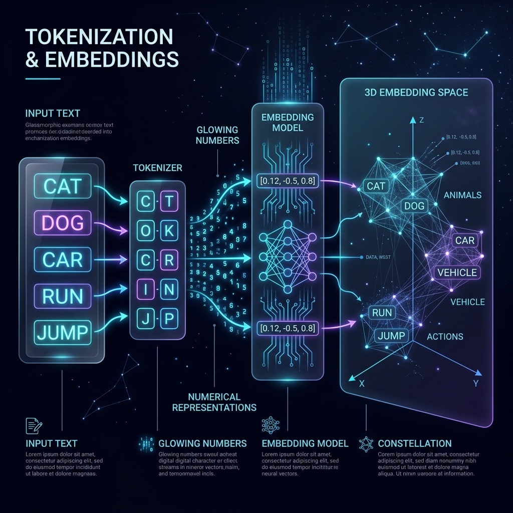
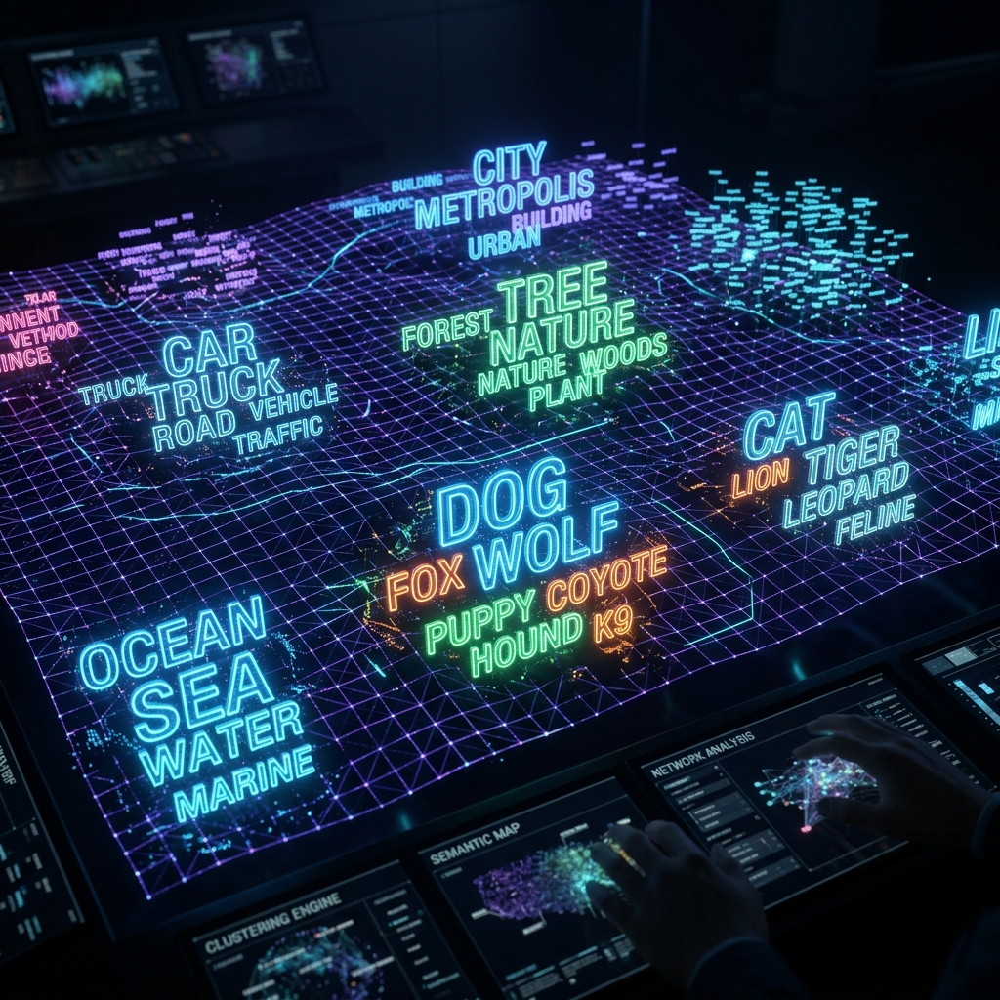
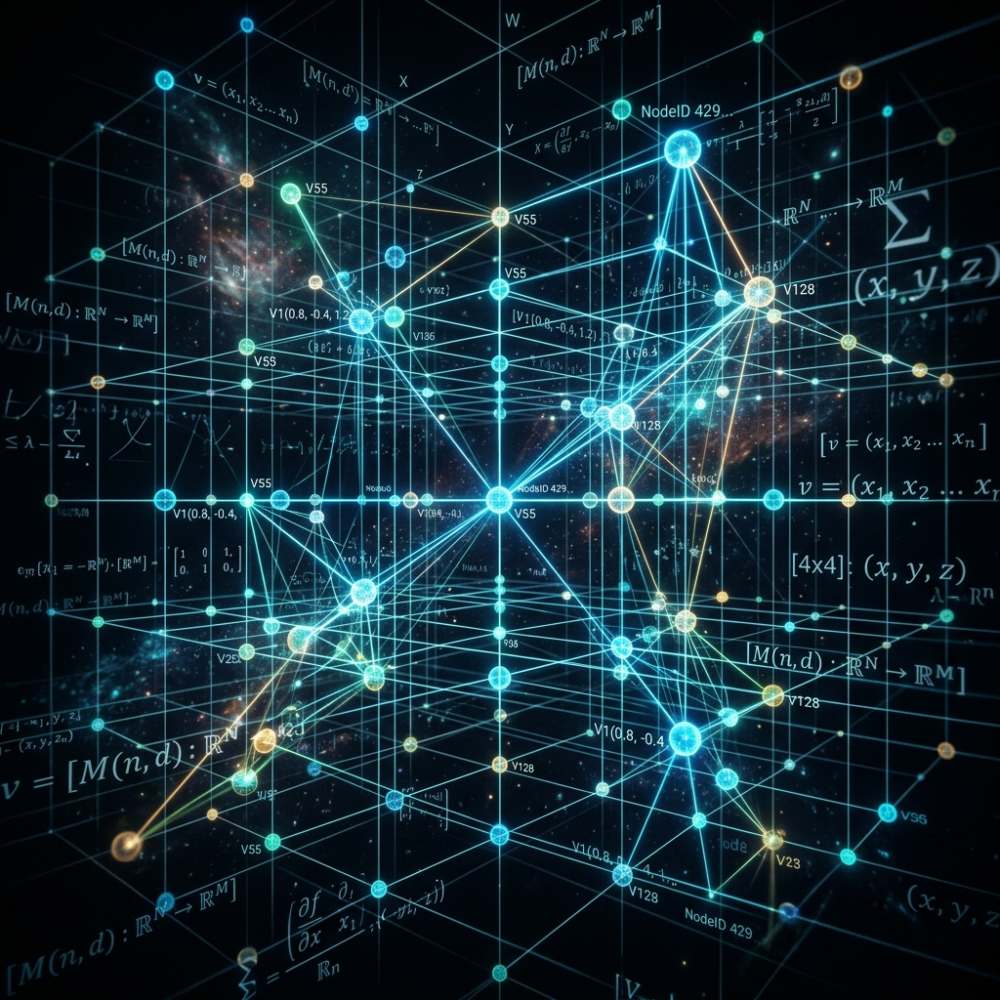

# Chapter 2: Speaking in Numbers

  

## 🎯 Objective
In this chapter, we will solve the most fundamental puzzle of AI: How does a machine that only calculates ones and zeros understand the difference between a "cat" and a "dog"? We will explore the concept of **Embeddings** and **Vector Spaces**, learning how language can be transformed into a massive, multi-dimensional geometric map.

---

## 💡 The Simple Explanation: The Infinite City Map

  

Imagine you are trying to describe a giant, invisible city to a robot that has never seen a building, a tree, or a human. If you tell the robot "I am at the bakery," it has no idea what that means. To the robot, "bakery" is just a string of letters.

To solve this, you give the robot a **GPS Map**. You assign every landmark in the city a specific set of coordinates ($X, Y$). 
*   The **Bakery** is at (10, 20).
*   The **Pastry Shop** is at (11, 21).
*   The **Hospital** is at (200, 500).

Suddenly, the robot doesn't need to know what a "bakery" is. It just looks at its map and sees that (10, 20) is very close to (11, 21). It concludes: *"These two places must be very similar."* It sees that the Hospital is miles away, so it concludes: *"The Hospital is not related to the Bakery."*

**Embeddings do this for the entire dictionary.** An LLM takes every word (token) and plots it as a point on a massive, invisible map. In this mathematical city, "happy" is parked right next to "joyful," while "refrigerator" is parked in a completely different neighborhood. By doing this, the AI has successfully turned **Meaning** into **Geography**.

---

## 🔍 Going Deeper: The Technical Reality

  

While our city map only has 2 dimensions (North/South and East/West), modern LLMs use **High-Dimensional Vector Spaces**. A model like OpenAI's `text-embedding-3-large` doesn't just use 2 numbers; it uses **3,072 dimensions** for every single word. 

### 1. The Vector Representation
Every token is represented as a **Vector**—a long list of floating-point numbers:
`Vector("dog") = [0.12, -0.45, 0.88, 0.02, ..., -0.11]`

You cannot visualize 3,000 dimensions, but you can understand what they represent. In these hidden dimensions, the model might be tracking specific "features" of a word:
*   Dimension 1: How much is this related to "Living things"?
*   Dimension 2: How much is this related to "Size"?
*   Dimension 3: How "Negative" is the sentiment?
*   Dimension 4: Is this a "Plural" object?

As clarified in *Build a Large Language Model (From Scratch)* by Sebastian Raschka, the model doesn't start with these definitions. It learns them during training by looking at which words appear in similar contexts (the **Distributional Hypothesis**).

### 2. Measuring Meaning: Cosine Similarity
If you have two vectors, how do you mathematically prove they are similar? You don't just subtract the numbers. Instead, you measure the **Angle** between the two arrows pointing from the origin of the map to the word points. 

This is called **Cosine Similarity**. 
*   If two arrows point in the exact same direction, the score is **1.0** (Perfectly identical meaning).
*   If the arrows are perpendicular (90 degrees), the score is **0** (No relationship).
*   If they point in opposite directions, the score is **-1** (Antonyms).

### 3. Vector Arithmetic: The Queen Problem
The most famous "Aha!" moment in NLP history was discovering that you can do actual math on these vectors. 
**Vector("King") - Vector("Man") + Vector("Woman") ≈ Vector("Queen")**

By subtracting the "Man-ness" from King and adding "Woman-ness," the resulting math points directly toward the coordinate for Queen. This proves that the model has captured abstract concepts like gender and royalty purely as relative distances in space.

---

## 🎯 The "Aha!" Moment
An embedding is a **Translation Layer** between the messy, subjective world of human language and the rigid, objective world of mathematics. Once every word is a vector, we stop "writing" and start performing **Matrix Calculus**. The "meaning" of a word is no longer a definition in a dictionary; it is simply its coordinates compared to everything else.

---

## 🌐 Real-World Connection

  

Have you ever searched for a movie on Netflix or a product on Amazon using words that weren't in the title, yet the website still found exactly what you wanted? 

If you search for *"movies about space explorers getting lost,"* the search engine doesn't just look for those literal words. It turns your whole sentence into a **Vector**. It then looks at its database of movie summaries (also turned into vectors) and finds the movies whose vectors are closest to yours. It will show you *"Interstellar"* or *"Gravity"* because the vectors match perfectly, even if the word "explorer" never appears in the title. This is called **Semantic Search**.

---

## 📚 References
*   **Hands-On Large Language Models** (Alammar & Grootendorst, 2024) - *Chapter 3: Tokens and Embeddings*.
*   **Build a Large Language Model (From Scratch)** (Sebastian Raschka, 2024) - *Chapter 2: Working with Text Data*.
*   **Large Language Models: A Deep Dive** (Stephan Raaijmakers, 2024) - *Chapter 2: Word Embeddings*.
*   **LLM Engineer’s Handbook** (Paul Iusztin, 2024 - *Section on Vector Databases and Ingestion*.
