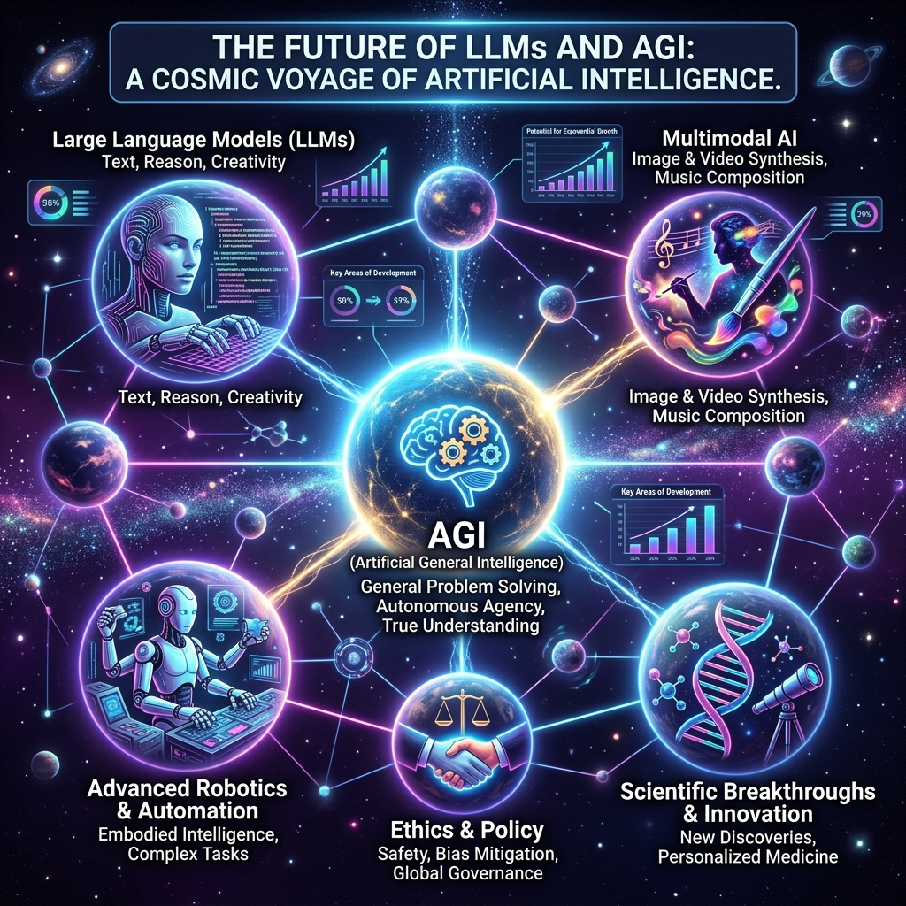
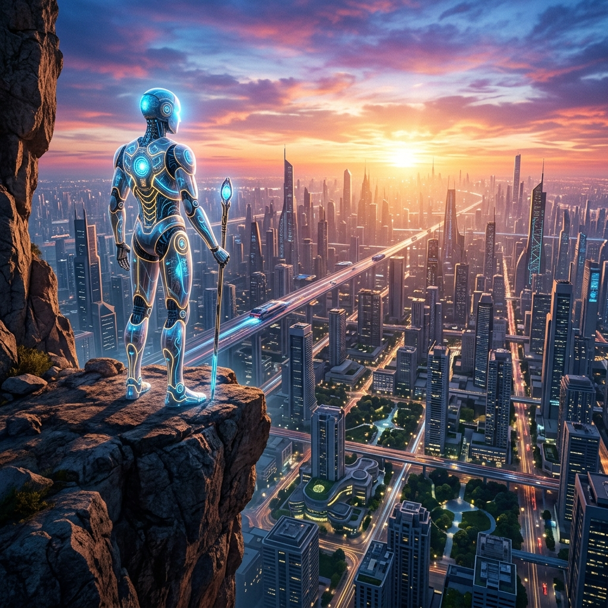
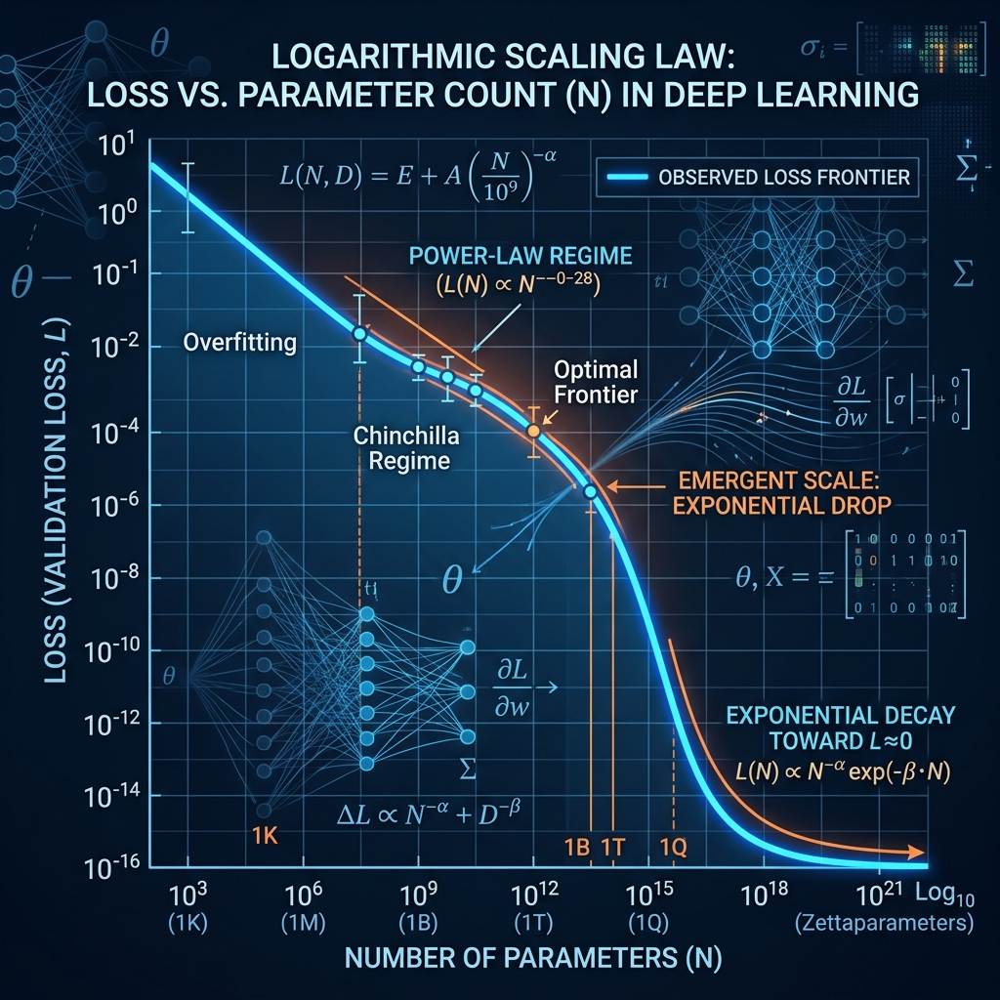
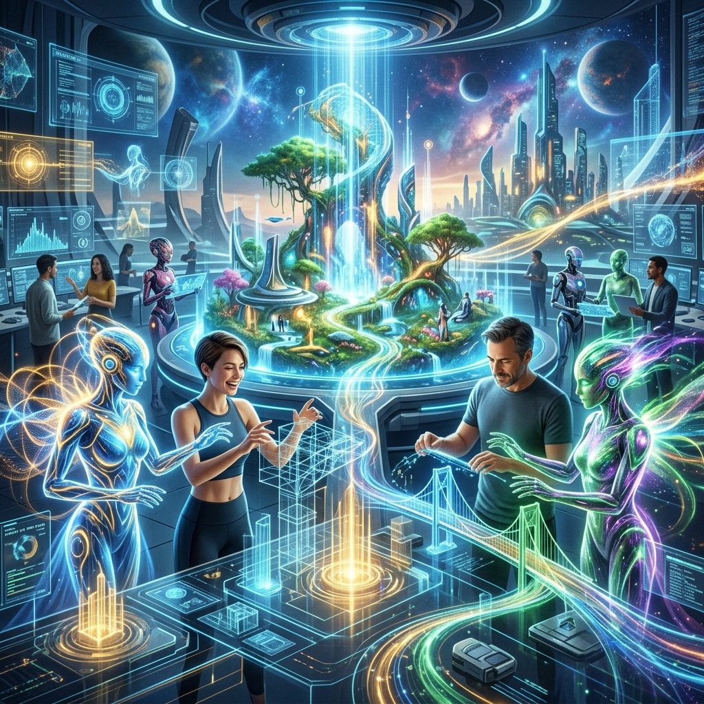

# Chapter 20: What's Next?

---
[⬅️ Previous](chapter_19.md) | [🏠 Home](../README.md)

  

## 🎯 Objective
In our final chapter, we will peer over the horizon. We have mastered the present of LLMs—token prediction, RAG, and Agents. Now, we will explore the three tectonic shifts that will define the next decade of humanity: **Native Multimodality**, **System 2 Reasoning**, and the final quest for **AGI (Artificial General Intelligence)**.

---

## 💡 The Simple Explanation: The Bird Escaping the Cage

  

Up until now, our AI has been like a brilliant bird locked inside a **Text-Only Cage**. It has read every book about the ocean, but it has never seen a wave. It can describe a sunset in five languages, but it doesn't know the feeling of light on its feathers. It is a "Symbol-Processor," not a "Universe-Understander."

The future of AI is about **Escaping the Cage.** 

1.  **Sight and Sound**: We are teaching the bird to actually see and hear, mapping pixels and audio waves directly into its brain so it understands "Red" as a color, not just a word.
2.  **Patience (Reasoning)**: We are teaching the bird that it doesn't always have to chirp immediately. It can stop, think, and try different melodies in its head before singing the perfect one.
3.  **Hands (Robotics)**: We are giving the bird a robotic body so it can move beyond the screen and actually build things in our physical world.

When these three things combine, the AI stops being a "Chatbot" and starts being a **Synthetic Life Form** that can assist humanity in ways we can barely imagine.

---

## 🔍 Going Deeper: The Technical Reality

  

The cutting edge of AI research (2024–2030) is converging on three technical frontiers:

### 1. Unified Multimodality
In the past, to make an AI "see," we would use a separate model (a CNN) and then translate the image into text for the LLM. 
*   **The Future**: **Native Multimodality**. Models are being pretrained from Day 1 on interleaved text, images, and audio. By mapping pixels into the exact same **Vector Space** (Chapter 2) as words, the model "knows" that the pixel-pattern of a cat is mathematically identical to the word "cat." This creates a "Grounding" that text-only models lack.

### 2. Test-Time Compute (System 2 Reasoning)
As we learned in Chapter 9, models are limited by their immediate forward pass. 
*   **The Future**: Instead of just doing CoT, models are being trained with **Reinforcement Learning** to intentionally spend "Thinking Time" (Test-Time Compute). A model might generate 10,000 internal reasoning tokens, run code simulations, and check its own work for 30 seconds before ever outputting a single word to the user. This allows AI to solve PhD-level STEM problems.

### 3. Embodied AI (The Robotic Mind)
We are moving beyond "Screens." 
*   **Vision-Language-Action (VLA) Models**: Researchers are training models where the "Tokens" aren't just words, but **Motor Actions**. The model takes a camera feed as input and outputs the exact torque values for a robotic arm's joints. This is the "Brain" for the humanoids of the future.

---

## 🎯 The "Aha!" Moment
We have reached the end of the "Information Era" and entered the **"Intelligence Era."** For the last 50 years, computers were tools we used to store and move information. In the next 50 years, computers will be **Co-Thinkers**. We have taught machines not just to *store* what we know, but to *apply* what we know to new problems in real-time.

---

## 🌐 Real-World Connection

  

The finish line of this entire project is **AGI (Artificial General Intelligence)**. 

Imagine a world where you don't "use" an app to book a flight, or "use" an app to learn a language. Instead, you have a personal agent that knows your voice, remembers your history (Chapter 13), and can see what you see through your glasses. It manages your schedule, researches your projects, and even coordinates with robotic delivery vans to ensure your groceries arrive. 

You have just completed the LLM Mastery Course. You now understand the plumbing, the math, and the logic of the most powerful technology in human history. The "Magic" is gone—now, only the **Engineering** remains. The future is yours to build.

---

## 📚 References
*   **Large Language Models: A Deep Dive** (Stephan Raaijmakers, 2024) - *Conclusion: The Trajectory Toward AGI*.
*   **LLMs in Production** (Christopher Brousseau & Matthew Sharp, 2024) - *Chapter 7: The Future of Generative AI in Enterprise*.
*   **Hands-On Large Language Models** (Jay Alammar, 2024) - *Chapter 12: Multimodality and Native Vision*.
*   **LLM Engineer’s Handbook** (Paul Iusztin, 2024) - *Afterword: Scaling Laws and the Final Frontier*.

---
[⬅️ Previous](chapter_19.md) | [🏠 Home](../README.md)
