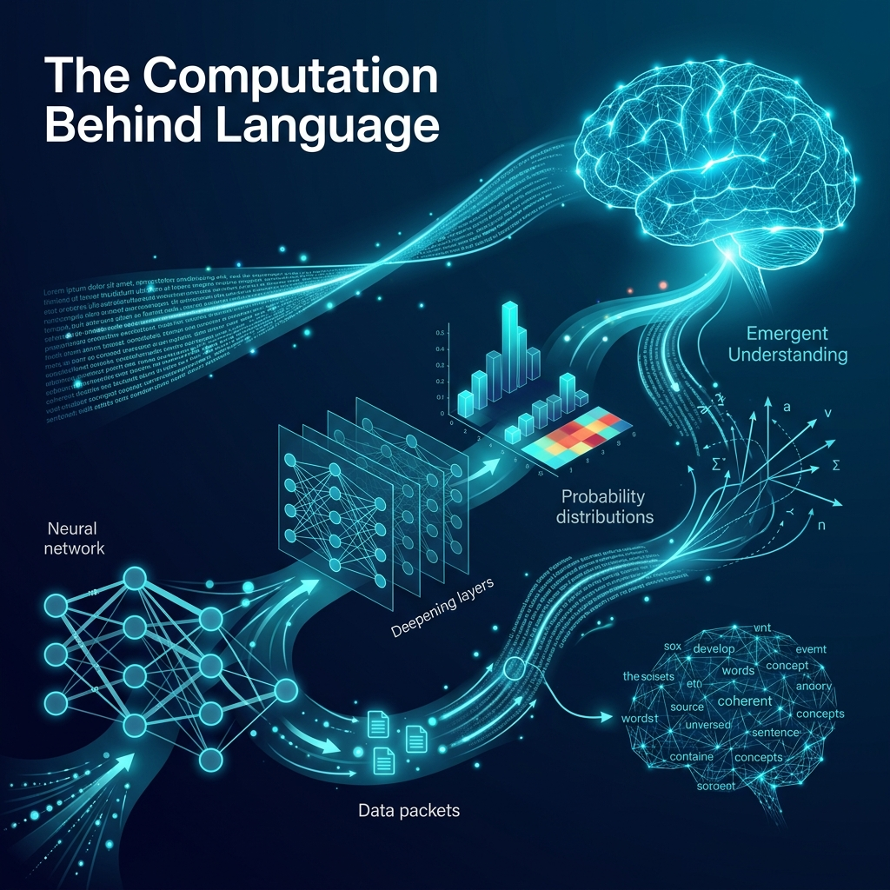
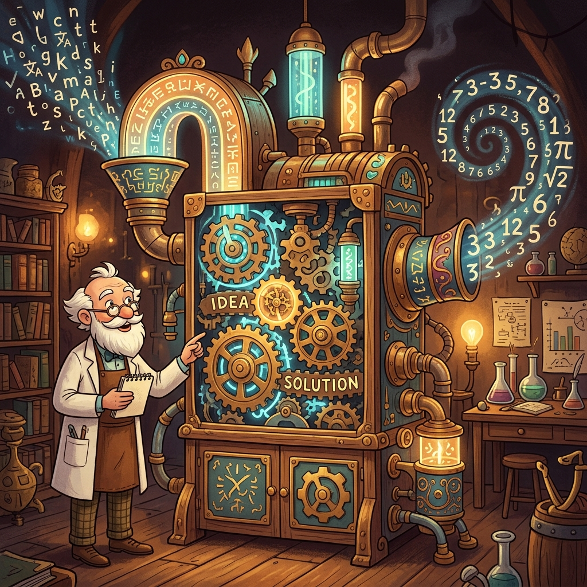
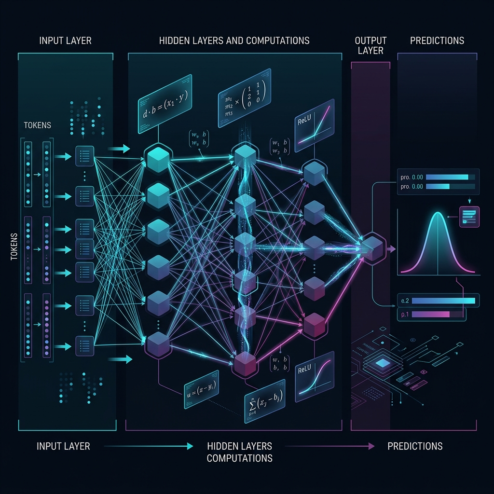

# Chapter 21: The Computation Behind Language

---
[⬅️ Previous](chapter_20.md) | [🏠 Home](../README.md) | [Next ➡️](chapter_22.md)

  

## 🎯 Objective
In this chapter, we will strip away the buzzwords and ask a deceptively simple question: **Why does a pile of matrix multiplications produce coherent English sentences?** We will explore the computational foundations of neural networks—from the humble perceptron to the emergent intelligence of billion-parameter models—using insights from Stephen Wolfram's first-principles analysis and Andriy Burkov's concise mathematical framework.

---

## 💡 The Simple Explanation: The Word-to-Number Factory

  

Imagine you walk into a gigantic, mysterious factory. On one end, there is a conveyor belt where you place **words**—any sentence you like. The words roll into the factory and disappear behind massive iron doors.

Inside the factory, there are no librarians, no dictionaries, and no grammar teachers. There are only **millions of tiny, identical machines**. Each machine does the simplest possible job: it takes a number, multiplies it by another number (its "weight"), and passes the result to the next machine. That's it. Multiply and pass.

Here's the miracle: even though no single machine "understands" language, when you connect millions of them together in layers (like floors of a skyscraper), the factory's **output conveyor belt** produces perfectly fluent, grammatically correct, contextually appropriate text.

As Stephen Wolfram explains in *What Is ChatGPT Doing ... And Why Does It Work*, the key insight is that **language itself has hidden mathematical structure**. Human sentences aren't random—they follow deep statistical patterns. The factory doesn't need to "understand" grammar; it just needs to be large enough to capture the statistical regularities that grammar creates. The "intelligence" you see is not programmed—it **emerges** from scale.

---

## 🔍 Going Deeper: The Technical Reality

  

To understand why computation produces language, we need to examine three foundational concepts that underpin every LLM.

### 1. The Perceptron: The Atom of Intelligence
As detailed in *The Hundred-Page Language Models Book* (Andriy Burkov), every neural network is built from a single, mathematically trivial unit: the **Perceptron**.

A perceptron takes a set of inputs ($x_1, x_2, ..., x_n$), multiplies each by a learned weight ($w_1, w_2, ..., w_n$), sums them up, adds a **Bias** term ($b$), and passes the result through a non-linear **Activation Function** (like ReLU or Sigmoid):

$\text{output} = \sigma(w_1 x_1 + w_2 x_2 + ... + w_n x_n + b)$

This is literally the entire computation. A single perceptron can only draw a straight line to separate two categories. But when you **stack millions of them** into layers, something remarkable happens.

### 2. The Universal Approximation Theorem
As Wolfram emphasizes, a neural network with enough neurons in a single hidden layer can approximate **any mathematical function** to arbitrary precision. This is the theoretical foundation of why neural networks work at all.

For language, this means: if there exists *any* mathematical function that maps "input text" to "correct next word" (and there does, because human language follows patterns), then a sufficiently large neural network **will find it**. The model doesn't need explicit rules for grammar, vocabulary, or context—it discovers them as side effects of minimizing its prediction error.

### 3. The Computational Irreducibility Problem
Wolfram introduces a crucial concept: **Computational Irreducibility**. Some systems are so complex that there is no shortcut to predicting their behavior—you must run the computation itself. 

LLMs live at the edge of this boundary. We can describe what they do mathematically (matrix multiplications → softmax → sampling), but we **cannot predict** what a 70-billion-parameter model will say to a novel prompt without actually running it. This is why LLMs constantly surprise us—their behavior is emergent, not designed.

### 4. From Parameters to Knowledge
The *Super Study Guide: Transformers & LLMs* (Amidi & Amidi) provides a clean summary: a model's "knowledge" is encoded entirely in its **Weight Matrices**. When we say GPT-4 has 1.8 trillion parameters, we mean it has 1.8 trillion individually-tuned multiplication factors. Each one is a tiny knob that was adjusted during training to make the model's predictions slightly more accurate. The collective state of all these knobs *is* the model's understanding of human language.

---

## 🎯 The "Aha!" Moment
An LLM doesn't contain a single line of code that says "use correct grammar" or "know that Paris is the capital of France." It contains only billions of numbers. The grammar, the facts, and the apparent reasoning all **emerge** from the simple math of weighted addition, non-linear squashing, and iterative error correction. Intelligence, in this paradigm, is not a program—it is a **pattern** that forms when computation reaches sufficient scale.

---

## 🌐 Real-World Connection

  

Stephen Wolfram's own product, **Wolfram Alpha**, represents the opposite philosophy: hand-coded mathematical knowledge curated by human experts over decades. When Wolfram studied ChatGPT, he was stunned that a purely statistical system could match (and in some cases surpass) his curated knowledge engine on general questions.

The real-world lesson is profound: **Brute-force pattern matching at sufficient scale can replicate the appearance of structured reasoning.** This is why companies like Google pivoted their entire search strategy. Instead of hand-engineering ranking algorithms (like Wolfram Alpha hand-engineers math), they now let massive neural networks learn the "ranking function" directly from billions of examples. The computation *is* the intelligence.

---

## 📚 References
*   **What Is ChatGPT Doing ... And Why Does It Work** (Stephen Wolfram, 2023) - *Chapter: Neural Networks and the Nature of Computation*.
*   **The Hundred-Page Language Models Book** (Andriy Burkov, 2024) - *Chapter 1: Foundations of Neural Language Models*.
*   **Super Study Guide: Transformers & Large Language Models** (Afshine & Shervine Amidi, 2024) - *Section: Neural Network Building Blocks*.
*   **Build a Large Language Model (From Scratch)** (Sebastian Raschka, 2024) - *Chapter 1: Understanding LLM Architecture*.

---
[⬅️ Previous](chapter_20.md) | [🏠 Home](../README.md) | [Next ➡️](chapter_22.md)
