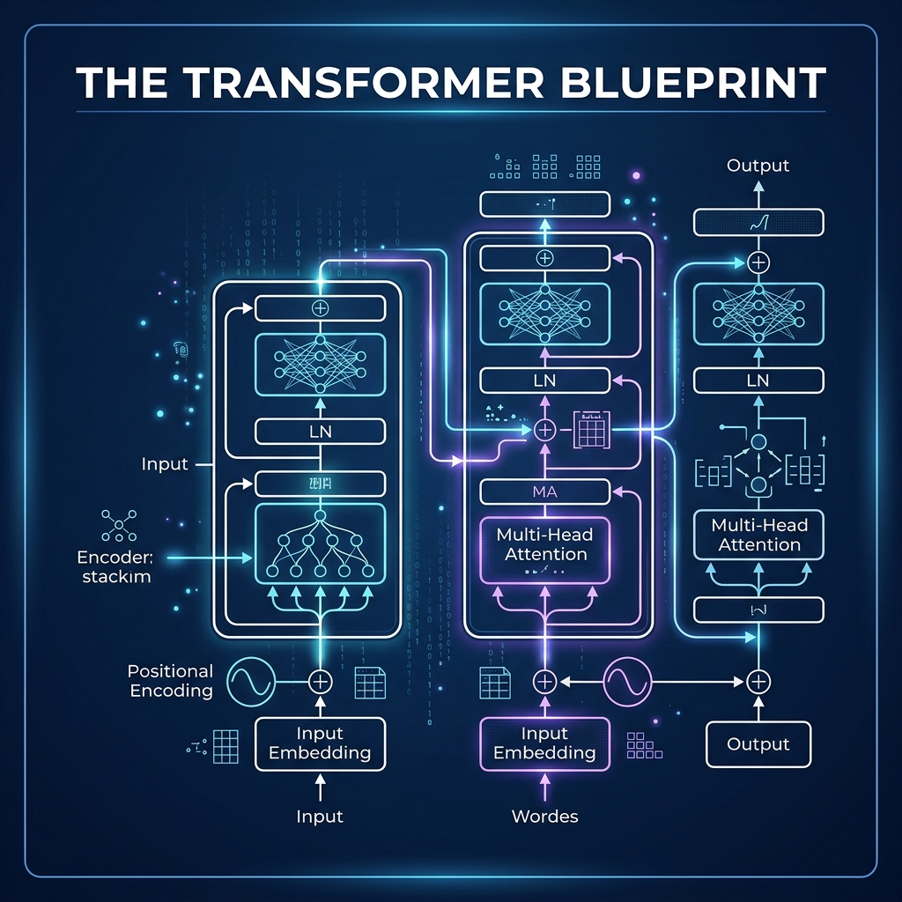
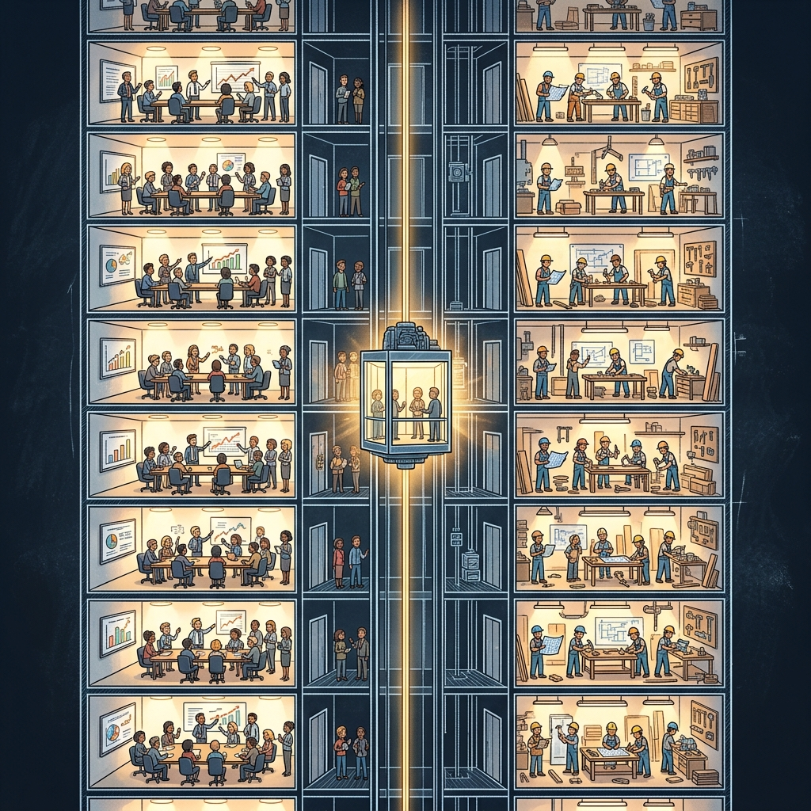
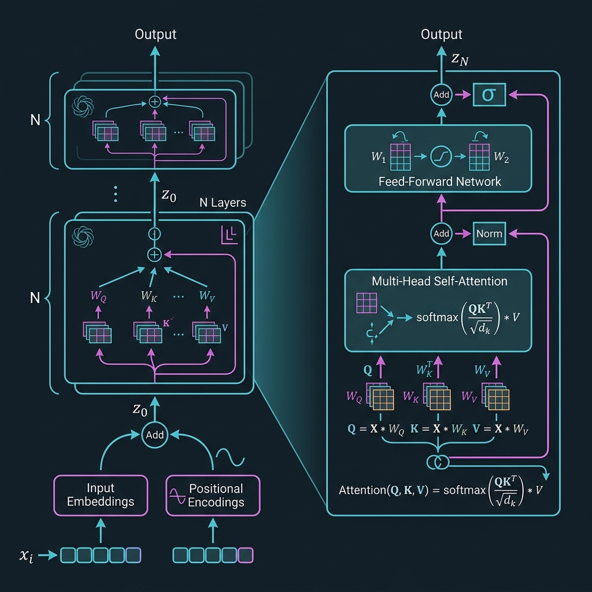

# Chapter 22: The Transformer Blueprint

---
[⬅️ Previous](chapter_21.md) | [🏠 Home](../README.md) | [Next ➡️](chapter_23.md)

  

## 🎯 Objective
In this chapter, we will perform a **complete architectural autopsy** of the Transformer model. While Chapter 3 introduced Self-Attention and Chapter 4 gave us the high-level view, here we will dissect every mathematical component—**Positional Encoding, Layer Normalization, the Feed-Forward Network, Residual Connections, and the Causal Mask**—using the rigorous reference framework from the Amidi twins' *Super Study Guide* and Burkov's *Hundred-Page Language Models Book*.

---

## 💡 The Simple Explanation: The Identical-Floor Skyscraper

  

Imagine you are the architect of a very special skyscraper. This building has exactly **96 identical floors** (one for each Transformer layer in a large model). Every single floor has the exact same layout:

1.  **The Conference Room (Self-Attention)**: On the left side of every floor, there is a conference room. All the "word-workers" sit around a table and discuss: *"Who among us is most relevant to each other right now?"* They vote, weigh each other's importance, and produce a refined summary of the sentence. (This is the QKV mechanism from Chapter 3.)

2.  **The Workshop (Feed-Forward Network)**: On the right side of every floor is a workshop. Each word-worker goes into a private booth, takes the refined summary from the conference, and processes it through their own personal set of tools—expanding it, transforming it, and compressing it back down. This is where the model does its "thinking."

3.  **The Express Elevator (Residual Connection)**: Here's a crucial detail—there's an express elevator shaft running from the ground floor to the roof. On every floor, a copy of the **original input** is sent directly up the shaft and **added** to the output of that floor's conference room and workshop. This prevents the "message" from getting garbled as it travels up 96 floors.

4.  **The Quality Inspector (Layer Normalization)**: After each room, a quality inspector standardizes all the numbers so they don't grow explosively large or shrink to near-zero. This keeps the building structurally sound.

**The genius of the Transformer is its simplicity.** The same two-room floor plan is repeated 96 times. The model's "intelligence" doesn't come from complex, unique architecture—it comes from **depth and repetition**.

---

## 🔍 Going Deeper: The Technical Reality

  

The *Super Study Guide: Transformers & Large Language Models* (Amidi & Amidi) provides a definitive mathematical reference for every component. Let's walk through the complete data flow.

### 1. Input Processing: Embeddings + Positional Encoding
As established in Chapter 2, tokens are mapped to vectors. But the Transformer processes all tokens **in parallel**, so it has no inherent notion of word order. To solve this, we add a **Positional Encoding** vector to each token's embedding.

The original paper uses sinusoidal functions:
*   $PE_{(pos, 2i)} = \sin(pos / 10000^{2i/d_{model}})$
*   $PE_{(pos, 2i+1)} = \cos(pos / 10000^{2i/d_{model}})$

As Burkov explains in *The Hundred-Page Language Models Book*, this encoding scheme has an elegant property: the model can learn to attend to **relative positions** because the difference between any two positional encodings is a fixed linear transformation. Modern models (like Llama) have replaced this with **Rotary Position Embeddings (RoPE)**, which encode position directly into the attention calculation.

### 2. The Attention Block (Revisited with Math)
The Amidi twins provide the precise formula for **Scaled Dot-Product Attention**:

$$\text{Attention}(Q, K, V) = \text{softmax}\left(\frac{QK^T}{\sqrt{d_k}}\right) V$$

The scaling factor $\sqrt{d_k}$ is critical. Without it, for large dimensions, the dot products grow so large that the Softmax function saturates (outputs near 0 or 1), creating vanishing gradients during training. This seemingly small detail was essential to making Transformers trainable.

### 3. The Causal Mask (Decoder-Only Models)
In **Generative** models (GPT, Llama, Claude), the model must not "cheat" by looking at future tokens. We apply a **Causal Mask**: a triangular matrix of $-\infty$ values that, when added to the attention scores before Softmax, forces all future-looking attention weights to zero. This ensures the model can only attend to tokens it has *already* generated.

### 4. The Feed-Forward Network (FFN)
After attention, each token passes independently through a two-layer neural network:

$$\text{FFN}(x) = \text{GELU}(xW_1 + b_1)W_2 + b_2$$

The FFN first **expands** the representation (typically by 4x: from 4096 to 16384 dimensions), applies a non-linear activation (GELU), and then **compresses** it back. As Raschka notes, this is where the model stores its "factual knowledge"—recent research shows that specific neurons in the FFN activate for specific concepts (like "Paris" or "capital of").

### 5. Layer Normalization and Residual Connections
The **Residual Connection** ($\text{output} = x + \text{SubLayer}(x)$) solves the **Vanishing Gradient Problem**: in very deep networks, gradients shrink to near-zero during backpropagation. The residual path provides a "gradient highway" that allows the error signal to flow unimpeded from the 96th layer all the way back to the 1st layer.

**Layer Normalization** normalizes activations across the feature dimension, ensuring stable training. Modern models use **RMSNorm** (Root Mean Square Normalization) instead of the original LayerNorm for computational efficiency.

---

## 🎯 The "Aha!" Moment
The Transformer's power comes not from any single brilliant component, but from a **synergistic stack** of simple, well-understood operations. Attention finds relationships. FFN stores knowledge. Residuals preserve information. Normalization ensures stability. When repeated 96 times, this simple recipe creates a system that appears to "understand" language—but in reality, it is just running the same mathematical assembly line on every floor of the skyscraper.

---

## 🌐 Real-World Connection

  

The evolution from GPT-1 (2018, 117M parameters, 12 layers) to GPT-4 (2023, ~1.8T parameters, ~120 layers) was achieved almost entirely by **scaling** this same architecture. The fundamental blueprint—attention + FFN + residual + norm—has barely changed since 2017. The Transformer is the "Intel x86 of AI": a dominant architecture that every major lab (OpenAI, Google, Meta, Anthropic) builds upon. Understanding this blueprint means understanding the foundation of every major LLM in existence.

---

## 📚 References
*   **Super Study Guide: Transformers & Large Language Models** (Afshine & Shervine Amidi, 2024) - *Section: Complete Transformer Architecture Reference*.
*   **The Hundred-Page Language Models Book** (Andriy Burkov, 2024) - *Chapter 2: The Transformer Architecture*.
*   **Build a Large Language Model (From Scratch)** (Sebastian Raschka, 2024) - *Chapter 3: Coding Attention Mechanisms* and *Chapter 4: Implementing a GPT Model*.
*   **What Is ChatGPT Doing ... And Why Does It Work** (Stephen Wolfram, 2023) - *Section: Inside the Neural Net of ChatGPT*.

---
[⬅️ Previous](chapter_21.md) | [🏠 Home](../README.md) | [Next ➡️](chapter_23.md)
