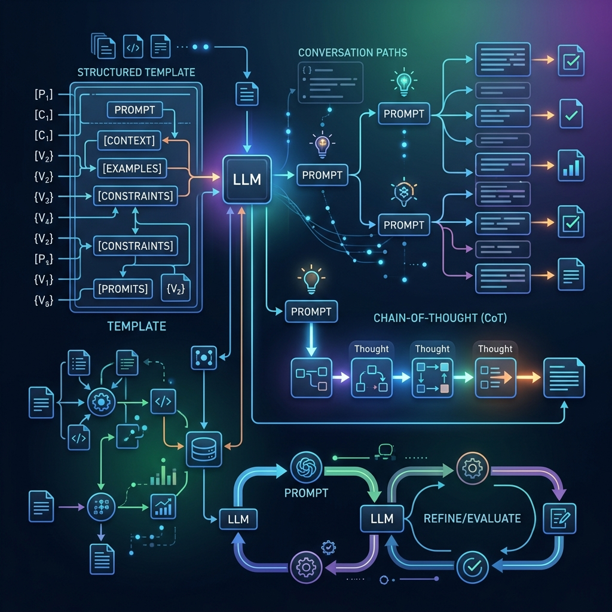
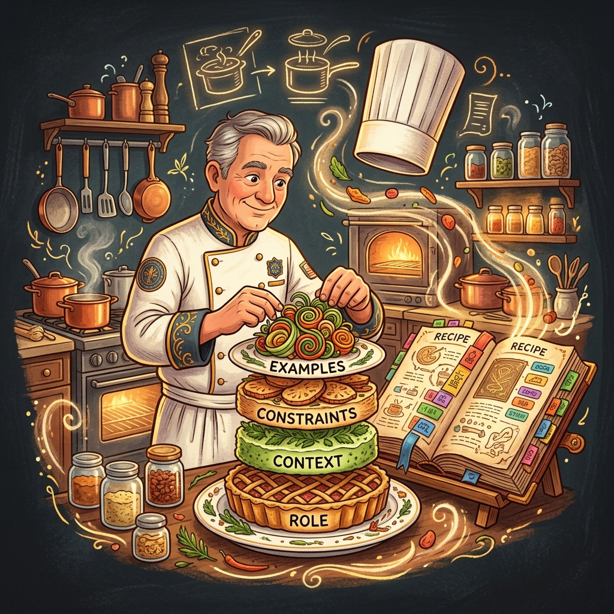
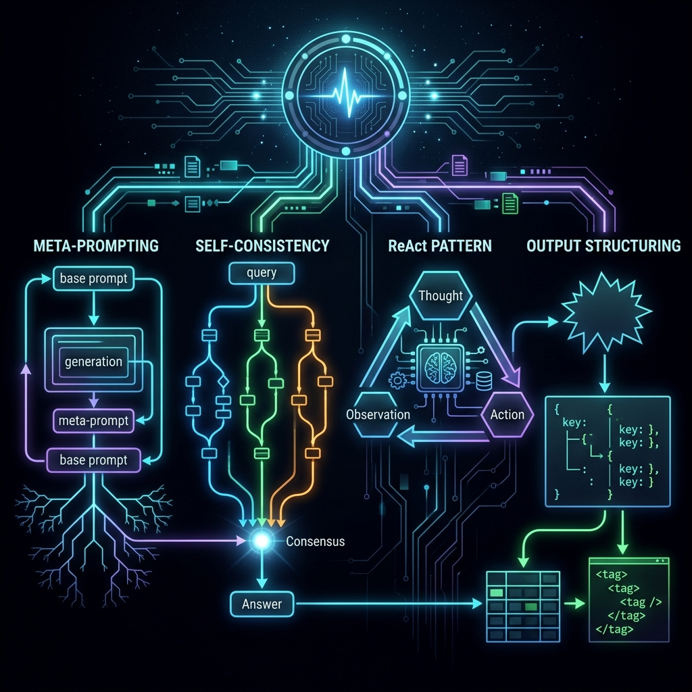

# Chapter 23: Advanced Prompt Patterns

---
[⬅️ Previous](chapter_22.md) | [🏠 Home](../README.md) | [Next ➡️](chapter_24.md)

  

## 🎯 Objective
Chapter 8 introduced prompt engineering as "The Art of Asking." In this chapter, we go from art to **science**. We will master the advanced prompting patterns catalogued in *Prompt Engineering for Generative AI* (Phoenix & Taylor) and *Prompt Engineering for LLMs* (Berryman & Ziegler)—including **Meta-Prompting**, **Directional Stimulus Prompting**, **Self-Consistency**, and **Prompt Chaining**—that separate weekend hobbyists from production-grade AI engineers.

---

## 💡 The Simple Explanation: The Master Chef's Recipe Book

  

In Chapter 8, we learned how to talk to the Genie. But giving the Genie a single, one-shot instruction is like a master chef who only knows one recipe. A **true** master chef has a thick, tabbed recipe book filled with dozens of specialized techniques for different situations.

Imagine that recipe book:
*   **Tab 1: The Layered Cake Technique** — You don't just say "make a cake." You build it in layers: first the base flavor (Role), then the filling (Context), then the frosting (Constraints), then the decoration (Examples). Each layer precisely controls the outcome.
*   **Tab 2: The Taste-Test Technique** — Instead of making one dish and hoping it's good, you make **five versions** of the same dish using slightly different techniques, then pick the one that tastes best across all five. This is "Self-Consistency."
*   **Tab 3: The Recipe-That-Writes-Recipes** — The most powerful technique: you don't write the recipe yourself. You ask the chef to *design the perfect recipe* for a dish you describe. The chef's expertise writes a recipe better than anything you could have created. This is "Meta-Prompting."

**Advanced prompt patterns are not about writing better sentences. They are about building repeatable, testable engineering frameworks** that treat the LLM as a programmable component.

---

## 🔍 Going Deeper: The Technical Reality

  

The two dedicated prompt engineering textbooks provide a rich taxonomy of patterns. Here are the most impactful ones for production systems.

### 1. Meta-Prompting: The Prompt That Writes Prompts
As detailed in *Prompt Engineering for Generative AI* (Phoenix & Taylor), instead of hand-crafting a prompt, you ask the LLM to generate the optimal prompt for a given task:

*"I need to classify customer emails into Billing, Technical, and General categories. Write me the most effective system prompt for an LLM to do this classification reliably."*

The LLM's output is then used as the actual system prompt. This leverages the model's understanding of its own strengths and weaknesses. The technique often produces prompts that outperform human-engineered ones.

### 2. Directional Stimulus Prompting (DSP)
This technique, highlighted by Berryman & Ziegler in *Prompt Engineering for LLMs*, involves inserting **"hint keywords"** that steer the model toward a specific reasoning direction without giving the full answer:

*"Classify the sentiment of this review. Keywords to consider: sarcasm, backhanded compliment, context reversal."*

By embedding these directional stimuli, the model is primed to notice subtle patterns (like sarcasm) that it might otherwise miss in a neutral prompt.

### 3. Self-Consistency Sampling
First introduced in Chapter 9 as a brief mention, this deserves full treatment. As Phoenix & Taylor elaborate:
1.  You send the same prompt to the LLM **N times** (e.g., 5 times) with a high Temperature (0.7+).
2.  Each run produces a slightly different reasoning path and answer.
3.  You take the **majority vote** across all N answers.

This dramatically improves accuracy on math, logic, and factual questions—because random errors in different runs cancel each other out, while the correct answer is consistently reinforced.

### 4. Prompt Chaining: The Assembly Line
Instead of one massive prompt, you break the task into a **pipeline** of smaller, focused prompts:

*   **Prompt 1**: *"Extract all factual claims from this article."* → Output: List of claims
*   **Prompt 2**: *"For each claim, search the database and determine if it is True, False, or Unverifiable."* → Output: Verified claims
*   **Prompt 3**: *"Write a summary of the article, noting which claims are verified and which are disputed."* → Output: Final report

Each prompt does one thing well. The chain is debuggable—if Step 2 fails, you only fix Step 2, not the entire monolithic prompt.

### 5. The CO-STAR Framework
Berryman & Ziegler formalize prompt structure using the **CO-STAR** framework:
*   **C**ontext: Background information
*   **O**bjective: The specific task
*   **S**tyle: The writing style or persona
*   **T**one: The emotional register
*   **A**udience: Who the output is for
*   **R**esponse format: The desired output structure (JSON, markdown, bullet points)

This framework ensures that no critical dimension is left unspecified—the #1 cause of "bad" AI output.

---

## 🎯 The "Aha!" Moment
A prompt is not a sentence—it is a **program** written in natural language. Advanced prompt engineering is software engineering: you have design patterns (Meta-Prompting, CO-STAR), you have testing methodologies (Self-Consistency), you have modular architecture (Prompt Chaining), and you have debugging workflows. The engineers who treat prompts with the same rigor as code are the ones building production-grade AI systems.

---

## 🌐 Real-World Connection

  

When you use **GitHub Copilot** to write code, you are witnessing advanced prompt engineering at scale. Behind the scenes, the system constructs a massive, dynamically-assembled prompt that includes your open file, your recent edits, your project's file structure, and relevant code from other files—all carefully formatted using prompt chaining patterns. The "magic" of Copilot completing your function perfectly is not just a smart model—it's a **brilliantly engineered prompt pipeline** that feeds the model exactly the right context at exactly the right time.

---

## 📚 References
*   **Prompt Engineering for Generative AI** (James Phoenix & Mike Taylor, 2024) - *Chapter 3: Advanced Prompting Strategies* and *Chapter 5: Meta-Prompting*.
*   **Prompt Engineering for LLMs** (John Berryman & Albert Ziegler, 2024) - *Chapter 4: The CO-STAR Framework* and *Chapter 7: Directional Stimulus Prompting*.
*   **Google Prompt Engineering** (Lee Boonstra, 2024) - *Chapter 3: Few-Shot and Chain-of-Thought Patterns*.
*   **Building LLMs for Production** (Louis-François Bouchard, 2024) - *Section on Prompt Optimization and Testing*.

---
[⬅️ Previous](chapter_22.md) | [🏠 Home](../README.md) | [Next ➡️](chapter_24.md)
