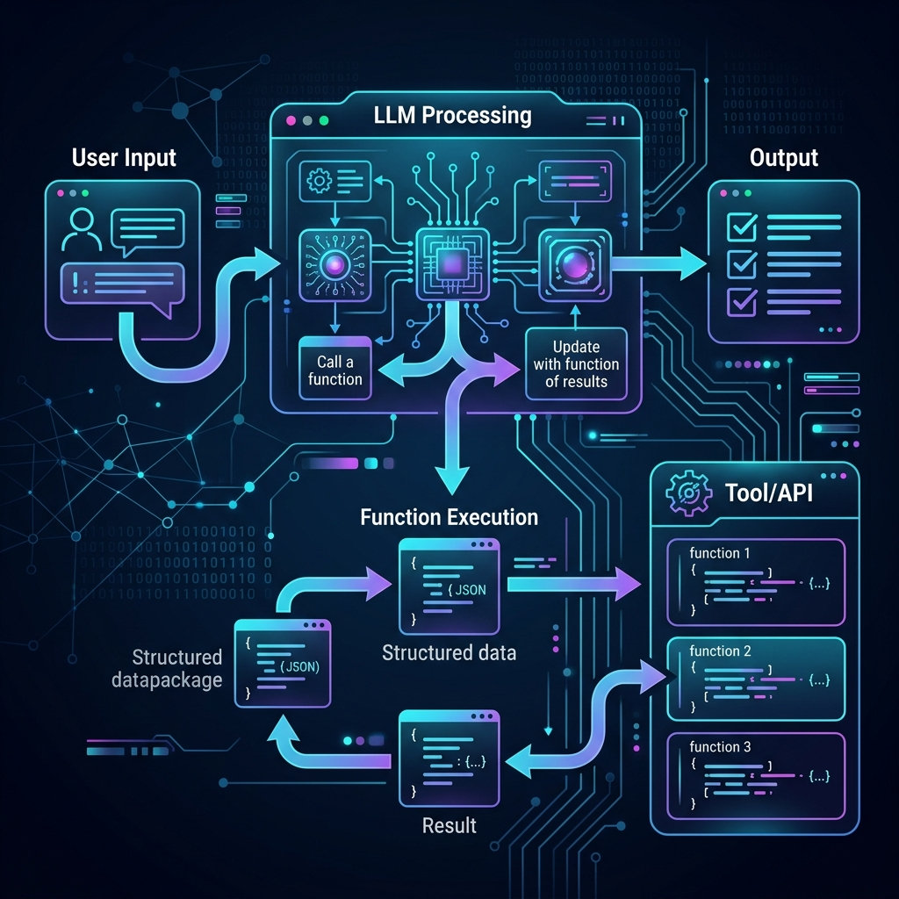

# Chapter 24: Structured Outputs & Function Calling


---
[⬅️ Previous](chapter_23.md) | [🏠 Home](../README.md) | [Next ➡️](chapter_25.md)


<p align="center">
  
</p>

## 🎯 Objective
LLMs produce free-text. Software systems consume structured data. In this chapter, we will bridge this gap by mastering **Structured Outputs** (forcing LLMs to produce valid JSON, XML, or typed schemas) and **Function Calling** (giving LLMs the ability to invoke external APIs with precise, machine-readable arguments). These techniques, detailed extensively in *Prompt Engineering for LLMs* (Berryman & Ziegler), are the foundation of every production AI application.

---

## 💡 The Simple Explanation: The Post Office Sorting Machine
<p align="center">
  
</p>

Imagine a post office. Every day, thousands of handwritten letters arrive—messy, unstructured, unpredictable. Some are in cursive, some are in block letters, some are in three different languages on the same page. This is what **free-text LLM output** looks like.

Now, your job is to sort these letters into a rigid filing system where every letter needs:
*   An **Exact Sender Name** (string)
*   A **Zip Code** (5-digit number)
*   A **Category** (one of: Personal, Business, Government)
*   A **Priority** (1–5)

If you just ask a postal worker (the LLM) to "sort the mail," they might scribble notes on sticky pads, write paragraphs of explanation, or format things differently every time. But if you give them a **rigid sorting tray** with exactly four slots—and tell them "put exactly one piece of data in each slot, or the machine rejects it"—you get perfectly structured, machine-readable output every single time.

**Structured Outputs** are that rigid sorting tray. **Function Calling** takes it further—instead of just sorting, the postal worker can now **press a button** that triggers an action: sending a reply, updating a database, or calling another department.

---

## 🔍 Going Deeper: The Technical Reality
<p align="center">
  
</p>

### 1. JSON Mode: Constraining the Output
As Berryman & Ziegler detail, modern LLM APIs (OpenAI, Anthropic, Google) support **JSON Mode**, where the model is forced to produce syntactically valid JSON. You provide a schema:

```json
{
  "name": "string",
  "sentiment": "positive | negative | neutral",
  "confidence": "number (0-1)",
  "key_topics": ["string"]
}
```

The model's token-by-token generation is constrained: after generating `"sentiment": "`, the model can only generate tokens that produce `positive`, `negative`, or `neutral`. This is implemented via **Constrained Decoding**—modifying the Softmax probabilities (Chapter 1) to zero-out any token that would violate the schema.

### 2. Function Calling: The Tool-Use Protocol
Function Calling extends Agents (Chapter 12) into a formal protocol:

1.  **Tool Definition**: You provide the LLM with a JSON Schema describing available functions:
    ```
    Function: get_weather
    Parameters: { "city": string, "unit": "celsius" | "fahrenheit" }
    ```
2.  **LLM Decision**: Given a user query like *"What's the weather in Madrid?"*, the model doesn't generate text. Instead, it outputs a **function call**:
    ```json
    { "function": "get_weather", "arguments": { "city": "Madrid", "unit": "celsius" } }
    ```
3.  **Execution**: Your application code intercepts this, calls the real weather API, and returns the result to the LLM.
4.  **Final Response**: The LLM incorporates the real data: *"It's currently 22°C and sunny in Madrid."*

### 3. Parallel Function Calling
As highlighted in *Prompt Engineering for Generative AI* (Phoenix & Taylor), modern models can invoke **multiple functions simultaneously**. A query like *"Compare the weather in Madrid and London"* triggers two parallel `get_weather` calls. The model waits for both results before composing its response.

### 4. Pydantic and Type Safety
In Python-based production systems, developers use **Pydantic** models to define output schemas with full type validation. Libraries like **Instructor** (built on LangChain) automatically:
*   Convert Pydantic models to JSON schemas for the API
*   Validate the LLM's response against the schema
*   **Retry** with error feedback if the output doesn't conform

This creates a **type-safe bridge** between the probabilistic world of LLMs and the deterministic world of software engineering.

---

## 🎯 The "Aha!" Moment
Without structured outputs, every LLM interaction requires writing fragile string-parsing code that breaks when the model adds an unexpected comma. With structured outputs, the LLM becomes a **first-class software component**—it has a defined interface (input schema → output schema), just like any other function in your codebase. Function Calling completes the picture by letting the LLM **act** on the world, not just describe it.

---

## 🌐 Real-World Connection
<p align="center">
  
</p>

When you say *"Hey Siri, set the living room lights to warm white at 60% brightness and play jazz music"*, the voice assistant is performing **multi-function calling** behind the scenes. The LLM:
1.  Parses your natural language into structured intent.
2.  Calls `set_lights(room="living_room", color="warm_white", brightness=60)`.
3.  Calls `play_music(genre="jazz")`.
4.  Returns a confirmation: *"Done! Lights are set and jazz is playing."*

Every smart home device, every booking assistant, every AI-powered customer service agent relies on this exact pattern: **natural language in → structured function calls out → real-world action**.

---

## 📚 References
*   **Prompt Engineering for LLMs** (John Berryman & Albert Ziegler, 2024) - *Chapter 8: Structured Outputs and JSON Mode*.
*   **Prompt Engineering for Generative AI** (James Phoenix & Mike Taylor, 2024) - *Chapter 6: Function Calling and Tool Use*.
*   **Creating Custom GPT with OpenAI GPT Builder** (Noelle Russell, 2024) - *Chapter on Actions and External API Integration*.
*   **LangChain Crash Course** (Greg Lim, 2024) - *Section on Tool Binding and Output Parsers*.


---
[⬅️ Previous](chapter_23.md) | [🏠 Home](../README.md) | [Next ➡️](chapter_25.md)
