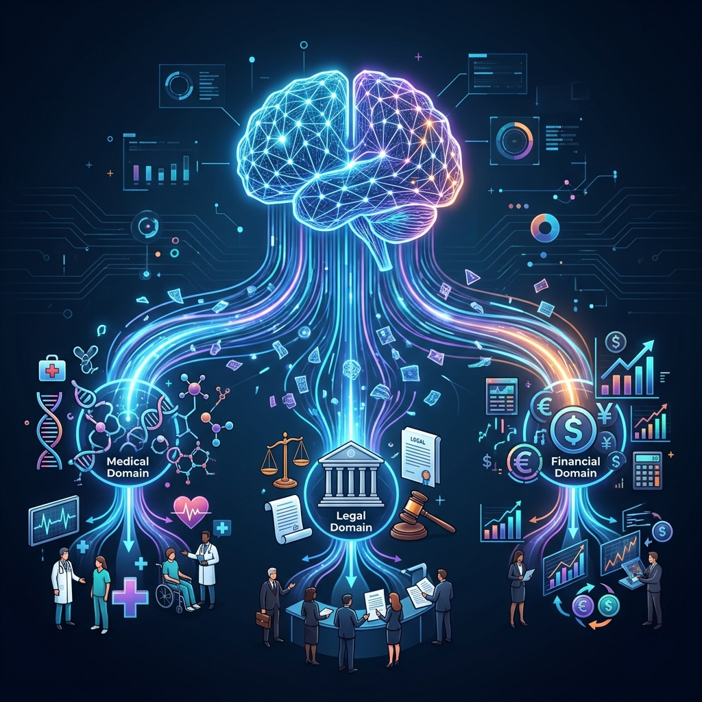
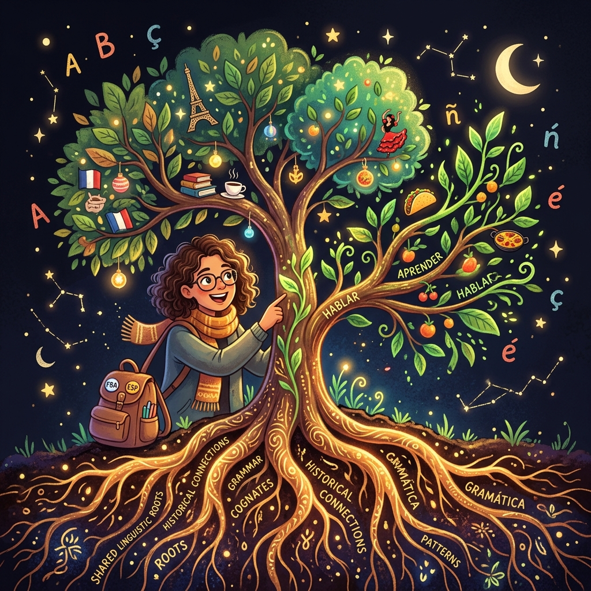
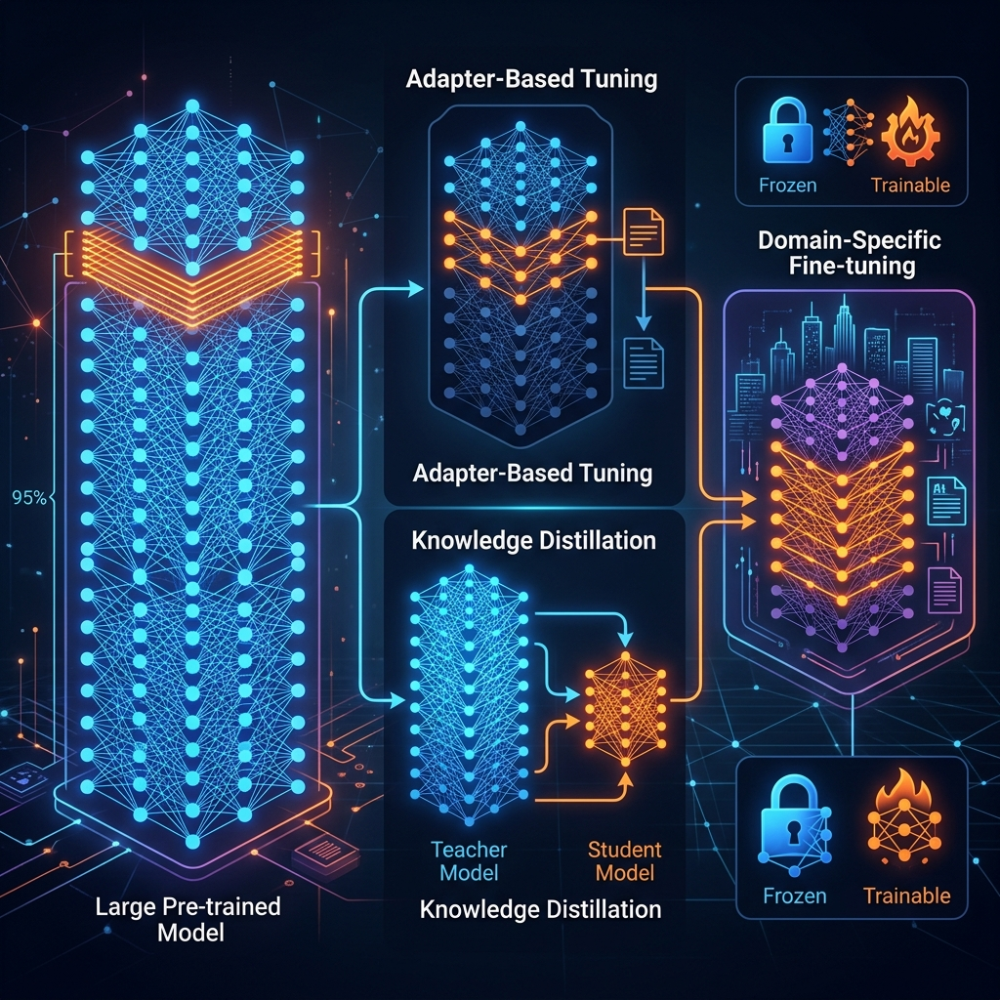
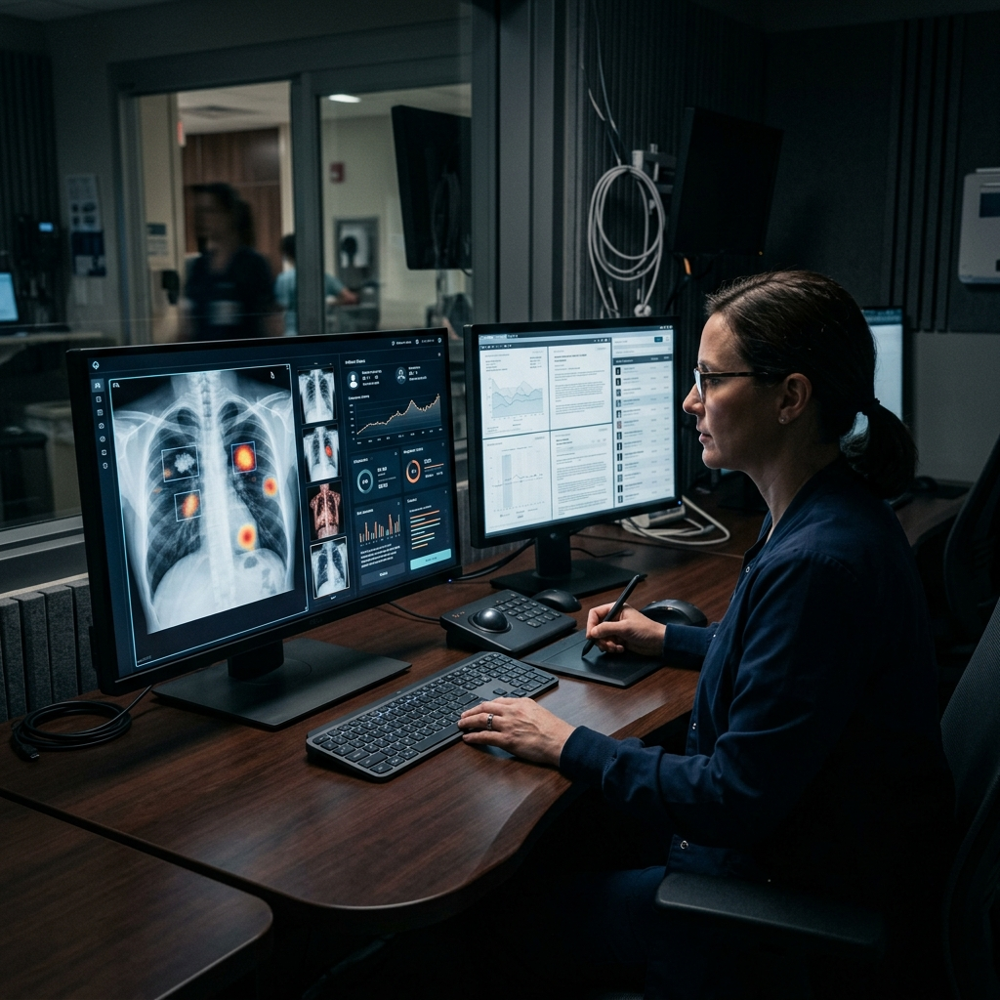

# Chapter 25: Transfer Learning & Model Adaptation

---
[⬅️ Previous](chapter_24.md) | [🏠 Home](../README.md) | [Next ➡️](chapter_26.md)

  

## 🎯 Objective
Chapter 6 introduced fine-tuning as "teaching old models new tricks." In this chapter, we go deeper into the broader paradigm of **Transfer Learning**—the science of reusing knowledge from one task to accelerate learning on another. Drawing from *Quick Start Guide to Large Language Models* (Ozdemir) and *The Hundred-Page Language Models Book* (Burkov), we'll explore **Knowledge Distillation**, **Continual Learning**, **Domain Adaptation**, and the critical trade-offs that determine whether you should fine-tune, distill, or simply prompt.

---

## 💡 The Simple Explanation: The Language Tree

  

Imagine a person who spent 20 years becoming fluent in French. They know grammar, sentence structure, idioms, and cultural context deeply. Now, they decide to learn Spanish.

Do they start from zero? Absolutely not. French and Spanish share **Latin roots**. The person already understands verb conjugation, gendered nouns, and Romance language sentence structure. They might learn Spanish in 6 months instead of 10 years because they can **transfer** the deep patterns from French directly.

**Transfer Learning is this exact phenomenon for AI.** A model that learned English grammar, logic, and world knowledge during pretraining doesn't need to re-learn these things when you want it to specialize in medical diagnosis. The "roots" (foundational knowledge) are already there. You only need to grow a new "branch" (the specialized skill).

The critical insight from Ozdemir's *Quick Start Guide* is the **Adaptation Spectrum**: at one end, simple prompting adds no new knowledge but steers existing knowledge. At the other end, full fine-tuning permanently modifies the model's weights. In between lies a rich landscape of techniques—each with different costs, risks, and benefits.

---

## 🔍 Going Deeper: The Technical Reality

  

### 1. The Adaptation Decision Tree
As Ozdemir establishes, the first question isn't "How do I fine-tune?" but "Should I fine-tune at all?" The decision tree is:

*   **Is the task solvable with good prompting?** → Use **In-Context Learning** (Chapter 8). Cost: $0. Risk: None.
*   **Does the model need private/domain knowledge?** → Use **RAG** (Chapter 10). Cost: Low. Risk: Low.
*   **Does the model need to change its behavior/style?** → Use **LoRA Fine-Tuning** (Chapter 6). Cost: Medium. Risk: Medium.
*   **Does the model need fundamental new capabilities?** → Use **Full Fine-Tuning** or **Continued Pretraining**. Cost: Very High. Risk: High.

### 2. Knowledge Distillation: The Teacher-Student Model
As Burkov details in *The Hundred-Page Language Models Book*, **Knowledge Distillation** is the process of training a small, fast "Student" model to mimic the behavior of a large, slow "Teacher" model.

*   The Teacher (e.g., GPT-4) generates high-quality outputs for thousands of examples.
*   The Student (e.g., a 7B parameter model) is trained to reproduce these outputs.
*   The result: a model that is 10x faster and 100x cheaper to run, with 90–95% of the Teacher's quality.

The key insight is that the Student doesn't just learn the Teacher's *outputs*—it learns the Teacher's *probability distributions* (the "soft labels"), which contain far richer information than simple correct/incorrect labels.

### 3. Continual Learning and Catastrophic Forgetting
When you fine-tune a model on medical data, there's a dangerous side effect: the model may **forget** its general English ability. This is called **Catastrophic Forgetting**.

Ozdemir documents several mitigation strategies:
*   **Elastic Weight Consolidation (EWC)**: Identifies which weights are "important" for old tasks and prevents them from changing too much during new training.
*   **Rehearsal**: Mixing old training data with new data during fine-tuning to maintain general knowledge.
*   **LoRA Adapters** (Chapter 6): The most practical solution—keep the base model frozen and only train lightweight adapter layers. When you remove the adapter, the original model is perfectly intact.

### 4. Domain-Adaptive Pretraining (DAPT)
For extreme specialization, Burkov describes **DAPT**: continuing the pretraining phase (not fine-tuning) on a massive domain-specific corpus (e.g., 100GB of legal documents). This gives the model a deep "fluency" in legal language before any task-specific fine-tuning begins. The sequence becomes: **General Pretraining → Domain Pretraining → Task Fine-Tuning** — each stage building on the roots of the previous one.

---

## 🎯 The "Aha!" Moment
Transfer Learning reveals that knowledge is **modular and stackable**. A model doesn't need to learn "everything" for "every task." It learns universal patterns once (during pretraining), then stacks specialized knowledge on top with minimal data and compute. This is why a 7B parameter model, properly adapted, can outperform a 70B general model on a specific task—depth beats breadth when the domain is narrow.

---

## 🌐 Real-World Connection

  

**Med-PaLM 2**, Google's medical AI, is a textbook example of transfer learning in action. Google didn't train a medical model from scratch. They took their general-purpose **PaLM 2** foundation model (trained on the internet) and applied **Domain-Adaptive Fine-Tuning** on curated medical textbooks, clinical guidelines, and exam questions. The result scored at an "expert doctor level" on the United States Medical Licensing Examination—not because they built a medical AI, but because they **transferred** general intelligence into a medical context.

---

## 📚 References
*   **Quick Start Guide to Large Language Models** (Sinan Ozdemir, 2024) - *Chapter 4: Transfer Learning and the Adaptation Spectrum*.
*   **The Hundred-Page Language Models Book** (Andriy Burkov, 2024) - *Chapter 5: Knowledge Distillation and Model Compression*.
*   **Build a Large Language Model (From Scratch)** (Sebastian Raschka, 2024) - *Chapter 6: Fine-Tuning for Classification* and *Chapter 7: Fine-Tuning to Follow Instructions*.
*   **LLM Engineer's Handbook** (Paul Iusztin & Maxime Labonne, 2024) - *Chapter on Continual Learning Strategies*.

---
[⬅️ Previous](chapter_24.md) | [🏠 Home](../README.md) | [Next ➡️](chapter_26.md)
