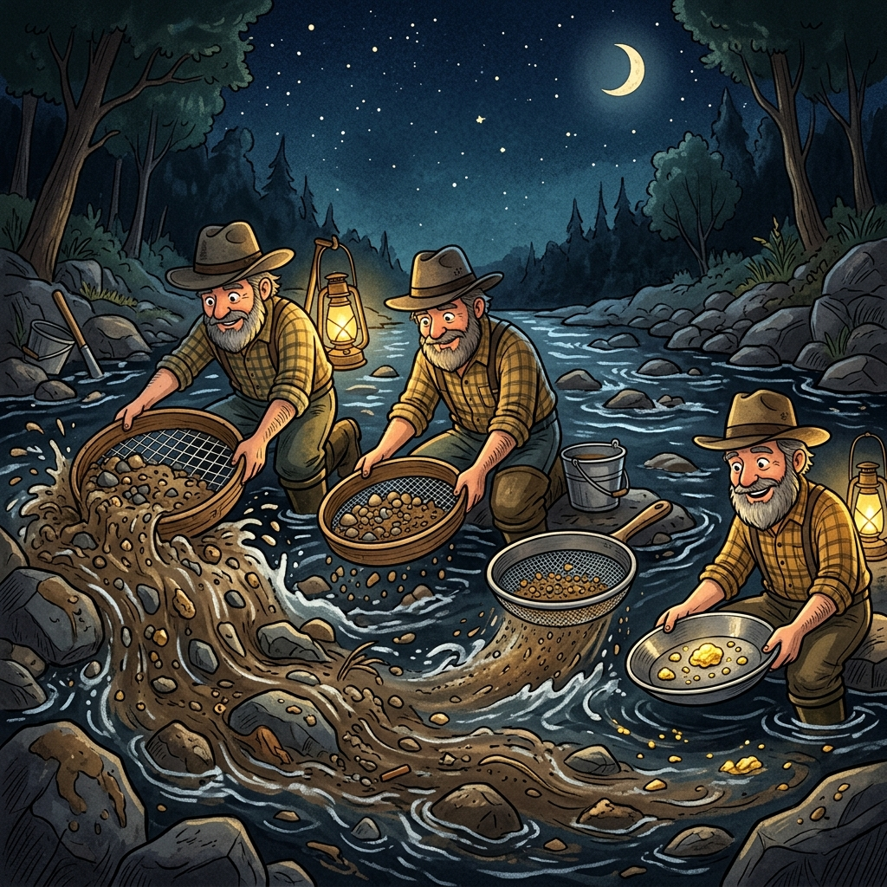
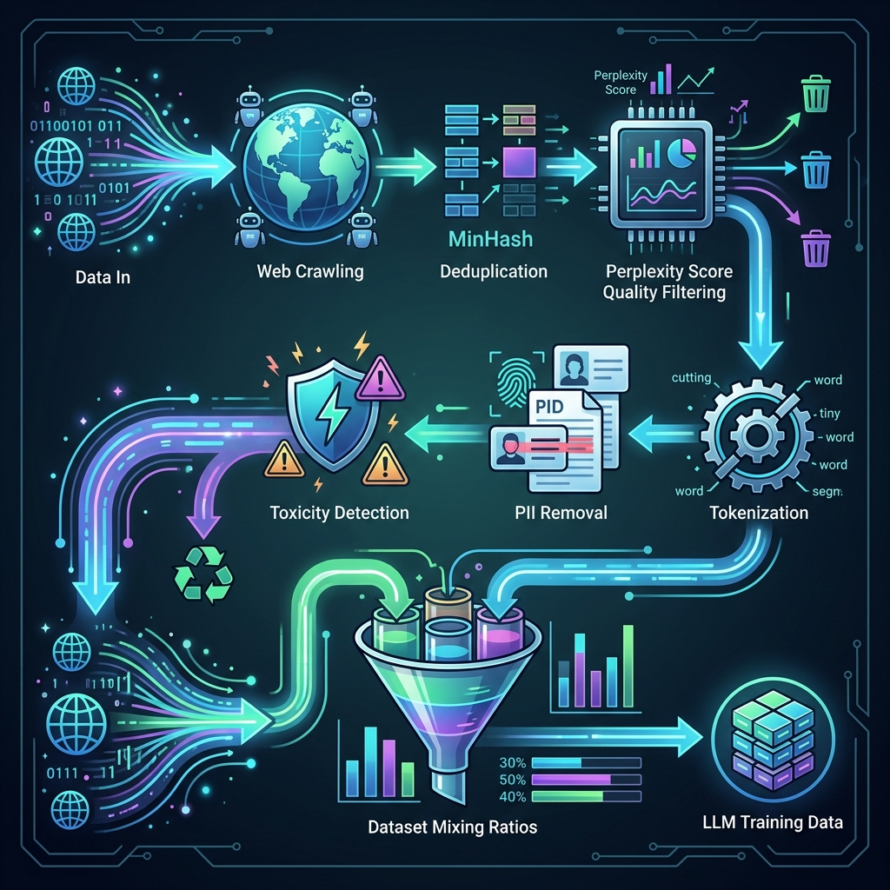

# Chapter 26: Data Preparation & Curation

---
[⬅️ Previous](chapter_25.md) | [🏠 Home](../README.md) | [Next ➡️](chapter_27.md)

  

## 🎯 Objective
Every LLM course talks about models, but few talk about **data**—the invisible fuel that determines whether a model is brilliant or broken. In this chapter, we'll explore the complete data lifecycle for LLM training: **collection, cleaning, deduplication, quality filtering, safety filtering, tokenization, and dataset mixing**. The content draws from *Quick Start Guide to Large Language Models* (Ozdemir) and the *LLM Engineer's Handbook* (Iusztin & Labonne).

---

## 💡 The Simple Explanation: Panning for Gold

  

Imagine you're a gold miner during the Gold Rush. You've found a river that supposedly contains gold, but when you scoop up a bucket of water, you get: mud, rocks, broken glass, fish bones, some fool's gold, and—if you're lucky—a few tiny flakes of real gold.

You can't just dump the entire bucket into your treasure chest. You need a **multi-stage filtering process**:
1.  **First Sieve (Coarse)**: Remove the big rocks and debris (strip HTML, boilerplate, navigation menus from web pages).
2.  **Second Sieve (Medium)**: Remove duplicate pebbles—you don't want 100 copies of the same Wikipedia article (deduplication).
3.  **Third Sieve (Fine)**: Remove toxic chemicals and fool's gold—content that's dangerous, biased, or contains personal information (safety filtering).
4.  **Final Polish**: The remaining gold flakes are weighed and mixed in precise ratios—40% general knowledge, 20% code, 20% academic papers, 20% conversation (dataset mixing).

**Data curation is this panning process.** The quality of the gold (training data) determines the quality of the jewelry (the model). No amount of architectural brilliance can fix a model trained on garbage data.

---

## 🔍 Going Deeper: The Technical Reality

  

### 1. Data Collection: The Raw River
As Ozdemir details, modern LLM training data comes from several sources:
*   **Common Crawl**: A massive, open archive of the web (~250 billion pages). This is the primary source for most open models.
*   **Curated Sources**: Wikipedia, academic papers (arXiv), books (Project Gutenberg), code repositories (GitHub/The Stack).
*   **Synthetic Data**: Increasingly, companies use stronger models (GPT-4) to *generate* high-quality training data for weaker models—a technique called **Data Flywheel**.

### 2. Deduplication: Removing the Echoes
The internet is incredibly repetitive. The same news article gets copy-pasted across hundreds of websites. If you don't deduplicate, the model memorizes these repeated passages verbatim—leading to copyright issues and reduced generalization.

The *LLM Engineer's Handbook* (Iusztin & Labonne) describes two approaches:
*   **Exact Deduplication**: Hash each document and remove identical copies.
*   **Fuzzy Deduplication (MinHash/LSH)**: Use locality-sensitive hashing to find documents that are *almost* identical (e.g., same article with a different headline). This can reduce dataset size by **30–50%** while dramatically improving model quality.

### 3. Quality Filtering: The Perplexity Gate
Not all text is equally useful. A product listing that says "Buy now! Free shipping!!!" is low-quality compared to a scientific abstract. To filter quality at scale:
*   Train a small language model on high-quality text (e.g., Wikipedia).
*   Use that model to calculate the **Perplexity** of each document. High-perplexity documents (the model is "surprised" by the bad grammar) are discarded.
*   This is Google's approach for **C4** (Colossal Clean Crawled Corpus), which filters Common Crawl down by ~99%.

### 4. Safety Filtering: PII and Toxicity
As the *Building LLMs for Production* (Bouchard) emphasizes:
*   **PII Removal**: Use Named Entity Recognition (NER) to detect and remove phone numbers, email addresses, Social Security Numbers, and medical records from the training data.
*   **Toxicity Detection**: Run every document through a toxicity classifier and remove or down-weight documents exceeding a threshold. This is the first layer of the safety defense described in Chapter 19.

### 5. Dataset Mixing: The Secret Recipe
The final—and perhaps most impactful—step is deciding the **ratio** of data types. Llama 3's training mix was approximately:
*   50% Web text
*   25% Code
*   15% Academic/Scientific
*   10% Conversation/Instruction data

Getting this ratio wrong produces lopsided models. Too much code → the model starts writing Python in casual conversation. Too little conversation data → the model sounds robotic and formal.

---

## 🎯 The "Aha!" Moment
The single most important insight in modern AI is: **Data quality matters more than model size.** Microsoft's research showed that a 1.3B parameter model trained on carefully curated "textbook-quality" data (Phi-1) can outperform 10x larger models trained on raw internet data. The gold isn't in the size of the river—it's in the quality of the filtration.

---

## 🌐 Real-World Connection

  

When Meta released **Llama 3**, they revealed that the model was trained on **15 trillion tokens**—but the raw Common Crawl they started with was over **100 trillion tokens**. That means they **discarded 85% of the internet** as not good enough. Their data pipeline involved 30+ stages of cleaning, filtering, and quality assessment, consuming more engineering time than the actual model training. The data pipeline *is* the product.

---

## 📚 References
*   **Quick Start Guide to Large Language Models** (Sinan Ozdemir, 2024) - *Chapter 2: Data Collection and Preparation for LLMs*.
*   **LLM Engineer's Handbook** (Paul Iusztin & Maxime Labonne, 2024) - *Chapter 3: Data Engineering for LLMs*.
*   **Building LLMs for Production** (Louis-François Bouchard, 2024) - *Section on Data Quality and Synthetic Data Generation*.
*   **The Hundred-Page Language Models Book** (Andriy Burkov, 2024) - *Chapter 3: Training Data and Preprocessing*.

---
[⬅️ Previous](chapter_25.md) | [🏠 Home](../README.md) | [Next ➡️](chapter_27.md)
