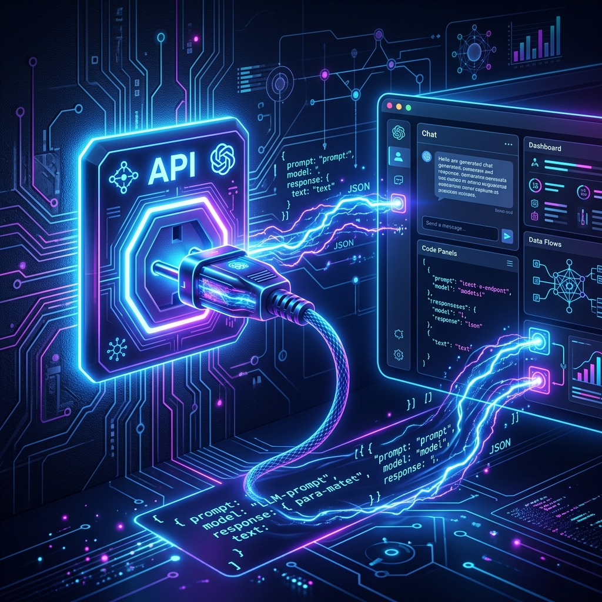
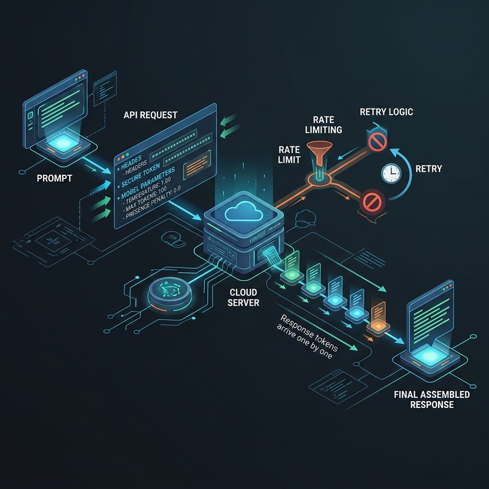

# Chapter 27: The LLM API Bridge

---
[⬅️ Previous](chapter_26.md) | [🏠 Home](../README.md) | [Next ➡️](chapter_27.md)

  

## 🎯 Objective
Most developers will never train an LLM from scratch. Instead, they interact with models through **APIs** (Application Programming Interfaces). In this chapter, we explore how to build reliable, secure, and performant applications by bridging the gap between your code and the "brains" in the cloud. We'll leverage insights from *Developing Apps with GPT-4 and ChatGPT* (Caelen & Blete) and *LLMs in Production* (Brousseau & Sharp).

---

## 💡 The Simple Explanation: The Electricity Grid

  

Imagine you want to light up your house. You don't build a coal power plant or a massive solar farm in your backyard. That's expensive, complex, and requires constant maintenance.

Instead, you use the **Electricity Grid**:
1.  **The Power Plant**: A massive, complex facility far away (The LLM model sitting on thousands of GPUs in a data center).
2.  **The Transmission Lines**: The infrastructure that carries the power to your neighborhood (The Internet).
3.  **The Wall Outlet**: A simple, standardized interface. You don't need to know how the turbines spin; you just plug in your lamp (The API Endpoint).
4.  **The Power Bill**: You only pay for what you use, measured in kilowatt-hours (Tokens).

**API integration is the "outlet" for AI.** You plug your application into the "Intelligence Grid" and get instant results without owning the "Power Plant."

---

## 🔍 Going Deeper: The Technical Reality

  

### 1. The Chat Completion Lifecycle
As Caelen & Blete explain, most modern LLM APIs (like OpenAI's `/v1/chat/completions`) follow a specific lifecycle:
*   **Request Configuration**: You don't just send text. You send a JSON object containing:
    *   `model`: (e.g., `gpt-4o`)
    *   `messages`: A list of roles (`system`, `user`, `assistant`) providing context.
    *   `temperature`: Controlling the "creativity" or randomness.
    *   `max_tokens`: Setting a hard limit on the output length.
*   **Tokenization**: Your text is converted into integers before it touches the model.
*   **Streaming**: For better UX, APIs can stream tokens one by one using Server-Sent Events (SSE). This prevents the user from staring at a blank screen for 30 seconds.

### 2. Rate Limiting and Backoff
LLM APIs are heavily restricted by **Rate Limits** (Requests Per Minute or Tokens Per Minute). If you exceed these, you get a `429 Too Many Requests` error.
A production-ready bridge implements **Exponential Backoff**:
1. Try the request.
2. If failed, wait 1 second and try again.
3. If failed again, wait 2 seconds, then 4, then 8...
4. Eventually, stop and report an error.

### 3. API Security & Key Management
*LLMs in Production* emphasizes that your API key is your credit card.
*   **Never hardcode keys**: Use Environment Variables or Secret Managers (AWS Secrets Manager, HashiCorp Vault).
*   **Backend Proxying**: Never call an LLM API directly from a frontend (React/Mobile). A hacker could easily steal your key from the network traffic. Always route requests through your own server.

---

## 🎯 The "Aha!" Moment
The magic of an API isn't just that it "works"—it's that it **decouples** the model from the application. You can swap `gpt-3.5` for `gpt-4` today, or a local `Llama-3` model tomorrow, often by changing just **one line of code** in your configuration, provided you use an abstraction layer like LangChain or a standardized API format.

---

## 🌐 Real-World Connection

  

Every modern "AI-native" app—from **Jasper** to **GitHub Copilot** to **Duolingo's Roleplay** feature—is built on this bridge. For example, Duolingo uses the API to generate dynamic responses in language practice. They don't run the models; they merely "plug in" to OpenAI's grid, allowing them to focus on pedagogical features while letting OpenAI handle the billions of dollars in GPU infrastructure.

---

## 📚 References
*   **Developing Apps with GPT-4 and ChatGPT** (Olivier Caelen & Marie-Alice Blete, 2023) - *Chapter 2: A Deep Dive into the GPT-4 and ChatGPT APIs*.
*   **LLMs in Production** (Christopher Brousseau & Matthew Sharp, 2025) - *Chapter 1: The Build-vs-Buy Decision*.
*   **The Developers Playbook for LLM Security** (Steve Wilson, 2024) - *Section on API Key Management and Proxy Security*.

---
[⬅️ Previous](chapter_26.md) | [🏠 Home](../README.md) | [Next ➡️](chapter_28.md)
