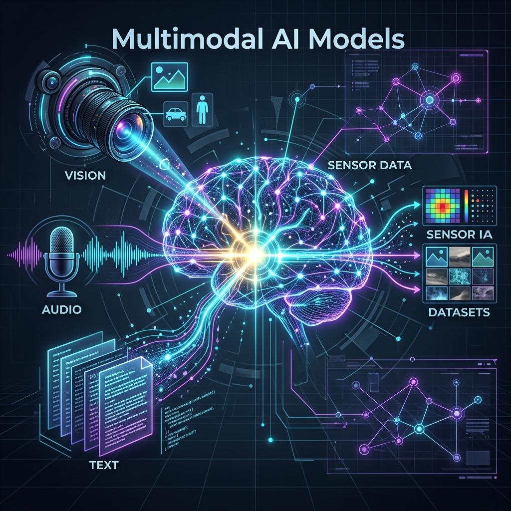

# Chapter 28: Beyond Text: Multimodal AI

---
[⬅️ Previous](chapter_27.md) | [🏠 Home](../README.md) | [Next ➡️](chapter_29.md)

  

## 🎯 Objective
Human intelligence isn't just about reading text; we see, hear, and touch simultaneously. In this chapter, we explore **Multimodal AI**—models that can process and reason across different types of data (text, images, audio, video) in a single workflow. We'll dive into the architectures like CLIP and Vision Transformers (ViT) using insights from *Generative AI on AWS* (Fregly, Barth & Eigenbrode) and *Hands-On Large Language Models* (Alammar & Grootendorst).

---

## 💡 The Simple Explanation: The Polyglot Diplomat

  

Imagine a world-class **Diplomat** who is also a "Polyglot" of senses. 

Standard LLMs are like a blind scholar: they can read every book in the library and explain the concept of a "sunset" with beautiful words, but they've never actually *seen* one.

A **Multimodal Diplomat**, however:
1.  **Hears** the music of a national anthem.
2.  **Sees** the subtle facial expressions of a counterpart.
3.  **Reads** the formal treaty document.
4.  **Connects** all of them into a single understanding.

When you show them a photo of a broken bridge and ask "How do I fix this?", they don't just "guess" based on text. They "see" the rust, "understand" the structural engineering text they've read, and combine them to give a surgical answer. **Multimodality is the fusion of senses into a single brain.**

---

## 🔍 Going Deeper: The Technical Reality

  

### 1. Vision Transformers (ViT)
How does a transformer "see"? As Alammar explains, ViTs treat an image like a sentence. They chop the image into small squares (patches), flatten them into vectors, and treat each square as a "token." The model then uses the same Self-Attention mechanism we learned in Chapter 3 to figure out which parts of the image relate to each other.

### 2. Contrastive Learning (CLIP)
The "Secret Sauce" for multimodal understanding often comes from **CLIP** (Contrastive Language-Image Pre-training). 
*   Instead of just labeling an image "Dog," CLIP is trained on millions of pairs of images and their internet captions.
*   It learns to push the vector of a "Photo of a sunset" and the text "Sunset over the ocean" close together in a shared **Embedding Space**.
*   This shared space is what allows a model to "describe" an image or "generate" an image from a description.

### 3. Multimodal Reasoning (RAG + Vision)
*Generative AI on AWS* details how these models handle complex tasks like **Visual Question Answering (VQA)**:
1.  **Image Encoder**: Processes the pixel data.
2.  **Text Encoder**: Processes your question (e.g., "Is the safety valve open?").
3.  **Fusion Layer**: Combines both vectors into a single "Multimodal" representation.
4.  **Decoder**: Generates the text response based on both inputs.

---

## 🎯 The "Aha!" Moment
The breakthrough isn't just that models can "see"—it's that they use **the same mathematical language** (vectors) for everything. A pixel, a word, and a sound wave all end up as points in a giant multi-dimensional map. Once everything is a vector, the model can do "math" on concepts: `[Image of a house] + [Word: "Modern"] = [Image of a glass mansion]`.

---

## 🌐 Real-World Connection

  

In **Healthcare**, multimodality is life-saving. An AI assistant can review a patient's **written medical history** (text) alongside their **latest X-ray** (image) and **heart rate data** (time-series). By fusing these inputs, the AI can flag a potential issue that might be missed if it only looked at the text or the image in isolation. This is the foundation of "Expert-in-the-loop" systems described in the *LLM Engineer's Handbook*.

---

## 📚 References
*   **Generative AI on AWS** (Chris Fregly, Antje Barth & Shelbee Eigenbrode, 2024) - *Chapter 10: Multimodal Foundation Models*.
*   **Hands-On Large Language Models** (Jay Alammar & Maarten Grootendorst, 2024) - *Section on Multimodal Architectures*.
*   **Super Study Guide: Transformers and LLMs** (Afshine Amidi & Shervine Amidi, 2024) - *Visual Transformers Deep Dive*.

---
[⬅️ Previous](chapter_27.md) | [🏠 Home](../README.md) | [Next ➡️](chapter_29.md)
