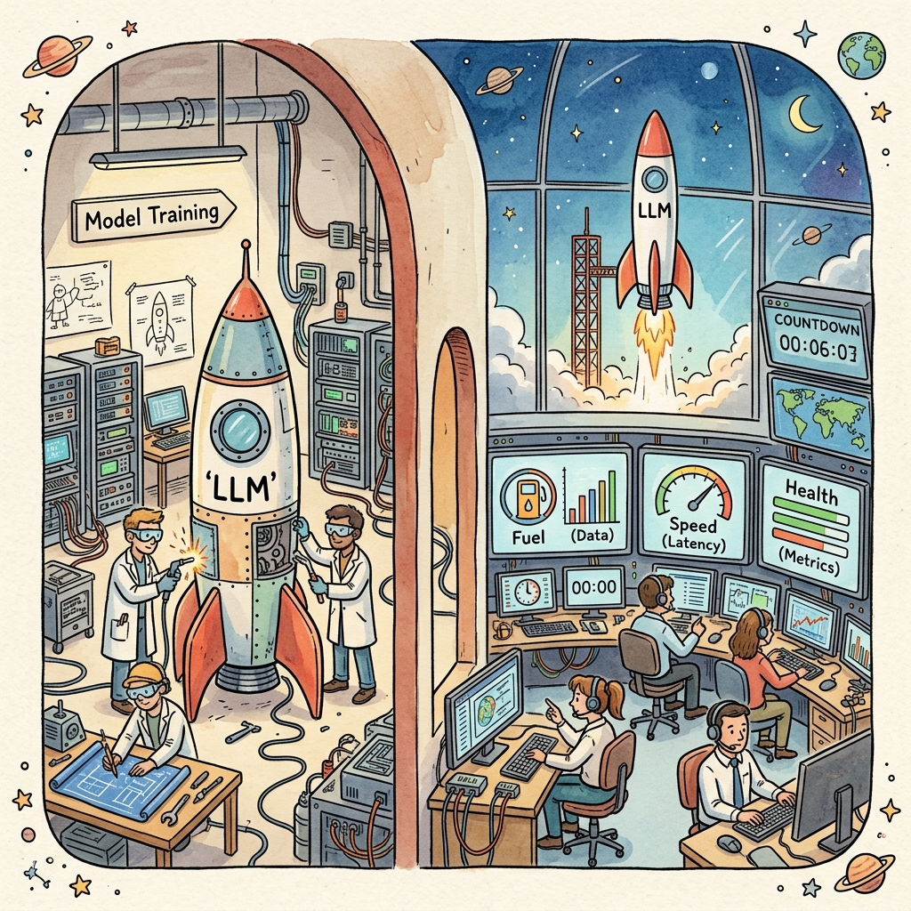
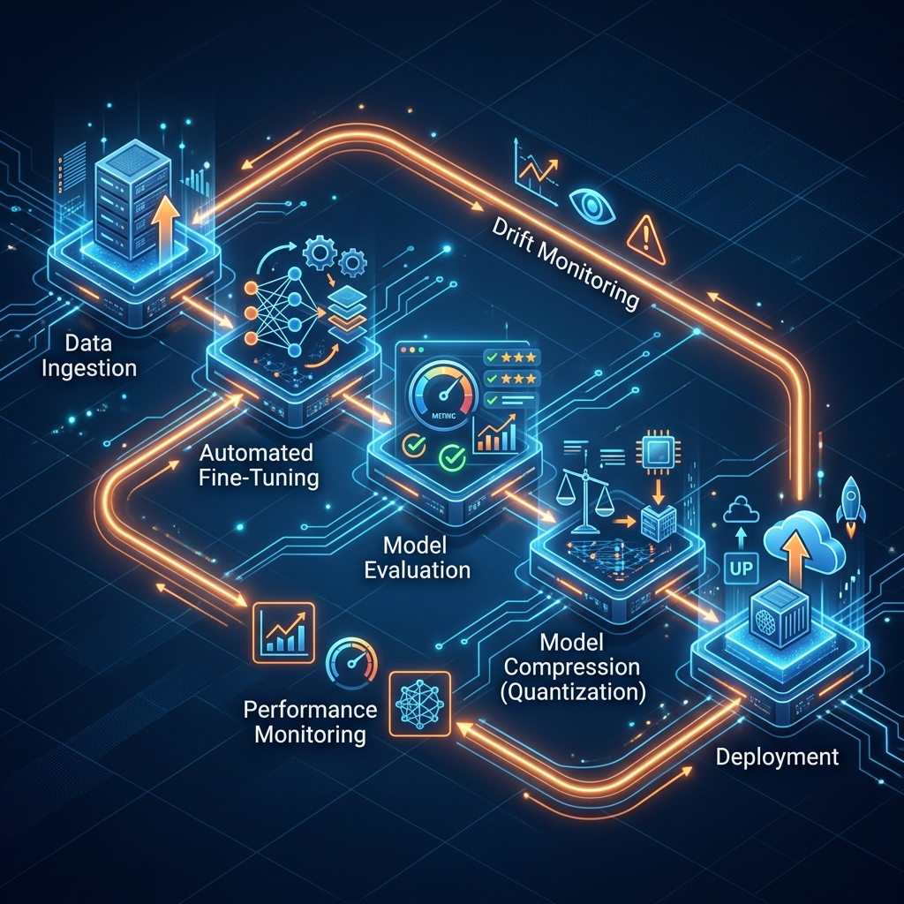

# Chapter 29: LLMOps: From Lab to Launch

---
[⬅️ Previous](chapter_28.md) | [🏠 Home](../README.md) | [Next ➡️](chapter_30.md)

  

## 🎯 Objective
Training a model in a Jupyter Notebook is the easy part. Ensuring that model stays fast, accurate, and cost-effective for 10,000 users is where the real engineering begins. In this chapter, we explore **LLMOps** (Large Language Model Operations)—the industrial-scale pipeline for deploying and maintaining AI. We'll utilize concepts from *LLMs in Production* (Brousseau & Sharp) and the *LLM Engineer's Handbook* (Iusztin & Labonne).

---

## 💡 The Simple Explanation: The Space Launch

  

Imagine you're building a rocket.
1.  **The Lab (Development)**: You spend months in a warehouse designing the engine and testing fuel mixes. This is like training your LLM in a notebook. It’s controlled and safe.
2.  **The Launch Pad (Deployment)**: Now you move the rocket outside. You need specialized transportation, cooling systems, and massive support structures.
3.  **Mission Control (LLMOps)**: Once the rocket is in the air, you need a team of people watching 100 screens. They monitor:
    *   **Fuel Levels** (Cloud Costs).
    *   **Trajectory** (Model Drift - the model getting worse over time).
    *   **Internal Pressure** (Latency - is it too slow?).
    *   **Emergency Abort** (Guardrails - stop the model if it goes rogue).

**LLMOps is Mission Control.** It's the difference between a prototype that "sometimes works" and a professional service that is reliable enough for the whole world.

---

## 🔍 Going Deeper: The Technical Reality

  

### 1. The Continuous Pipeline
As Iusztin & Labonne describe, a professional LLM pipeline is a loop:
*   **Continuous Integration (CI)**: Testing code changes.
*   **Continuous Deployment (CD)**: Automatically pushing models to servers.
*   **Continuous Training (CT)**: Feeding new user data (anonymized) back into the model to keep it up-to-date.

### 2. Model Compression
To reduce "weight" for flight, we use several techniques described in *LLMs in Production*:
*   **Quantization**: Shrinking the model's numbers from 16-bit to 4-bit. This makes the model 4x lighter and much faster with only a tiny drop in quality.
*   **Knowledge Distillation**: Training a "Student" model (small) to mimic the "Teacher" model (large).
*   **Pruning**: Cutting out the "neurons" that never fire.

### 3. Monitoring for "Drift"
Unlike traditional software, LLMs can "break" without crashing. **Model Drift** happens when the model's accuracy degrades because the world changed (e.g., someone mentions a new event the model wasn't trained on). LLMOps systems monitor the "Perplexity" and "Cosine Similarity" of outputs to flag when the model needs a "refuel" (re-training).

---

## 🎯 The "Aha!" Moment
The single biggest shock in LLMOps is: **The model is the smallest part of the system.** In a true production environment, the model itself is maybe 5% of the codebase. The other 95% is dedicated to data cleaning, monitoring, security guardrails, and cost management. As Brousseau & Sharp say, "The model is the catalyst; the operations are the factory."

---

## 🌐 Real-World Connection

  

When **Meta** or **OpenAI** pushes a new update, they don't just replace a file. They use **Blue-Green Deployment** or **Canary Releases**. They send the new model to 1% of users first, monitoring for any weird behavior or increased latency. Only once "Mission Control" gives the green light is the model rolled out to everyone. This prevents a single hallucinating model from affecting millions of people at once.

---

## 📚 References
*   **LLMs in Production** (Christopher Brousseau & Matthew Sharp, 2025) - *Chapter 3: Large Language Model Operations*.
*   **LLM Engineer's Handbook** (Paul Iusztin & Maxime Labonne, 2024) - *Chapter 12: Deploying and Monitoring LLMs*.
*   **Generative AI with LangChain** (Dr. Priyanka Singh & Hariom Singh, 2025) - *Chapter 8: AI in DevOps and MLOps*.

---
[⬅️ Previous](chapter_28.md) | [🏠 Home](../README.md) | [Next ➡️](chapter_30.md)
