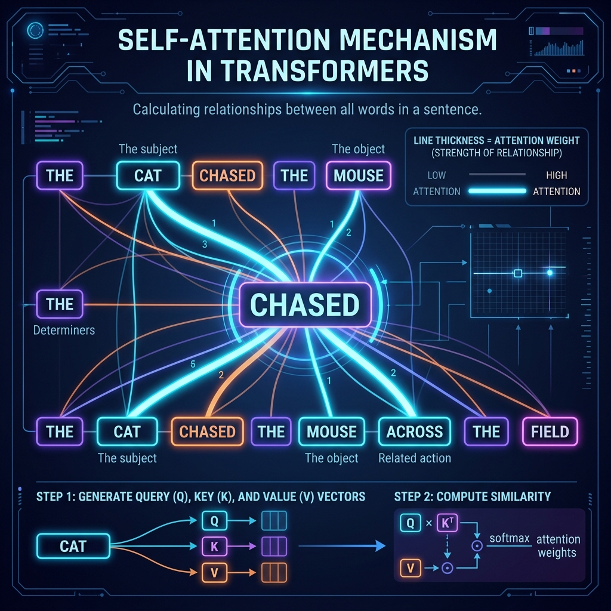
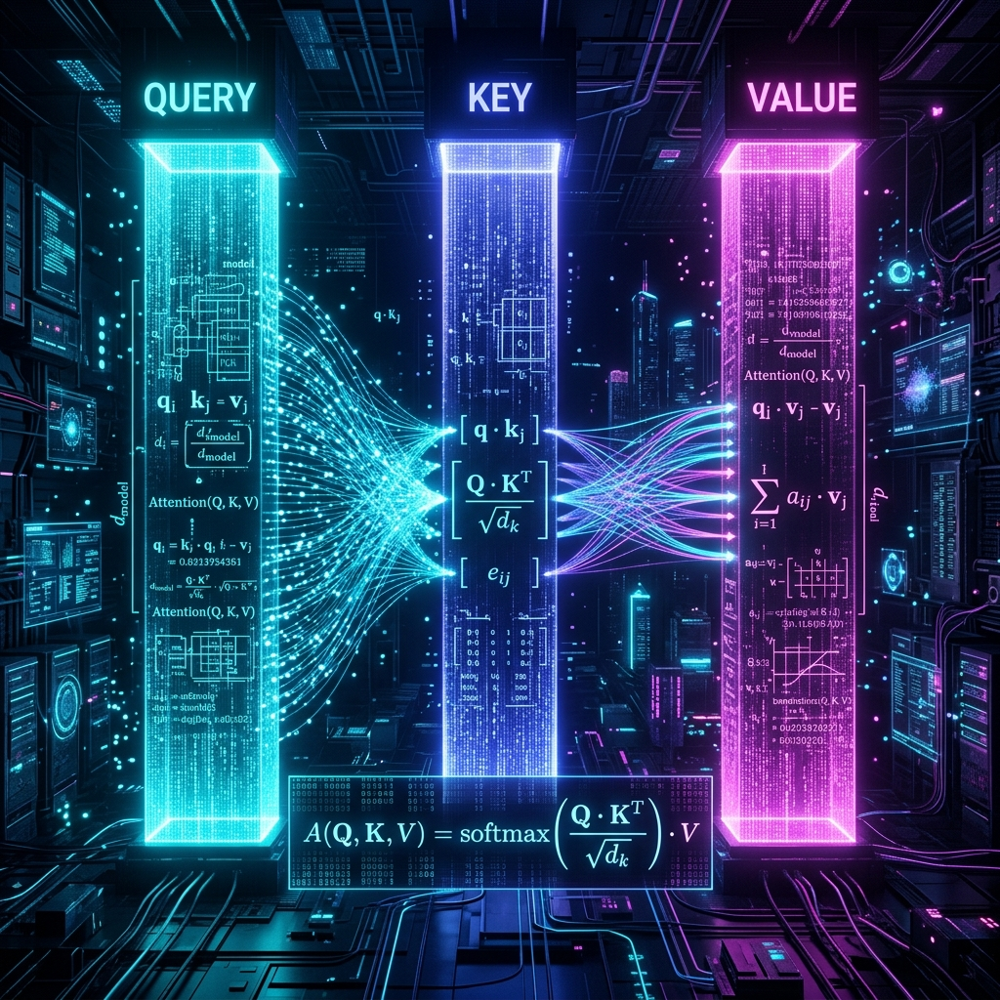
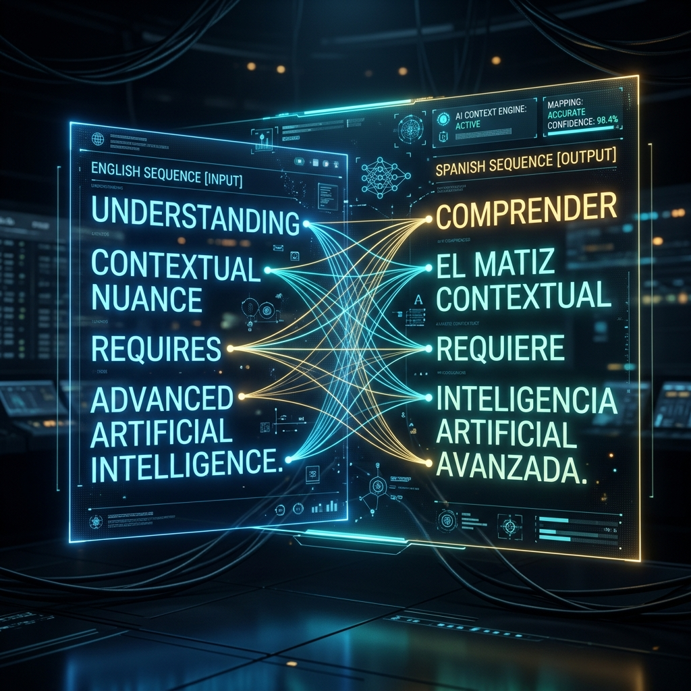

# Chapter 3: The Attention Revolution

  

## 🎯 Objective
In this chapter, we will explore the "Holy Grail" of modern AI: **The Attention Mechanism**. We will learn why traditional AI models used to "forget" the beginning of a sentence by the time they reached the end, and how the Transformer architecture solved this by allowing every word to talk to every other word simultaneously.

---

## 💡 The Simple Explanation: The Expert Detective

  

Imagine you are a detective investigating a complex crime scene. You walk into a room and see hundreds of clues: a broken window, a spilled glass of wine, a muddy footprint, and a ticking clock. 

An old, primitive AI would look at these clues like it was walking through a dark tunnel with a tiny flashlight. It would see the window, then the wine, then the footprint. By the time it looked at the clock, it would have already started to forget the exact shape of the broken glass. It processes clues **sequentially**, one by one.

Now, imagine an **Expert Detective** (the Transformer). This detective stands in the middle of the room and opens their eyes wide. They see *every clue at once*. They don't just look at the muddy footprint in isolation; they look at the footprint and immediately "pay attention" to the broken window. They connect the clues mathematically. They realize that the "wine" is more related to the "glass" than it is to the "clock."

**Self-Attention is the detective's vision.** It allows a word in a sentence to look at all other words and decide which ones are important for its meaning. In the sentence *"The animal didn't cross the street because **it** was too tired,"* the word **"it"** pays 90% of its attention to **"animal"** and only 5% to **"street."** This is how models finally learned "common sense" context.

---

## 🔍 Going Deeper: The Technical Reality

  

In 2017, the paper *"Attention Is All You Need"* changed the world by introducing **Multi-Head Self-Attention**. This isn't just a vague feeling of "importance"—it is a rigorous calculation involving three specific matrices: **Query**, **Key**, and **Value**.

### 1. The QKV Logic (The Filing Cabinet Metaphor)
As detailed in *Build a Large Language Model (From Scratch)* by Sebastian Raschka, every word's embedding vector is multiplied by three different weight matrices to create three new vectors:

*   **Query (Q)**: What the word is looking for. (e.g., *"I am a pronoun, I am looking for my noun!"*)
*   **Key (K)**: The "label" the word offers to others. (e.g., *"I am a noun, I am a valid target for a pronoun!"*)
*   **Value (V)**: The actual information the word contains. (e.g., *"I am the 'Animal' information!"*)

### 2. The Dot-Product Calculation
To find out how much attention Word A should pay to Word B, the model calculates the **Dot Product** of Word A's **Query** and Word B's **Key**. 
*   If the vectors "match" (point in a similar direction), the score is high. 
*   If they don't match, the score is low.

These scores are then passed through a **Softmax** function (Chapter 1) to create a perfect percentage map. If "it" identifies "animal" as a 0.9 match, it takes 90% of the "Animal" **Value** and mixes it into its own representation.

### 3. Multi-Head Attention: Parallel Perspectives
Why limit the detective to just one set of eyes? **Multi-Head Attention** means the model runs this calculation 8, 12, or even 100 times simultaneously. 
*   **Head 1** might focus purely on **Grammar** (matching subjects to verbs).
*   **Head 2** might focus on **Logic** (matching causes to effects).
*   **Head 3** might focus on **Style** (matching the tone of adjectives).

By combining the results of all these heads, the model achieves a deep, multi-dimensional understanding of the text that no previous technology could match.

---

## 🎯 The "Aha!" Moment
Traditional AI (like RNNs and LSTMs) was a **Memory** problem—how much can I remember from the past? Transformers turned it into a **Filtering** problem—what is the most important thing to look at *right now*? By processing everything in parallel instead of one-by-one, the model doesn't just work faster; it understands relationships that were previously invisible.

---

## 🌐 Real-World Connection

  

The most immediate place you see the "Attention Revolution" is in **Google Translate**. 

In gendered languages like French or Spanish, the translation of a word often depends on a word far earlier in the sentence. Older systems often failed this. A modern Transformer model, however, uses its "attention eyes" to look at a noun 20 words away, realize it is feminine, and instantly adjust the gender of the adjectives at the end of the sentence. This is why translation suddenly felt "human" around 2018—the machine finally stopped reading words and started reading **Context**.

---

## 📚 References
*   **Hands-On Large Language Models** (Jay Alammar, 2024) - *Chapter 5: The Transformer Architecture*.
*   **Build a Large Language Model (From Scratch)** (Sebastian Raschka, 2024) - *Chapter 3: Coding Attention Mechanisms*.
*   **LLMs in Production** (Brousseau & Sharp, 2024) - *Section on Transformer Evolution*.
*   **Large Language Models** (Stephan Raaijmakers, 2024) - *Chapter on The Attention Pattern*.
