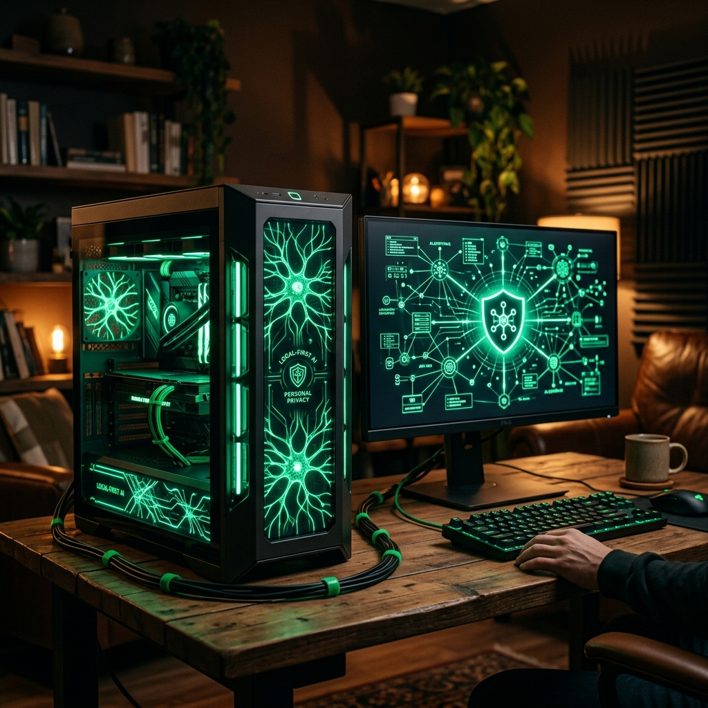
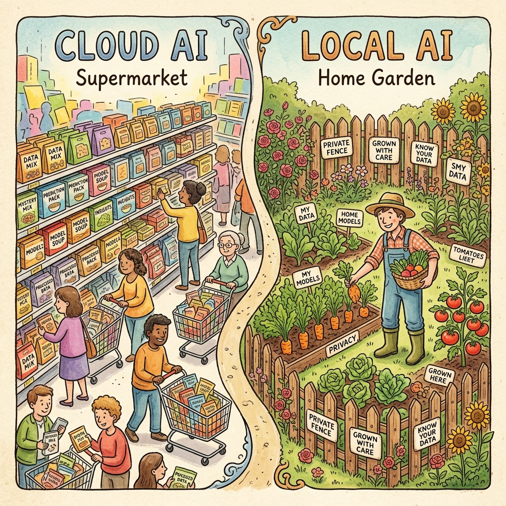
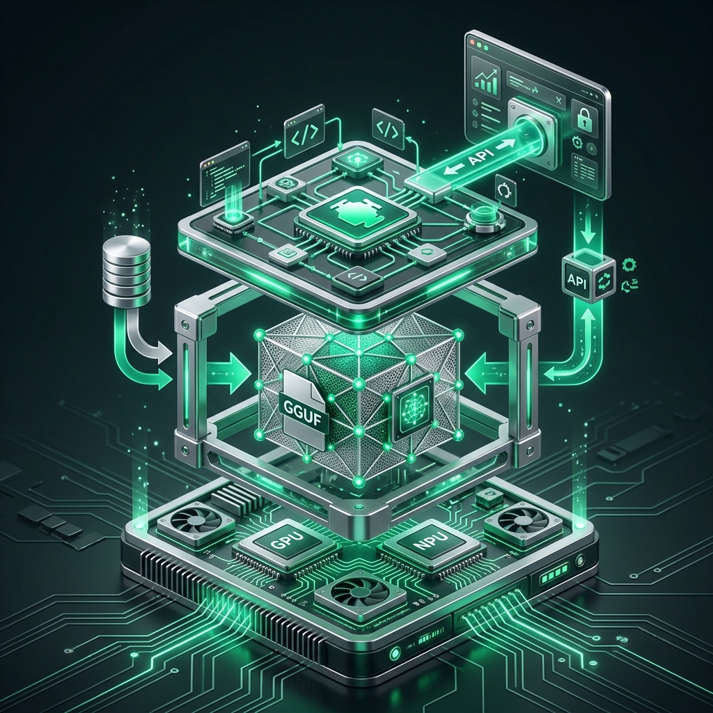
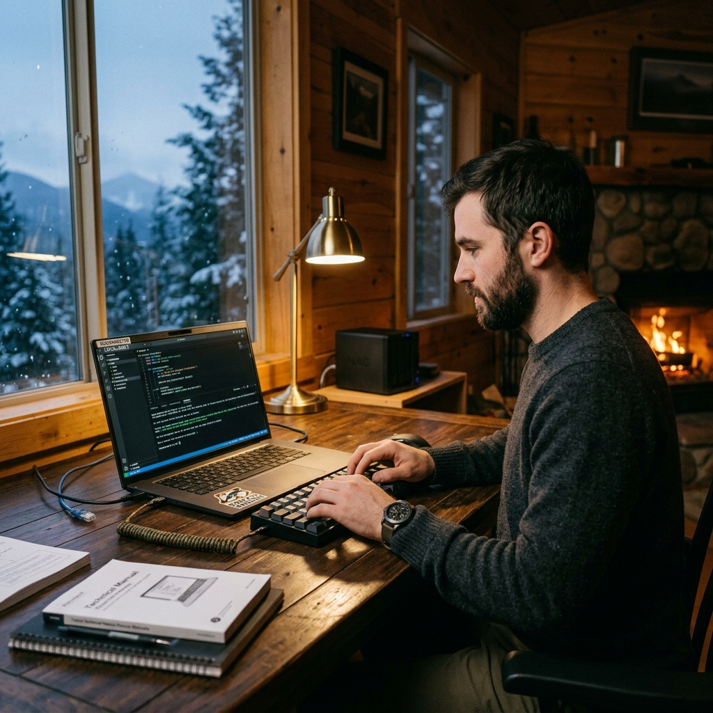

# Chapter 30: Local-First AI

---
[← Previous: Chapter 29](./chapter_29.md) | [Next: Chapter 31 →](./chapter_31.md)

  

## 🎯 Objective
In the race to build bigger models in the cloud, we've neglected a critical question: **Privacy**. If every prompt is sent to a server, who really owns the data? In this final chapter, we explore **Local-First AI**—the art of running powerful LLMs entirely on your own hardware. We'll examine the tools like `llama.cpp`, `Ollama`, and the "Clawdbot" philosophy for secure, private AI based on *OpenClaw: The Local-First AI Agent Handbook* (Ahmed).

---

## 💡 The Simple Explanation: The Home Garden

  

Imagine you want a salad.
1.  **The Supermarket (Cloud AI)**: You drive to a massive store. They have every vegetable imaginable, grown in distant lands by people you've never met. It's convenient and high-tech. But you don't know what pesticides were used, and the supermarket keeps a record of everything you buy. If the store closes or the road is blocked, you go hungry.
2.  **The Home Garden (Local AI)**: You plant seeds in your own backyard. You own the soil, the water, and the fence. It might take a bit more effort to set up (installing software and buying hardware), and your selection might be slightly smaller. But the vegetables are **yours**. Nobody can track your eating habits, and even if the whole world goes offline, you can still make a salad.

**Local AI is your private garden.** It ensures that your most sensitive thoughts and data never leave your "yard."

---

## 🔍 Going Deeper: The Technical Reality

  

### 1. The Inference Engine
To run an LLM locally, you need more than just the "weights" (the brain). You need an **Inference Engine** that can talk to your specific hardware (CPU, GPU, or Apple Silicon).
*   **llama.cpp**: The revolutionary engine that made local AI possible on consumer hardware by writing the heavy math in raw C++.
*   **Ollama**: A simplified wrapper that allows you to "pull and run" models like you would with Docker containers.
*   **vLLM**: A high-performance engine used for local hosting when multiple people need to access the same local machine.

### 2. The GGUF Format
In Chapter 29, we learned about Quantization. In the local world, the **GGUF** format is the standard. It packs the quantized model weights together with the model's "metadata" (the instructions on how to use it) into a single file. This allows your local engine to automatically configure itself for different models (Llama, Mistral, Phi) without manual tuning.

### 3. Agentic Autonomy
*The OpenClaw Handbook* emphasizes "Local-First Agents." Unlike a simple chatbot, an **Agent** can "do things"—read your files, run local code, or control your smart home. If this agent is in the cloud, you are giving a third-party access to your entire digital life. By keeping the agent local, you maintain a "Security Perimeter" where the AI has power, but the data stays within your local network.

---

## 🎯 The "Aha!" Moment
The single biggest misconception about local AI is that you need a $10,000 "AI Supercomputer" to do anything useful. Thanks to quantization and efficient engines, a $500 Mac Mini or a decent gaming laptop can now run models that are **better than GPT-3.5** at typing speeds that exceed a human's reading pace. The barrier to entry has moved from the "Data Center" to the "Desk."

---

## 🌐 Real-World Connection

  

Local AI is becoming the standard for **Legal and Medical** consulting. A lawyer can load thousands of confidential client documents into a local RAG system (as seen in Chapter 14) and ask questions without fear of breaching attorney-client privilege. The sensitive data never touches the internet, ensuring total data sovereignty. This is the "Private Assistant" future envisioned by the *Clawdbot* project.

---

## 📚 References
*   **Clawdbot/OpenClaw: The Local-First AI Agent Handbook** (Tamer Ahmed, 2024) - *Chapter 1: The Privacy-First Manifesto*.
*   **LLMs in Production** (Christopher Brousseau & Matthew Sharp, 2025) - *Section on On-Device and Edge Inference*.
*   **LLM Engineer's Handbook** (Paul Iusztin & Maxime Labonne, 2024) - *Section on High-Performance Inference with llama.cpp*.

---
[← Previous: Chapter 29](./chapter_29.md) | [Next: Chapter 31 →](./chapter_31.md)
