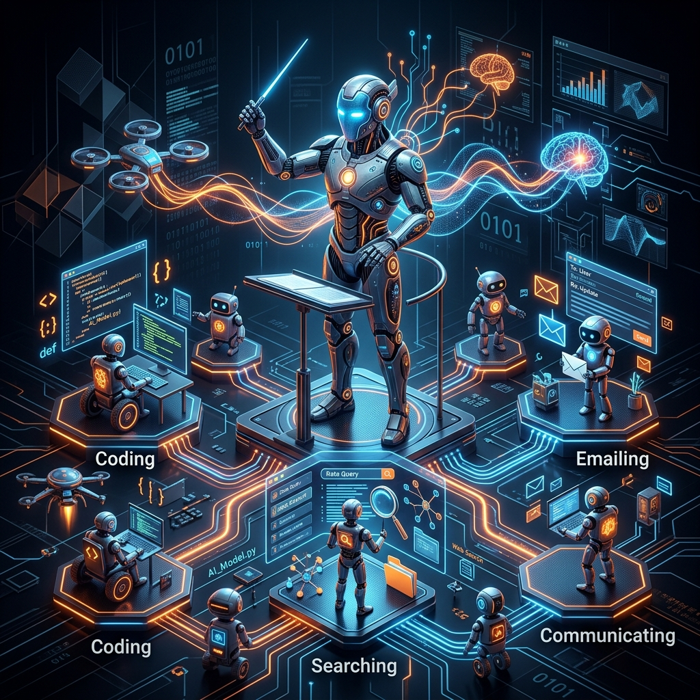
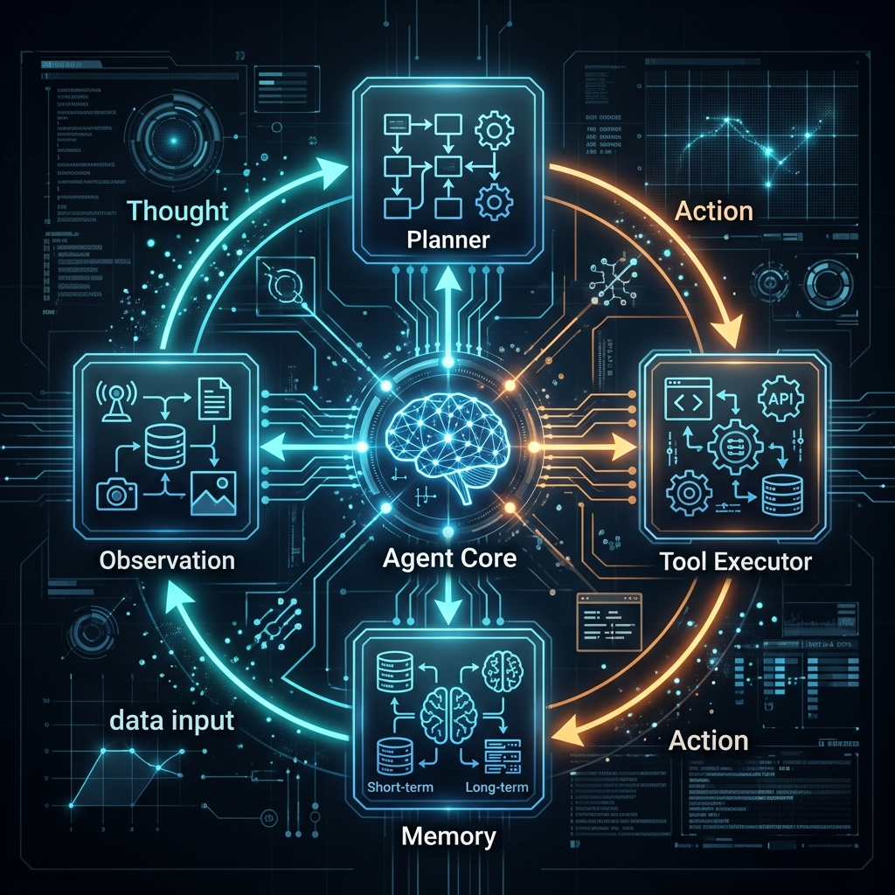

# Chapter 31: AI Agents: The Autonomous Revolution

  

Up until now, we've treated LLMs like high-powered calculators or sophisticated search engines. You give them a prompt, and they give you a response. But what if the model could decide its own next steps? What if it could use tools, browse the web, or write code to solve a problem without you holding its hand?

Welcome to the era of **AI Agents**.

---

## 💡 The Simple Explanation: The Head Chef

Imagine you want to cook a 5-course gourmet dinner for ten people.

In the "traditional" LLM world, the AI is like a **Static Recipe Book**. You ask "How do I make beef bourguignon?" and it gives you the instructions. The burden of shopping, chopping, cooking, and adjusting for a salty sauce is all on you.

In the **Agentic** world, the AI is a **Head Chef**.
1.  **Planning**: The Chef looks at the goal (5-course dinner) and breaks it down into individual tasks (prep vegetables, sear meat, simmer sauce).
2.  **Tool Use**: The Chef knows when to use a knife, when to use an oven, and when to call a supplier because they ran out of wine.
3.  **Observation & Adaptation**: If the sauce is too thin, the chef doesn't just keep following a stale recipe; they *observe* the state, *adjust* the flame, and keep working until the goal is achieved.

An agent is simply an LLM equipped with a **loop** that allows it to think, act, observe the result, and think again.

---

## 🔍 Going Deeper: The ReAct Framework

The technical heart of most modern agents is the **ReAct** (Reason + Act) loop. Instead of just generating a final answer, the model is prompted to follow a specific internal cycle:

  

1.  **Thought**: The model reasons about what it needs to do. *"To find the current temperature in Paris, I need to use a weather tool."*
2.  **Action**: The model selects a tool to use and provides the parameters. *"Action: weather_tool(location='Paris')"*
3.  **Observation**: The system executes the tool and provides the "external world" feedback back to the model. *"Observation: 18°C, Cloudy"*
4.  **Final Answer (or New Thought)**: The model incorporates this new knowledge. It either provides the final answer or realizes it needs another step.

### Agent Architecture Components

Behind the scenes, a robust agent consists of:
*   **The Brain (LLM)**: Usually a powerful model like GPT-4 or Claude 3.5 Sonnet that is good at following instructions and logic.
*   **Planning Module**: Techniques like *Chain of Thought* or *Sub-goal Decomposition* allow the agent to break large tasks into bite-sized pieces.
*   **Memory**:
    *   **Short-term**: The current context window (previous steps in the loop).
    *   **Long-term**: Using a Vector Database (RAG) to remember past interactions or specific documentation.
*   **Tools**: Python interpreters, search engines, API connectors, or even other agents.

  

---

## 🌐 Real-World Connection: From Chatbots to Workers

We are moving from agents that answer questions to agents that perform **jobs**.

*   **Software Engineering**: Agents like **Devin** or **GitHub Copilot Workspace** can take a bug report, navigate a directory, write a fix, run tests, and submit a Pull Request—often while the developer is asleep.
*   **Market Research**: An agent can spend three hours browsing a hundred different websites, comparing prices, reading reviews, and synthesizing a 10-page report.
*   **Cybersecurity**: "Red Team" agents can autonomously scan for vulnerabilities and attempt ethical exploits to test a system's resilience.

  

By giving the LLM a way to "touch" the world through tools, we've turned a creative writer into a digital employee.

---

### 📖 References
*   **Source**: *AI Agents in Action* by Micheal Lanham.
*   **Chapter Reference**: Chapter 1: "The Agent Evolution."

---

[← Previous: Chapter 30](./chapter_30.md) | [Next: Chapter 32 →](./chapter_32.md)
