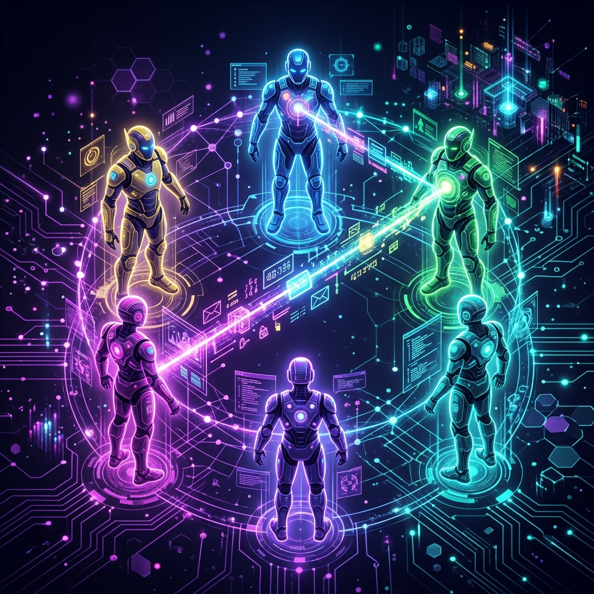
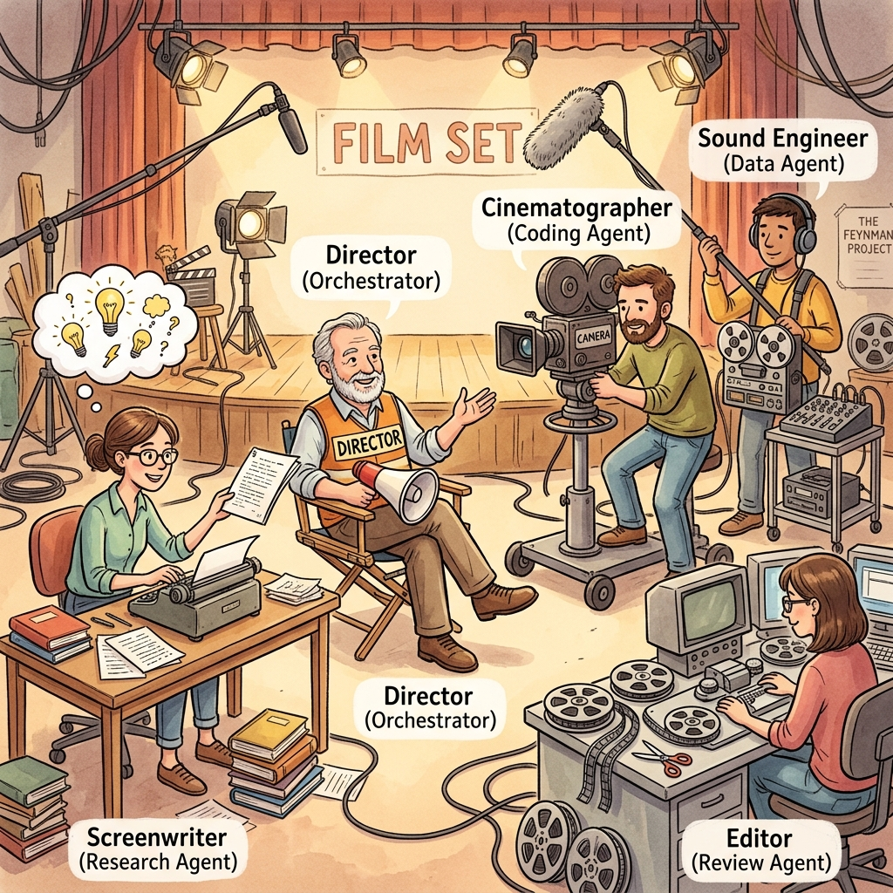
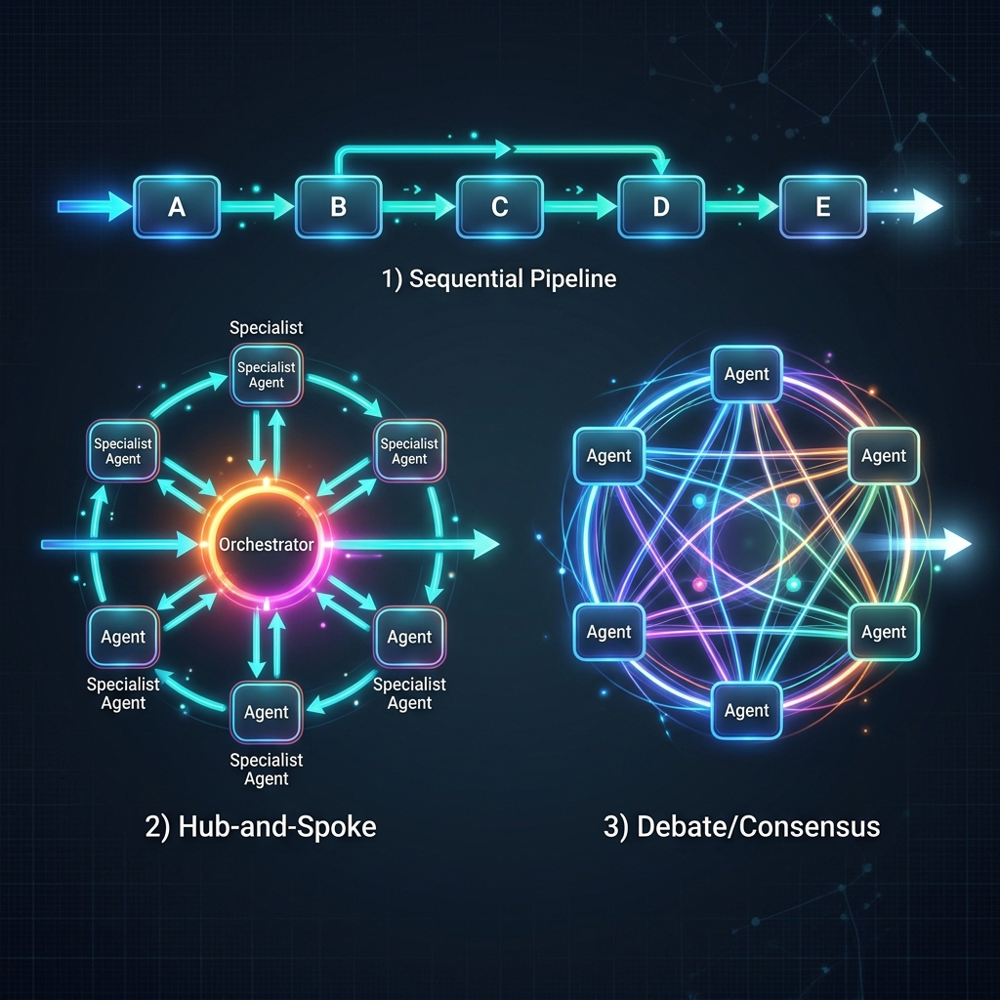
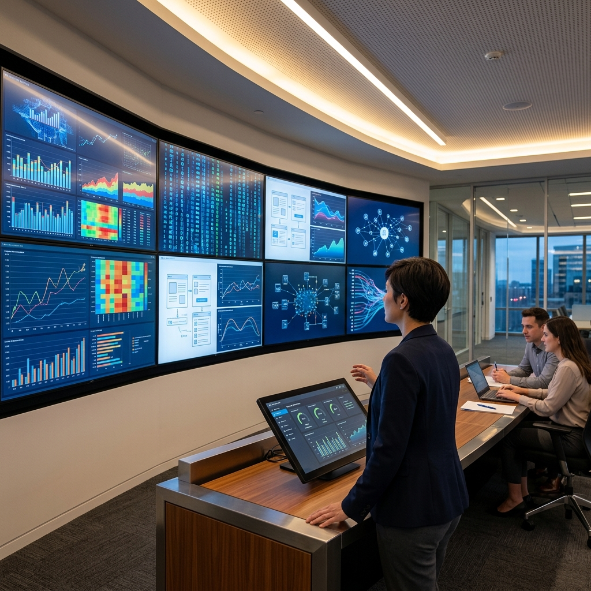

# Chapter 32: Multi-Agent Systems: Digital Collaboration

  

A single AI agent is powerful, but it has limits. Just as a single brilliant person can't build a skyscraper alone, a single LLM can suffer from "context saturation" or lose focus when a task becomes too complex. 

The solution is **Multi-Agent Systems (MAS)**: specialized models working together as a team.

---

## 💡 The Simple Explanation: The Film Production Set

Imagine you are making a blockbuster movie. 

Could one person write the script, build the sets, act every role, handle the lighting, and edit the final cut? Technically, maybe—but it would be a mess.

Instead, we use a **Production Crew**:
1.  **The Screenwriter**: Specialized only in story and dialogue.
2.  **The Cinematographer**: Only cares about visual composition and lighting.
3.  **The Actor**: Focused entirely on performance.
4.  **The Director (Manager)**: Doesn't do the individual tasks, but **orchestrates** the specialists, ensuring they are all working toward the same vision.

In MAS, we create different "Personas" for the AI. One agent is the **Searcher**, another is the **Coder**, and a third is the **Reviewer**. By separating concerns, we make the system more reliable, accurate, and scalable.

---

## 🔍 Going Deeper: Orchestration Patterns

How these agents talk to each other is just as important as what they do. There are three primary ways to organize an AI team:

  

### 1. The Sequential Pipeline (Conga Line)
Agent A does its work and passes the output to Agent B, who passes it to Agent C. 
*   *Example*: [Research Agent] -> [Writing Agent] -> [Editing Agent].

### 2. The Hub-and-Spoke (Manager Pattern)
A central "Orchestrator" agent receives the user's request, decides which specialist to call, reviews their work, and then asks the next specialist. The specialists never talk to each other; they only talk to the Manager.
*   *Best for*: Complex, branching tasks where the next step isn't always known.

### 3. The Debate/Consensus Pattern
Multiple agents are given the same problem and are asked to debate each other's answers until they reach a consensus.
*   *Best for*: High-stakes reasoning, coding fixes, or fact-checking.

  

---

## 🌐 Real-World Connection: The Autonomous Enterprise

Multi-agent systems are starting to power "fully automated" business workflows:

*   **Customer Support Triaging**: An **Entry Agent** identifies the user's intent. If it's technical, it passes it to a **Support Engineer Agent**. If that agent fixes the bug, a **Tester Agent** verifies the fix, and a **Comms Agent** notifies the customer.
*   **AI Venture Capital**: Teams of agents can perform due diligence. One agent scrapes financial data, another analyzes the competitive landscape, and a third plays "Devil's Advocate" to find flaws in the investment thesis.
*   **Game Development**: A "Game Master" agent manages the world, while individual "NPC Agents" have their own memories, goals, and personalities, interacting with each other to create an emergent story.

  

By moving from a single "Smart Chatbot" to a "Digital Hive Mind," we overcome the limitations of individual context and create systems that are truly greater than the sum of their parts.

---

### 📖 References
*   **Source**: *Building Applications with AI Agents* by Michael Albada.
*   **Chapter Reference**: Chapter 8: "From One Agent to Many."

---

[← Previous: Chapter 31](./chapter_31.md) | [Next: Chapter 33 →](./chapter_33.md)
