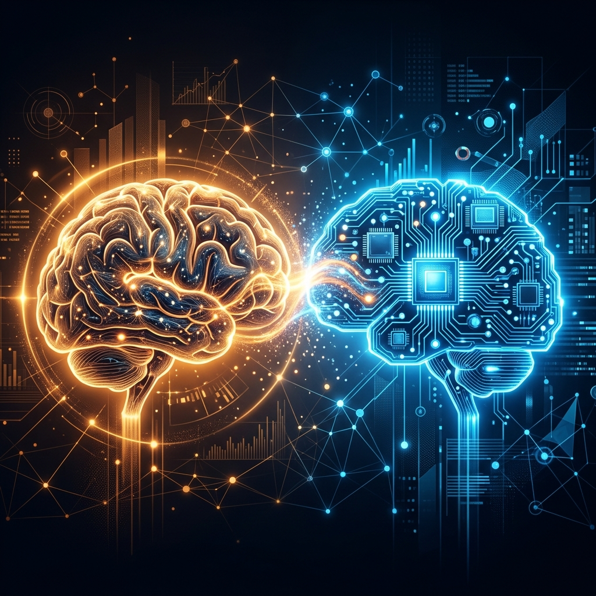
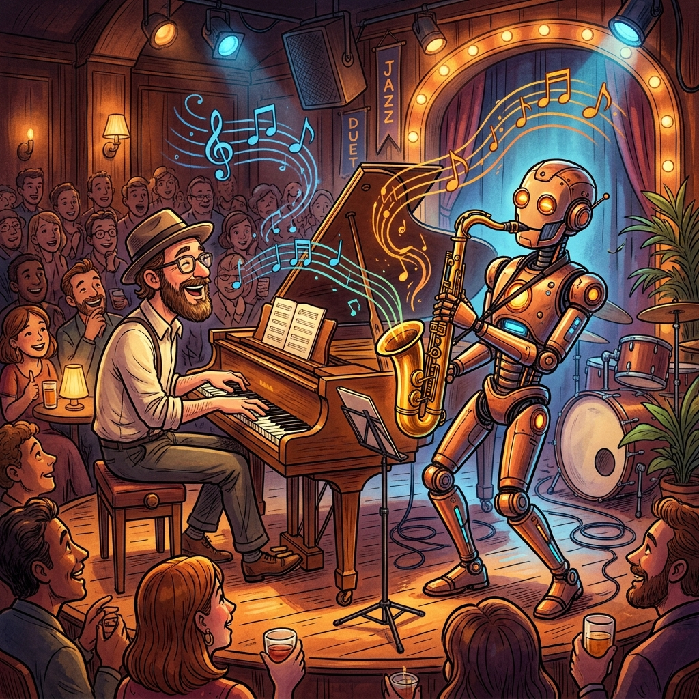
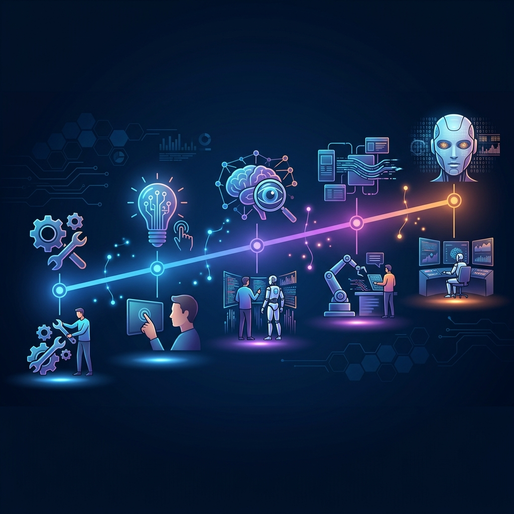

# Chapter 33: Co-Intelligence: The Partnership Era

  

We often talk about AI as a tool—like a hammer or a spreadsheet. But LLMs are different. They don't just "do" what they are told; they have an "alien" logic, a massive library of human history, and a strange creative spark.

As Ethan Mollick argues, we are moving from **Artificial Intelligence** to **Co-Intelligence**.

---

## 💡 The Simple Explanation: The Jazz Duet

Imagine you are playing a musical instrument. 

Using a **Traditional Computer Program** is like playing a **Player Piano**. You press a button, and the song plays exactly the same way every time. You are the operator; the machine is the instrument.

Using an **LLM** is more like a **Jazz Duet**.
1.  **Improvisation**: You play a few notes (a prompt), and the AI plays a response based on what you played.
2.  **Shared Creation**: You don't know exactly what the AI will play next, and it doesn't know exactly where you are going. 
3.  **Active Listening**: The "song" (the final result) isn't yours, and it isn't the AI's. It's a third thing that only exists because you worked together.

Co-intelligence is the realization that AI isn't just a "calculator for words"; it's a teammate that requires us to change how we work, learn, and lead.

---

## 🔍 Going Deeper: The Spectrum of Collaboration

To work effectively with "Alien Minds," we need to understand the different modes of partnership:

  

### The Collaborative Matrix
*   **AI as a Person**: Treating the LLM like an intern. You give it context, define its goals, and critique its work. Just as you wouldn't tell an intern "Write a 500-page book," you don't give the LLM impossible tasks without guidance.
*   **AI as a Creative**: Using the LLM to get over "the blank page." The AI is better at generating 100 bad ideas than you are, but you are better at picking the one brilliant idea and refining it.
*   **AI as a Tutor**: The model can explain any concept at any level. You don't just "search" for an answer; you "interrogate" the topic.

  

### The "Sleepless Night" Realization
Mollick suggests that truly understanding AI requires about "three sleepless nights." It's that moment where you stop trying to "code" the AI and start trying to "partner" with it. You realize it has a personality, biases, and a unique way of seeing the world.

---

## 🌐 Real-World Connection: The Augmented Self

How does co-intelligence look in practice?

*   **Medical Diagnosis**: Doctors use AI not to *replace* their judgment, but to catch the one rare disease they might have missed in a 12-hour shift. The doctor remains the "Moral Anchor," while the AI is the "Pattern Matcher."
*   **Education**: Instead of a single teacher for 30 kids, every student has a personalized **Socratic Tutor** that knows exactly where they are confused and adjusts the lesson in real-time.
*   **Creative Writing**: Authors use LLMs to "world-build"—generating maps, family trees, and histories for a fantasy world so they can focus entirely on the emotional arc of their characters.

  

Co-intelligence isn't about the AI becoming human; it's about humans using AI to become "more than human"—smarter, faster, and more creative.

---

### 📖 References
*   **Source**: *Co-Intelligence: Living and Working with AI* by Ethan Mollick.
*   **Chapter Reference**: Introduction: "Three Sleepless Nights."

---

[← Previous: Chapter 32](./chapter_32.md) | [Next: Chapter 34 →](./chapter_34.md)
