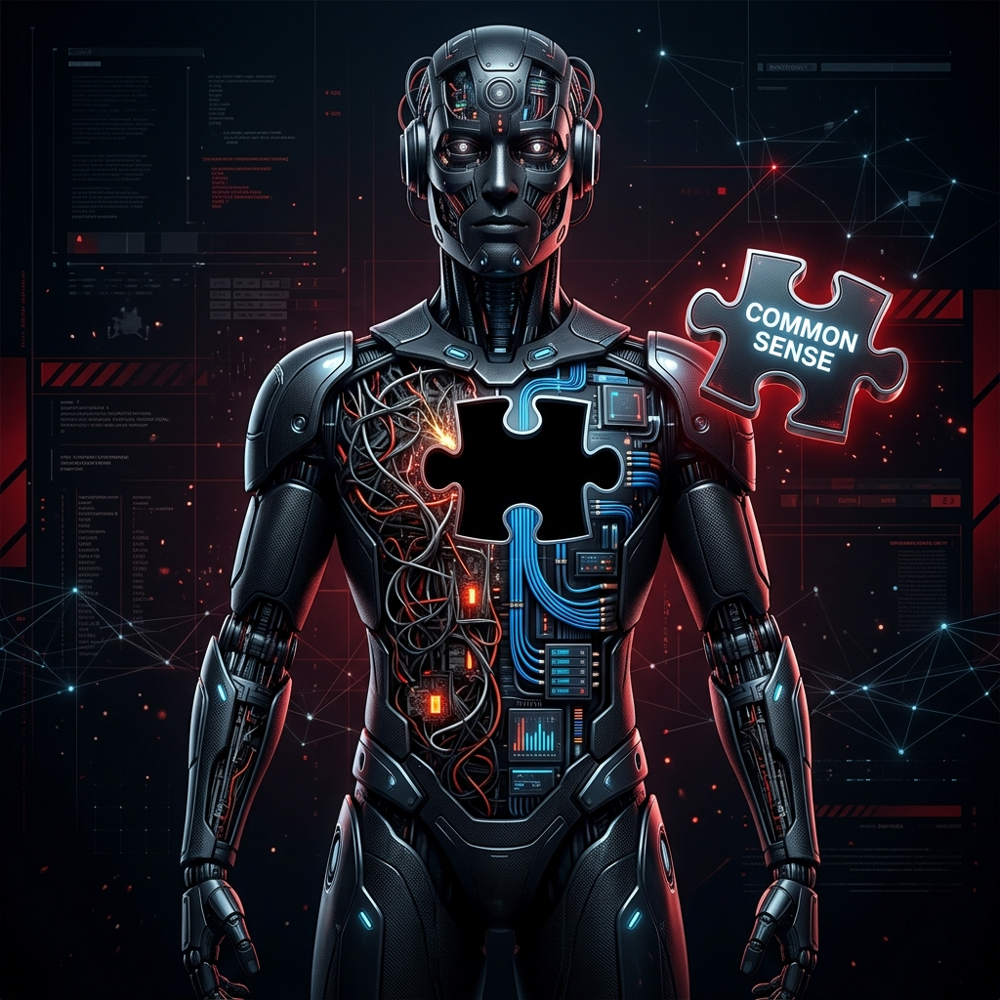
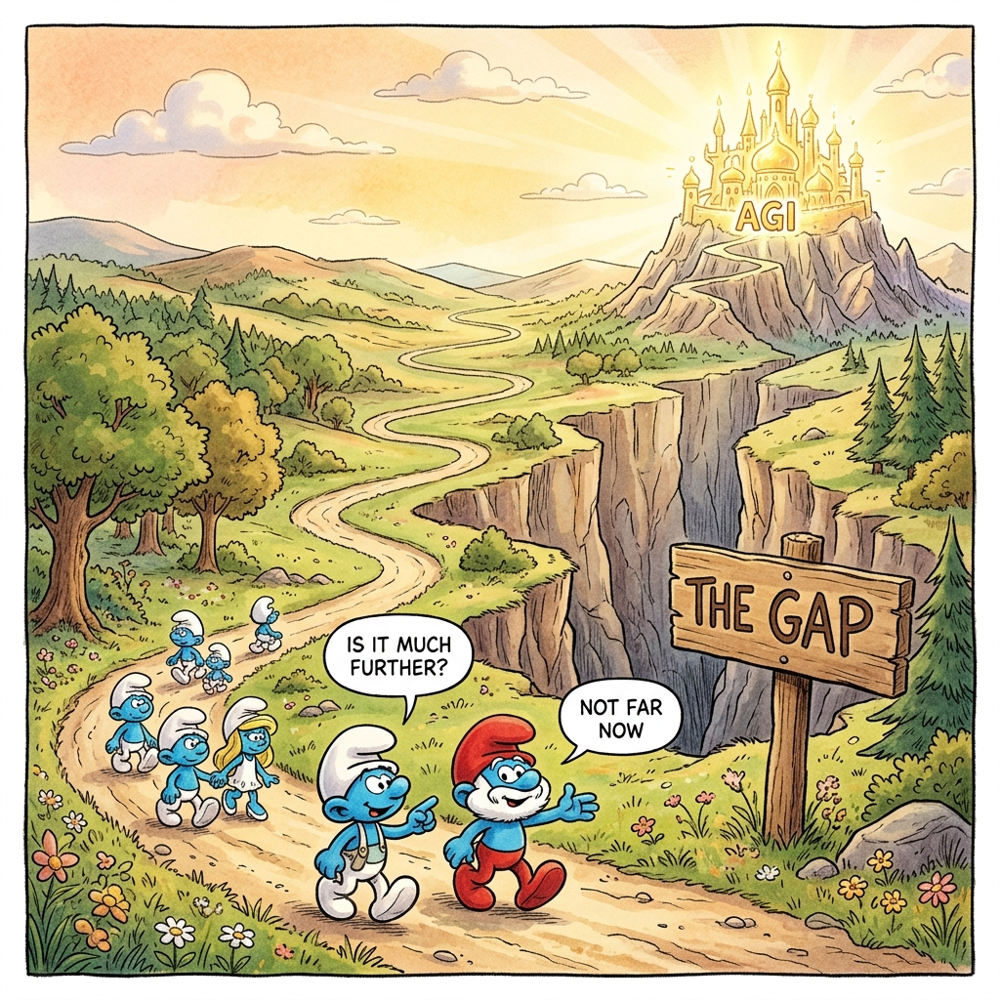
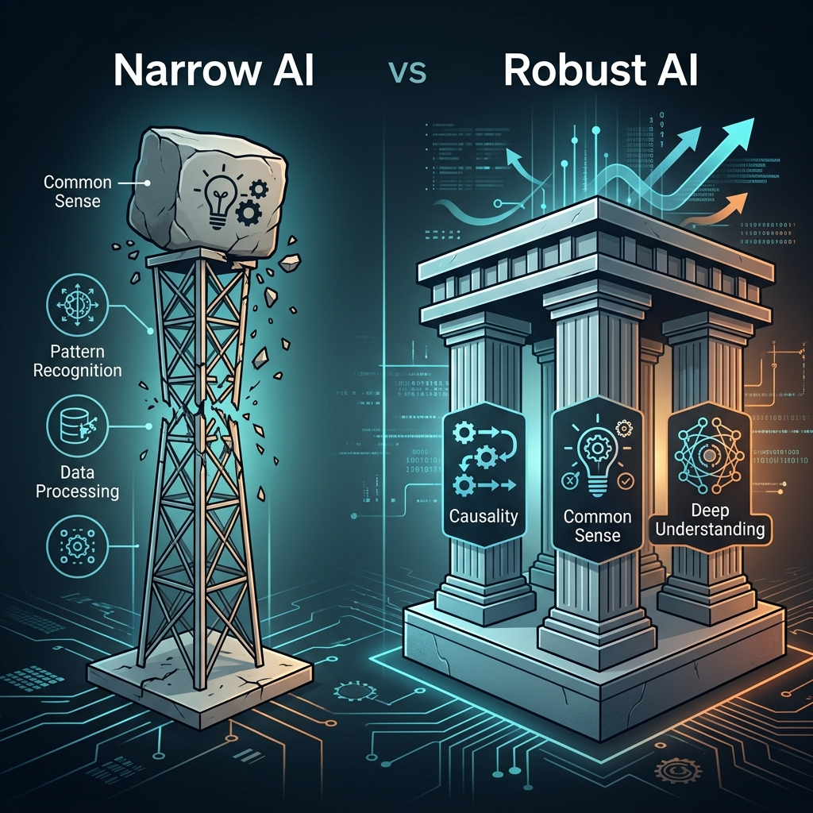
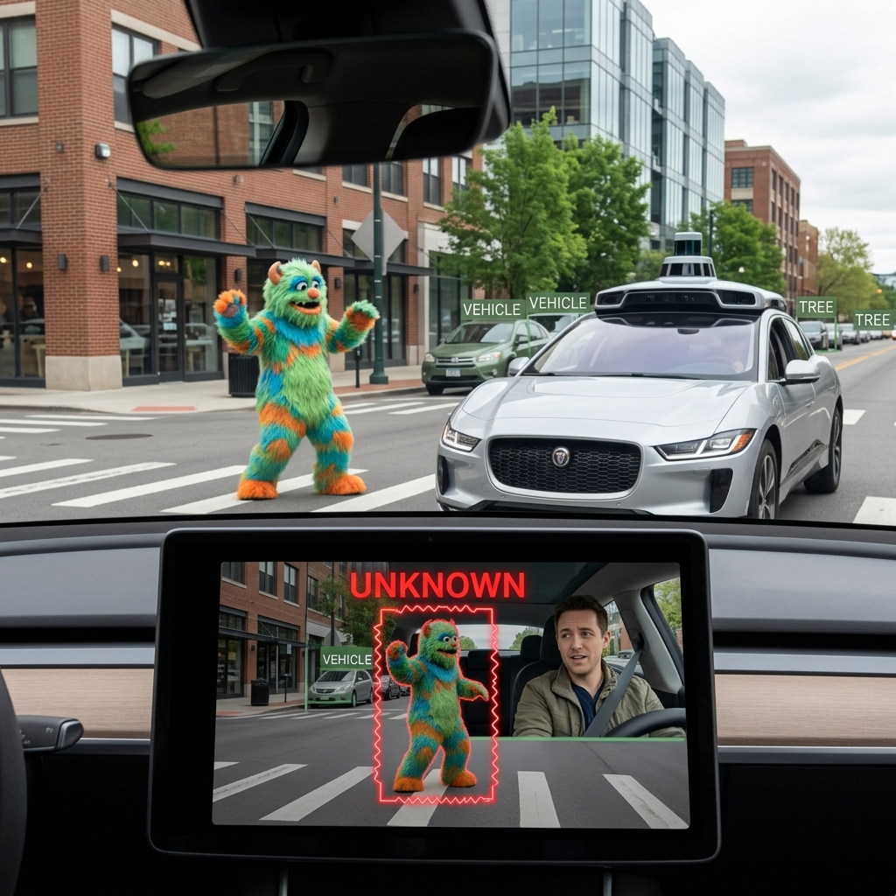

# Chapter 34: The Common Sense Gap: The Path to Robust AI

  

We've seen how powerful LLMs are. They can write poetry, code entire apps, and debate philosophy. But they also make "stupid" mistakes—hallucinating facts, falling for trick questions, and failing at basic logic that a five-year-old would catch. 

Gary Marcus and Ernest Davis call this the **Trust Gap**. To build AI we can truly trust, we need to go beyond "statistical prediction" and reach "deep understanding."

---

## 💡 The Simple Explanation: The Smurf Journey

Imagine a family of Smurfs walking through a forest on a long journey toward a shining city on a hill (Artificial General Intelligence).

Every few years, the children ask: **"Is it much further, Papa Smurf?"**
And Papa Smurf always answers: **"Not far now."**

In 1965, pioneers said AGI was 20 years away. In 2024, people say it's 2 years away. We think we are "nearly there" because the AI can do high-level things like play Chess or write legal briefs. 

But there is a **Massive Canyon** in the middle of the road that we haven't crossed yet: **The Common Sense Gap**. We are very good at building "Narrow AI" (the road), but we are struggling to build "Robust AI" (the bridge over the canyon) that doesn't break when it sees something it hasn't been trained on.

---

## 🔍 Going Deeper: Why Deep Learning is Brittle

Today's AI is based on **Statistical Correlation**. It knows that the word "Paris" often follows the word "Capital of." It doesn't actually *understand* what a city, a country, or a capital is.

  

### The Four Pillars of Robust AI
To bridge the gap, Marcus and Davis argue we need to give AI four things it currently lacks:

1.  **Causal Reasoning**: Understanding *why* things happen, not just *that* they happen together. (e.g., "If I drop this glass, it will break.")
2.  **Common Sense**: The basic knowledge of the physical and social world. (e.g., "A toaster doesn't belong in a bathtub.")
3.  **Spatiotemporal Awareness**: Understanding space and time. (An LLM might know a person was born in 1950 and died in 1940 because it's just predicting tokens, not tracking a timeline.)
4.  **Deep Understanding**: The ability to build internal "Mental Models" of the world that don't depend on seeing a billion examples.

  

---

## 🌐 Real-World Connection: The Safety Crisis

Why does this matter? Because "brittle" AI is dangerous in the real world.

*   **Self-Driving Cars**: A car's vision system might be 99.9% accurate, but if it has never seen a person wearing a "traffic cone" costume, it might not recognize them as a human. It lacks the *common sense* to know that "human + costume = still human."
*   **Medical Diagnosis**: An AI might find a correlation between "wearing a specific hospital gown" and "having cancer" because the training data came from a cancer ward. It doesn't *understand* the causal link between the disease and the patient.
*   **Automated Law/Finance**: A legal agent might cite a case that never happened (hallucination) because it was "statistically plausible" in the text, not because it exists in reality.

  

As we move toward the final chapters of this course, remember: The goal isn't just a "Smarter Chatbot." The goal is **Robust AI**—systems that understand the world as well as we do, and that we can trust with our lives.

---

### 📖 References
*   **Source**: *Rebooting AI: Building Artificial Intelligence We Can Trust* by Gary Marcus and Ernest Davis.
*   **Chapter Reference**: Chapter 7: "Common Sense and the Path to Deep Understanding."

---

[← Previous: Chapter 33](./chapter_33.md) | [Home: README](../README.md)
