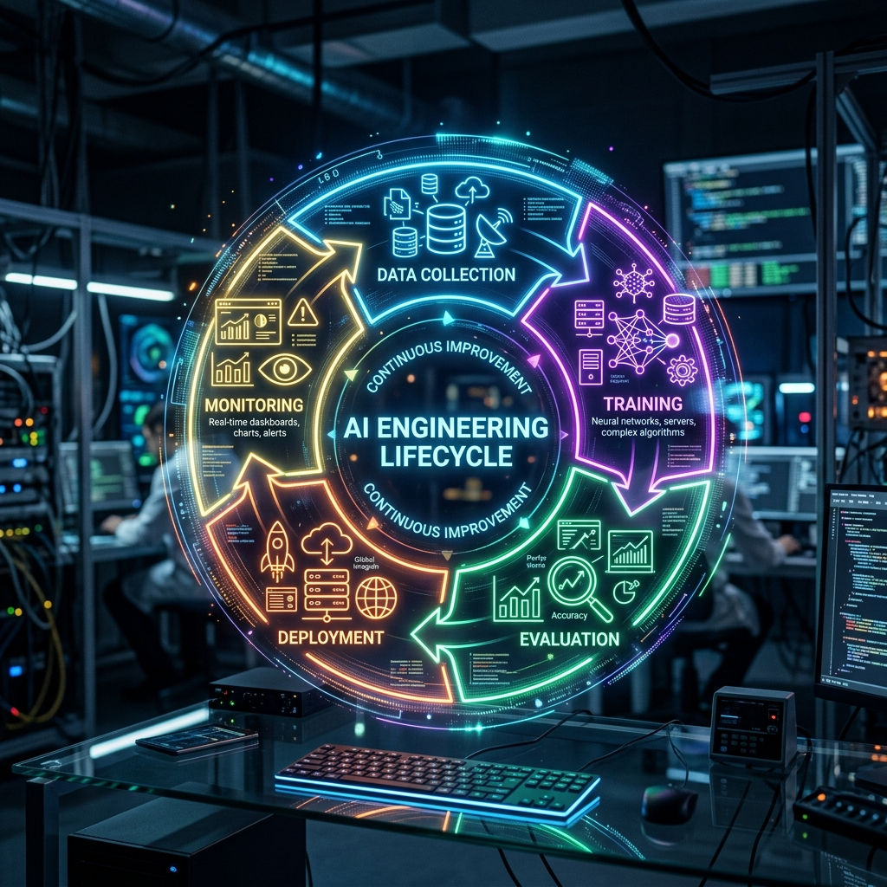

# Chapter 35: The AI Lifecycle: Engineering the Foundation Model

  

Most people think building an AI application is as simple as writing a smart prompt. While that works for a demo, it fails in production. In the real world, "AI Engineering" is about moving from a single handcrafted "recipe" to a scalable, automated "industrial kitchen" that can serve millions safely and consistently.

Chip Huyen, in *AI Engineering*, argues that the foundation model is just one small part of a much larger technical lifecycle.

---

## 💡 The Simple Explanation: The Chef vs. The Factory

Imagine you are a world-class chef. You spent weeks perfecting a new recipe for a complex souffle. It tastes amazing when you make it yourself in your kitchen.

**The "Chef's Recipe" (The Notebook Phase)**:
This is you in a Jupyter Notebook. You found the right model, wrote the perfect prompt, and it worked on your computer. You are happy!

**The "Automated Industrial Kitchen" (The Engineering Phase)**:
Now imagine you want to serve that same souffle to 10,000 customers across the country, every single night, at exactly the same quality.
*   **Sourcing**: Where do you get the eggs? (Our Data Pipeline)
*   **Consistency**: How do you make sure every oven is calibrated exactly the same? (Our Evaluation & Benchmarks)
*   **Safety**: How do you ensure no one gets food poisoning? (Our Security Guardrails)
*   **Feedback**: If customers say it's too salty, how do you change the recipe for all 10,000 kitchens instantly? (Our Iteration Loop)

**AI Engineering** is the process of building the kitchen, not just writing the recipe.

---

## 🔍 Going Deeper: The Foundation Model Lifecycle

According to Chip Huyen, a robust AI system follows a closed-loop cycle that never truly ends.

  

### 1. The Context Gap
Models are "frozen" in time. If you use GPT-4, it doesn't know about news that happened yesterday. Engineering the lifecycle means building systems like **RAG** (Retrieval-Augmented Generation) to bridge that context gap in real-time.

### 2. Evaluation: The Compass of Engineering
In traditional software, you have "Unit Tests." In AI, you have "Evaluations." Because LLM outputs are probabilistic (they change slightly every time), you need a system that runs thousands of test cases and calculates scores (Accuracy, Toxicity, Hallucination) to tell you if your last change made the model better or worse.

### 3. Monitoring the Drift
Models "drift." A model that works perfectly today might start giving weird answers next month because the way people talk to it has changed. AI Engineering involves monitoring for "Data Drift" and "Concept Drift" to trigger new training or prompt updates.

---

## 🌐 Real-World Connection: From "Vibe Check" to "Model Ops"

Early AI developers used the **"Vibe Check"**: if the answer looked okay, they shipped it. 

Today, companies like Uber, Netflix, and OpenAI use **Model Ops**. They have automated pipelines that:
1.  **A/B Test**: Send 5% of users to a new prompt/model and 95% to the old one.
2.  **Shadow Mode**: Run the new model in the background, compare its answers to the "Live" model, but don't show them to the user yet.
3.  **Automatic Rolls**: If the new model scores higher on safety and accuracy benchmarks, it automatically becomes the new "Live" version.

Engineering the lifecycle ensures that your AI isn't just a "parrot" repeating tokens, but a reliable piece of infrastructure.

---

### 📖 References
*   **Source**: *AI Engineering: Building Applications with Foundation Models* by Chip Huyen.
*   **Chapter Reference**: Chapter 1: "The Foundation Model Lifecycle."

---

[← Previous: Chapter 34](./chapter_34.md) | [Home: README](../README.md) | [Next: Chapter 36 →](./chapter_36.md)
