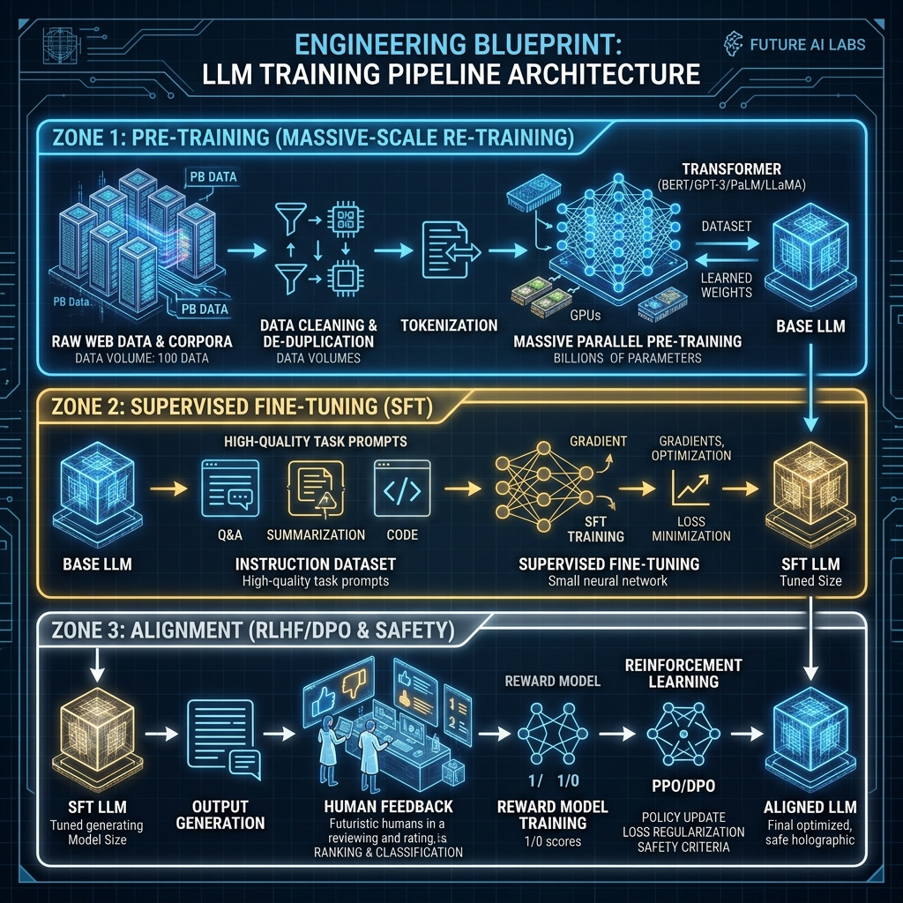

# Chapter 36: The LLM Engineer's Blueprint: From Data to RLHF

  

Building a state-of-the-art LLM like Llama-3 or GPT-4 isn't just about throwing data at a GPU. It's a multi-stage construction process where each layer must be built perfectly for the whole structure to stand.

In the *LLM Engineer’s Handbook*, Paul Iusztin and Maxime Labonne lay out a "Blueprint" for creating useful, aligned models.

---

## 💡 The Simple Explanation: The Tower of Layers

Imagine you are building a massive tower (the Model) intended for people from all over the world to live in.

**Stage 1: The Foundation (Pre-training)**
You start by gathering every brick and piece of wood ever made (the Internet). You stack them into a massive pile. This creates a "General" shape, but you can't live in it yet. It's just a raw heap of "knowledge."

**Stage 2: The Floor Plan (Supervised Fine-Tuning - SFT)**
Now, you go in and start building actual walls, stairs, and doors. You teach the model: "When I say X, you should do Y." You are turning the "Pile of Bricks" into a "Structured Building." This makes the model helpful.

**Stage 3: The Safety Inspector (RLHF & DPO)**
Finally, you bring in human safety inspectors. They walk through the building and say, "Don't put a sink next to the stove," or "Make sure this balcony is safe for kids." This is **Alignment**. We are ensuring the model doesn't just "talk," but talks in a way that is safe and helpful for humans.

**LLM Engineering** is the art of overseeing every floor of this construction.

---

## 🔍 Going Deeper: The Training Pipeline

The modern LLM lifecycle consists of four distinct phases of data and compute.

  

### 1. Pre-training: The Giant Vacuum
This is where the model learns the statistical structure of language. It costs millions of dollars in GPU time. The goal is simple: "Predict the next token."
*   **Data**: The Pile, Common Crawl, Github.
*   **Output**: A "Base" model that can complete sentences but can't follow instructions well.

### 2. SFT: Instruction Tuning
We give the model sets of `{Instruction, Response}` pairs. This teaches the base model how to act like an assistant.
*   **Data**: Handcrafted datasets like Alpaca or ShareGPT.
*   **Goal**: Behavioral mapping. "If user asks for a summary, give a summary."

### 3. Preference Alignment (RLHF/DPO)
Even after SFT, models might be rude, biased, or hallucinate. We show the model two answers and ask a human (or a smarter model): "Which one is better?"
*   **Techniques**: RLHF (Reinforcement Learning from Human Feedback) or DPO (Direct Preference Optimization).
*   **Goal**: Pushing the probability of "Good" answers up and "Bad" answers down.

---

## 🌐 Real-World Connection: The Hybrid Frontier

Most engineers today don't train models from scratch. They use **PEFT** (Parameter-Efficient Fine-Tuning) techniques like **LoRA**.

Instead of rebuilding the entire tower (the model), LoRA adds "extra scaffolding" around it. You keep the 70 billion original bricks frozen and only train a tiny "adapter" layer. This allows a single engineer to specialize a massive model for "Medical Law" or "Python Bug Fixing" in just a few hours on a single GPU.

The blueprint has evolved from "Building the Mountain" to "Decorating the Room."

---

### 📖 References
*   **Source**: *LLM Engineer’s Handbook* by Paul Iusztin and Maxime Labonne.
*   **Chapter Reference**: Chapter 3: "The Full LLM Training Pipeline."

---

[← Previous: Chapter 35](./chapter_35.md) | [Home: README](../README.md) | [Next: Chapter 37 →](./chapter_37.md)
