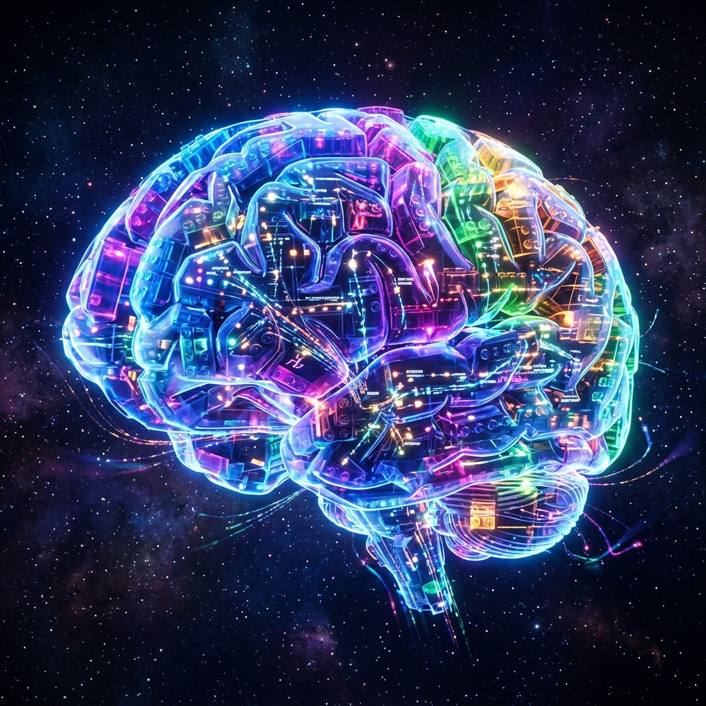
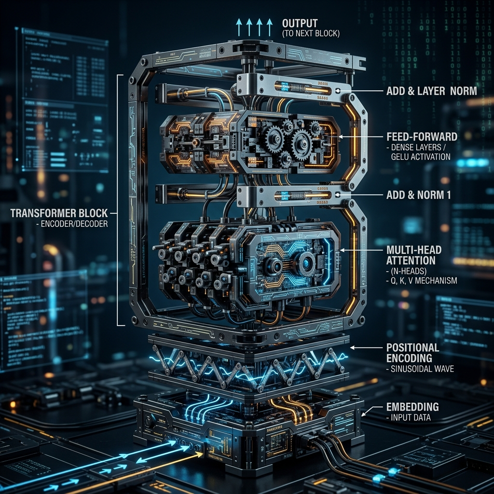

# Chapter 37: Building the Brain: Architecting Transformers from Scratch

  

To truly understand how a machine "thinks," you have to build it brick by brick. While we often treat LLMs as "Black Boxes," they are actually modular structures built from just a few simple types of mathematical "Lego blocks."

In *Build a Large Language Model (From Scratch)*, Sebastian Raschka teaches us how to assemble these pieces into a working brain.

---

## 💡 The Simple Explanation: The Lego Brain

Imagine you want to build a robotic brain out of Lego blocks. You don't have one giant "Intelligence" block. Instead, you have thousands of tiny, simple pieces that work together.

**Block 1: The Translator (The Embedding Layer)**
First, you need a piece that converts human words into something the robot understands: numbers. It transforms the word "Apple" into a specific coordinate like `(0.5, -0.2)`.

**Block 2: The Spotlight (Multi-Head Attention)**
Next, you need a block that can "shine a light" on different parts of a sentence. In the sentence "The cat sat on the mat because it was tired," this block shines a light on "it" and "cat" to show they are the same thing.

**Block 3: The Calculator (Feed-Forward Network)**
After the "Spotlight" finds the connections, the "Calculator" block does the heavy lifting. It takes all the highlighted information and calculates: "Given these connections, what is the next most likely Lego block to add?"

**Architecting from scratch** is about learning how to snap these blocks together so they don't fall apart.

---

## 🔍 Going Deeper: The Transformer Stack

A Transformer is essentially a "Stack" of Identical Blocks. Each block (Layer) refines the meaning of the tokens.

  

### 1. Tokenization and Embeddings
We split text into `tokens` (words or parts of words). Each token is assigned an `ID`.
`"Hello world"` → `[15496, 995]`
These are then converted into `Vectors`.

### 2. Positional Encoding
Wait! In a pile of Lego, the pieces don't know where they are. In language, order matters ("Dog bites man" vs "Man bites dog"). We add a "Signal" to each vector that tells the model its exact position in the sentence.

### 3. The Attention Mechanism (Q, K, V)
This is the "Secret Sauce."
*   **Query (Q)**: What am I looking for?
*   **Key (K)**: What information do I have?
*   **Value (V)**: The actual content.
The model calculates a "Score" between Q and K. If they match well, it "pays attention" to that Value.

### 4. Layer Normalization
To keep the "building" stable, we normalize the numbers after each calculation. This prevents the math from "exploding" (becoming too large) or "vanishing" (becoming zero).

---

## 🌐 Real-World Connection: The Hardware Lottery

Why do we use Transformers and not other designs? Because of the **Hardware Lottery**.

Transformers are "Parallelizable." This means instead of reading a book word-by-word (like a human or older AI), the Transformer looks at the whole page at once. This makes them perfect for **GPUs** (Graphics Processing Units), which are designed to do thousands of calculations simultaneously.

This efficiency is why we can train models on the entire internet in weeks, rather than decades.

---

### 📖 References
*   **Source**: *Build a Large Language Model (From Scratch)* by Sebastian Raschka.
*   **Chapter Reference**: Chapter 3: "Coding a Transformer Architecture from Scratch."

---

[← Previous: Chapter 36](./chapter_36.md) | [Home: README](../README.md) | [Next: Chapter 38 →](./chapter_38.md)
