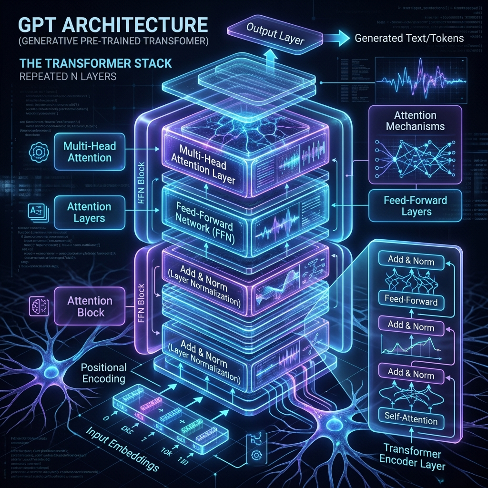
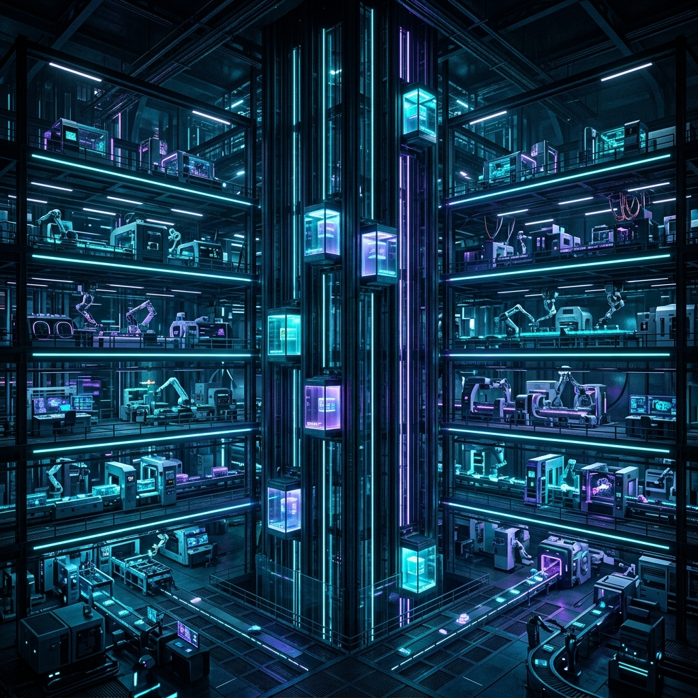
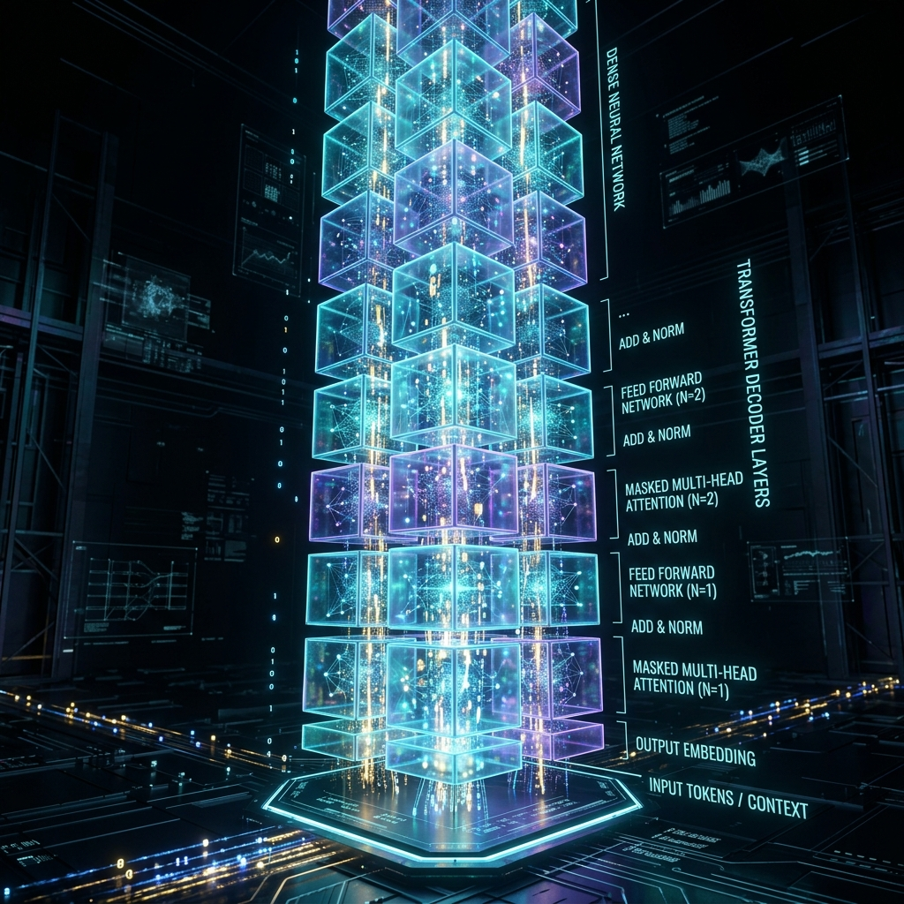

# Chapter 4: Building a Brain

---
[⬅️ Previous](chapter_3.md) | [🏠 Home](../README.md) | [Next ➡️](chapter_5.md)

  

## 🎯 Objective
In this chapter, we will learn how to organize the individual components we’ve studied—Embeddings and Attention—into a cohesive, functioning "digital brain." We will explore the **Transformer Block** and understand why stacking these blocks creates the sophisticated reasoning we see in models like ChatGPT.

---

## 💡 The Simple Explanation: The Multi-Story Filtering Factory

  

Building an LLM is like constructing a massive, 96-story skyscraper that functions as a highly automated sorting factory. On the ground floor, raw text (tokens) enters the building. But the text isn't just stacked there; it needs to be refined.

Every floor of this skyscraper is **identical**. On each floor, there are two main machines:

1.  **The Context Machine (Attention)**: This machine looks at all the incoming data boxes and draws connections. It says, *"This box labeled 'it' is actually about the box labeled 'Apple'."* It adds a little tag to the box with that information.
2.  **The Thinking Machine (Feed-Forward)**: This machine takes the newly tagged boxes and polishes the data inside. It refines the "meaning" based on the context it just received. 

Once the "Thinking Machine" is done, the data boxes are sent up the elevator to the next floor. The next floor has the *exact same machines*, but since the data was already polished once, the machines on the second floor can find even deeper, more subtle patterns. 

By the time the data reaches the roof (the 96th floor), it has been processed so many times that the final box coming out is no longer just a word—it is a highly refined prediction of the next possible concept. **This skyscraper is the Transformer Architecture.**

---

## 🔍 Going Deeper: The Technical Reality

  

Modern Large Language Models (like Llama, GPT-4, and Mistral) almost exclusively use a **Decoder-Only Transformer** architecture. This is a stack of identical layers, each designed to stabilize and transform data through rigorous linear algebra.

As detailed in *Build a Large Language Model (From Scratch)* by Sebastian Raschka, a single "Transformer Block" contains four critical engineering components:

### 1. Multi-Head Self-Attention (Chapter 3)
This is where the tokens "talk" to each other to establish context.

### 2. Layer Normalization
If you multiply large numbers over and over again (through 96 layers), the numbers will eventually become so large (exploding) or so small (vanishing) that the computer can no longer calculate them. **LayerNorm** acts like a "Volume Knob" that keeps all the mathematical values in a healthy range, ensuring the training process remains stable.

### 3. Residual Connections (Skip Connections)
This was a massive breakthrough in deep learning. Instead of the data *only* going through the Attention and Thinking machines, we also have a "Side Path" (the residual connection). We take the original input and **add it back** to the output of the machine. 
*   **Intuition**: It ensures that if a shallow layer discovers a really important fact, that fact isn't "diluted" or lost as it passes through the deeper parts of the factory. It allows gradients to flow smoothly during training.

### 4. Feed-Forward Network (FFN)
After the attention mechanism has shared information across tokens, each token passes through a private, two-layer neural network. This is where the model maps the "contextualized" data into a higher-level semantic space. Modern models often use the **SwiGLU** activation function here to provide better non-linear reasoning.

---

## 🎯 The "Aha!" Moment
The "intelligence" of an LLM doesn't come from a complex, unique blueprint for every chapter of human knowledge. It comes from **Iteration**. By taking the same basic filtering block and stacking it 32, 80, or 96 times, the model transitions from understanding simple grammar at the bottom layers to understanding complex human logic at the top layers. **Depth is the engine of wisdom.**

---

## 🌐 Real-World Connection

  

Have you ever wondered why ChatGPT gets smarter every year, but the way it looks and acts stays the same? It's because the "Floor Plan" of the Transformer factory (the architecture) hasn't fundamentally changed since 2017. 

The industry discovered that if you simply build a **taller skyscraper** (more layers) and make the **floor space wider** (larger embedding dimensions), the model becomes exponentially more capable. This is known as **Scaling Laws**. GPT-2 was like a tiny 12-story office building; GPT-3 was a massive 96-story skyscraper. The architecture is the same—the scale is what creates the "magic."

---

## 📚 References
*   **Build a Large Language Model (From Scratch)** (Sebastian Raschka, 2024) - *Chapter 4: Coding a Transformer Block from Scratch*.
*   **Hands-On Large Language Models** (Jay Alammar, 2024) - *Chapter 5: Transformer Architecture Deep Dive*.
*   **Large Language Models: A Deep Dive** (Stephan Raaijmakers, 2024) - *Chapter 3: The Architecture of Scale*.
*   **LLMs in Production** (Brousseau & Sharp, 2024) - *Section on Model Architecture and Hosting*.

---
[⬅️ Previous](chapter_3.md) | [🏠 Home](../README.md) | [Next ➡️](chapter_5.md)
