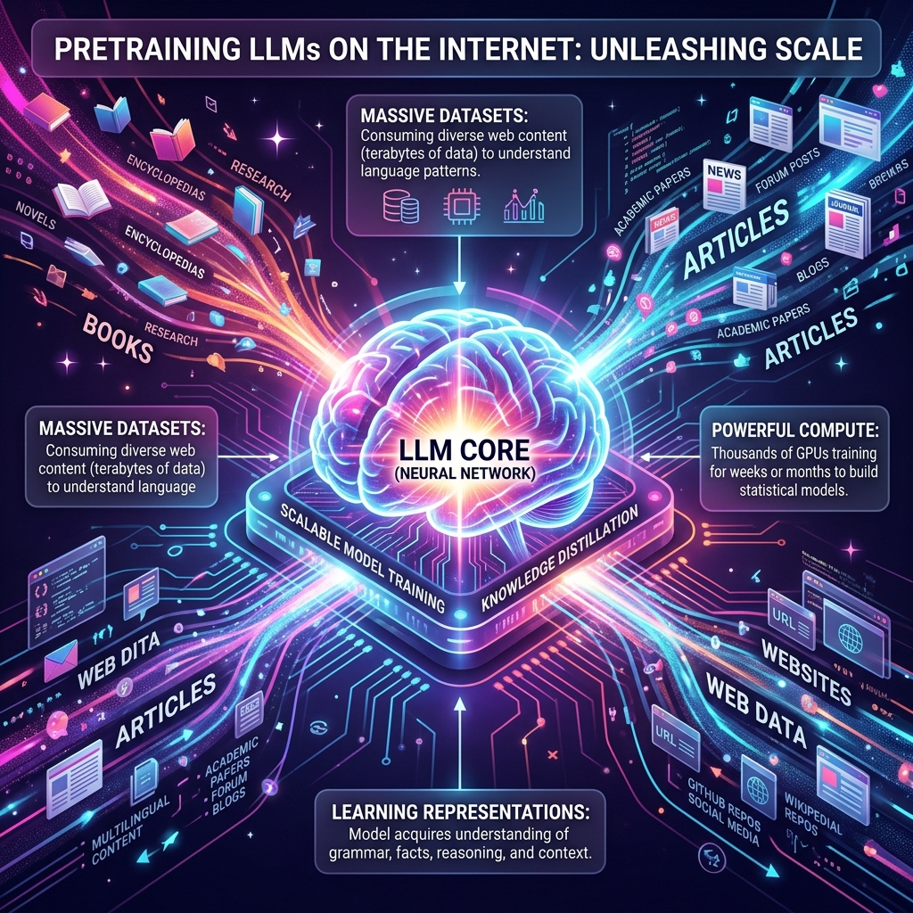

# Chapter 5: The Training Ground

  

## 🎯 Objective
In this chapter, we will learn how the empty "digital brain" of a Transformer becomes an expert in human knowledge. We will explore the massive computational process of **Pretraining**, the mathematics of **Gradient Descent**, and why training an LLM is currently one of the most expensive and energy-intensive tasks on Earth.

---

## 💡 The Simple Explanation: The Blind Librarian's Game

  

Imagine you have just finished building the 96-story factory we described in Chapter 4. The machines are all in place, the power is on, and the conveyor belts are moving. However, the machines haven't been "tuned" yet. If you put data in, the factory just spits out random garbage because all the internal knobs and dials are set to random positions.

To tune this factory, you hire a **Blind Librarian**. 

The Librarian cannot "know" what a house is, but they have a trillion pages of human text. They take a sentence like *"The sky is ___"* and they cover up the last word. They ask the factory to guess. Because the factory is untrained, it guesses a random word like *"bicycle."*

You, standing nearby with the original sentence, shout: *"WRONG! The answer was 'blue'! You were off by a huge margin."* 

The Librarian doesn't just get angry. Instead, they trace the error back through every single floor of the factory. They slightly turn thousands of knobs to make the factory a tiny bit more likely to say "blue" next time. Then, they do it again for the next sentence. And the next. And the next. 

After doing this **trillions of times**, across every Wikipedia page, every news article, and every public book on the internet, the knobs in the factory are perfectly positioned. The factory has reverse-engineered the entire structure of human thought, just by trying to fill in the blanks.

---

## 🔍 Going Deeper: The Technical Reality

  

This phase is called **Pretraining**, and it is where the "Base Model" is born. It is a mathematical optimization problem of astronomical proportions. 

### 1. Self-Supervised Learning
As noted in *Build a Large Language Model (From Scratch)* by Sebastian Raschka, the magic of LLMs is that they don't need humans to "label" data. The internet itself is the teacher. By using the **Next-Token Prediction** task, the model uses the future words as its own answer key. This allows us to use datasets containing trillions of tokens (like Common Crawl).

### 2. The Loss Function
The "Wrongness" of a model is officially measured by a **Loss Function** (usually Cross-Entropy Loss). If the model gives "blue" a low probability and "bicycle" a high probability, the Loss score is very high. The goal of training is to drive this Loss score as close to zero as possible.

### 3. Backpropagation and Gradient Descent
To lower the Loss, we use two fundamental algorithms:
*   **Backpropagation**: Like the Librarian tracing the error back through the factory, this algorithm uses calculus (the Chain Rule) to calculate exactly how much each of the billions of weights contributed to the error.
*   **Gradient Descent**: Once we know the "direction" of the error, we update the weights by a microscopic amount (guided by the **Learning Rate**) to move "down the hill" toward a lower loss.

### 4. The Optimizer
In modern training, we use an optimizer called **AdamW**. This is a sophisticated version of gradient descent that uses "momentum"—it remembers which direction it was moving previously to speed up the training process and avoid getting stuck in mathematical "puddles" (local minima).

---

## 🎯 The "Aha!" Moment
LLMs are never "told" that the capital of France is Paris. No human ever wrote a line of code saying `if user_asks_capital("France"): return "Paris"`. Instead, the model's internal weights are mathematically "sculpted" by trillions of examples until the network naturally settles into a shape where "Paris" is the only statistically valid conclusion to the prompt. **Learning is just the minimization of surprise.**

---

## 🌐 Real-World Connection

  

Pretraining a frontier model like Llama-3 (70B) or GPT-4 is an industrial-scale engineering feat. It requires:
*   **Thousands of NVIDIA H100 GPUs**: Working in perfect synchronization for months.
*   **Megawatts of Power**: Large enough to power a small city.
*   **Massive Capital**: The cost of electricity and hardware for a single training run can exceed $100 million.

This is why only a few companies on Earth can build "Base Models." However, once the training is done, the resulting file (the "Weights") can be downloaded and used by anyone. You are essentially downloading billions of "knob positions" that were perfected at the cost of $100 million.

---

## 📚 References
*   **Build a Large Language Model (From Scratch)** (Sebastian Raschka, 2024) - *Chapter 5: Pretraining on Unstructured Text*.
*   **LLMs in Production** (Brousseau & Sharp, 2024) - *Chapter 2: Training and Fine-tuning Infrastructure*.
*   **Large Language Models: A Deep Dive** (Stephan Raaijmakers, 2024) - *Section on Gradient Descent and Calibration*.
*   **LLM Engineer’s Handbook** (Paul Iusztin, 2024) - *Overview of Training Pipelines*.
