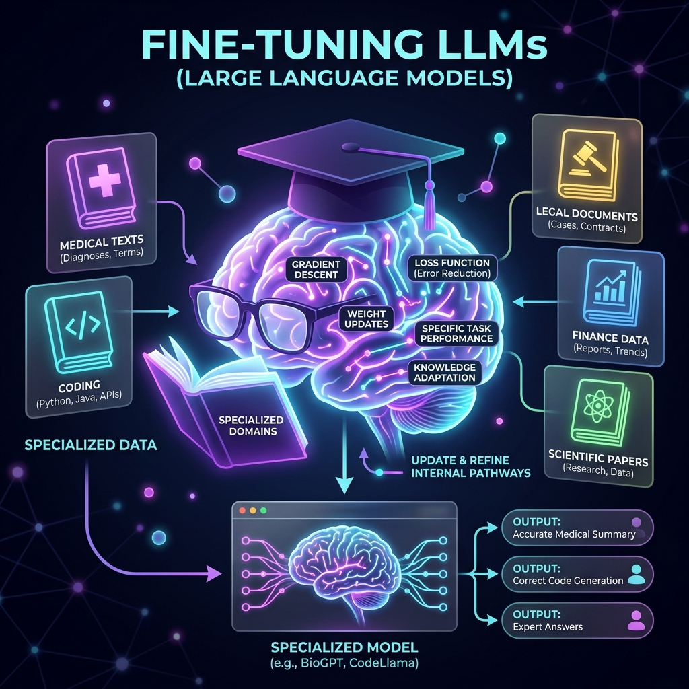
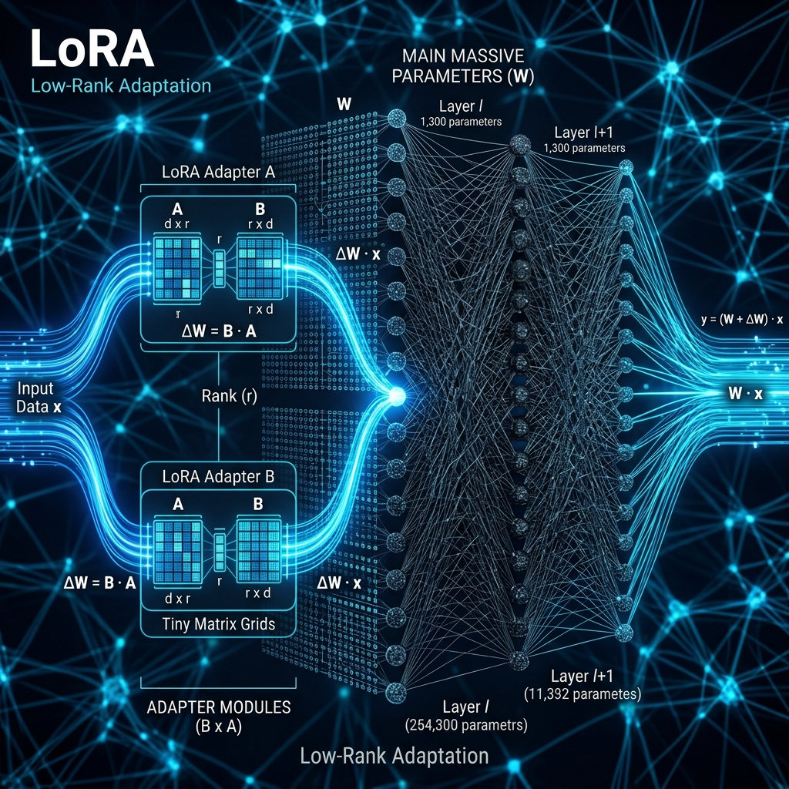
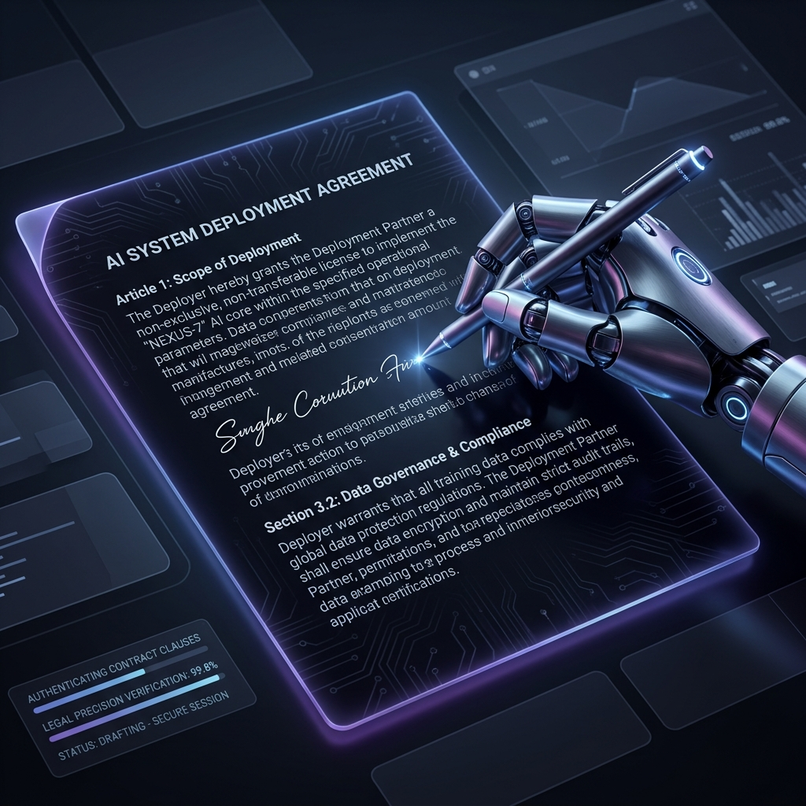

# Chapter 6: Teaching Old Models New Tricks

  

## 🎯 Objective
In this chapter, we will learn how to turn a generic "Base Model" into a specialized expert. We will explore the science of **Fine-Tuning**, the efficiency of **LoRA (Low-Rank Adaptation)**, and how we can achieve professional-grade results without needing a billion-dollar supercomputer.

---

## 💡 The Simple Explanation: The Brilliant Medical Resident

  

Imagine you meet a brilliant young medical resident. They have spent the last eight years reading every biology book, every chemistry paper, and every medical journal in existence (this is the **Pretraining** phase). They are remarkably smart, but they haven't actually practiced medicine yet. If you ask them a specific question about a rare neurological disorder, they can explain the theory, but they might not know how to interact with a patient or write a clinical report in your hospital's specific format.

To fix this, you don't send them back to elementary school. That would be a waste of time and money. Instead, you put them through a **Residency**. You give them a few weeks of intensive, hands-on training where they only look at hundreds of actual case files and patient reports from your specific clinic. 

Because they already know "medicine" and "language," they don't need to relearn the basics. They only need to "tweak" their knowledge to match your clinic's style and expertise. 

**This is Fine-Tuning.** We take a massive Base Model that already knows "The World" and we give it a few thousand specialized examples (Legal, Medical, or Coding) to align its billions of "knobs" for a specific job.

---

## 🔍 Going Deeper: The Technical Reality

  

Traditional "Full Fine-Tuning" is incredibly expensive. If you want to update all 70 billion parameters of a model, you would need multiple high-end GPUs just to store the math. To solve this, engineers use **PEFT (Parameter-Efficient Fine-Tuning)**, and the gold standard is **LoRA**.

### 1. The Core Limitation: The GPU Wall
When you train a model, you have to store not just the weights, but also the "gradients" and "optimizer states." This usually takes 3 to 4 times more memory than the model itself. A 70B model requires ~140GB of VRAM just to load; fine-tuning it would require ~600GB—thousands of dollars in server costs.

### 2. Enter LoRA: Low-Rank Adaptation
As explained in the *LLM Engineer's Handbook (Iusztin & Labonne)*, LoRA uses a brilliant mathematical trick: **Matrix Decomposition**. 

Instead of updating the massive weight matrix $W$, we keep it "Frozen" (locked). We then add two tiny, thin matrices ($A$ and $B$) next to it. 
*   If $W$ is a $1,000 \times 1,000$ matrix ($1,000,000$ numbers), the LoRA matrices might only be $1,000 \times 8$ and $8 \times 1,000$ (only $16,000$ numbers).
*   During training, we only update the tiny $16,000$ numbers in $A$ and $B$.

### 3. Rank (r) and Alpha ($\alpha$)
The "thickness" of these tiny matrices is called the **Rank ($r$)**. 
*   A low rank (like 4 or 8) is very efficient but might not learn complex new knowledge. 
*   A higher rank (like 64 or 128) can learn more complex patterns but takes more memory.
The **Alpha** parameter acts as a "scaling factor" that decides how much the tiny LoRA "opinion" should weight against the base model's knowledge.

### 4. Why it works
The fundamental insight of the LoRA paper is that most of the weights in a massive LLM don't actually need to change to learn a new task. The "Intrinsic Dimensionality" of the task is very low. By only training a tiny fraction of the weights, we can achieve 99% of the performance of full fine-tuning at 1% of the cost.

---

## 🎯 The "Aha!" Moment
Fine-tuning is about **Specialization**, not the creation of new intelligence. Think of the Base Model as a massive piece of marble representing all human knowledge. Full Fine-Tuning is like trying to remelt the entire block. LoRA is like using a small chisel to expertly carve a specific statue out of that marble. It’s faster, cleaner, and much more practical for real-world business applications.

---

## 🌐 Real-World Connection

  

Imagine a high-end law firm that wants an AI that writes exactly like their senior partners. If they use a generic model, it sounds like Wikipedia—polite but generic. 

Instead, they take an open-source model like Llama-3 and collect 500 historic, perfectly-written NDAs from their archives. They run a LoRA fine-tuning session on a single workstation for about 4 hours. The resulting model doesn't just know "Law"; it has perfectly mimicked the specific syntactic quirks, formatting, and legal tone of that specific firm. They have built a **"Digital Partner"** for the cost of a few dollars.

---

## 📚 References
*   **Build a Large Language Model (From Scratch)** (Sebastian Raschka, 2024) - *Chapter 6: Fine-tuning on Preselected Tasks*.
*   **LLM Engineer’s Handbook** (Paul Iusztin & Maxime Labonne, 2024) - *Chapter 4: Advanced Fine-Tuning Strategies (LoRA & QLoRA)*.
*   **Hands-On Large Language Models** (Jay Alammar, 2024) - *Section on Adapters and PEFT*.
*   **Large Language Models: A Deep Dive** (Stephan Raaijmakers, 2024) - *Chapter 6: Adapting the Model*.
