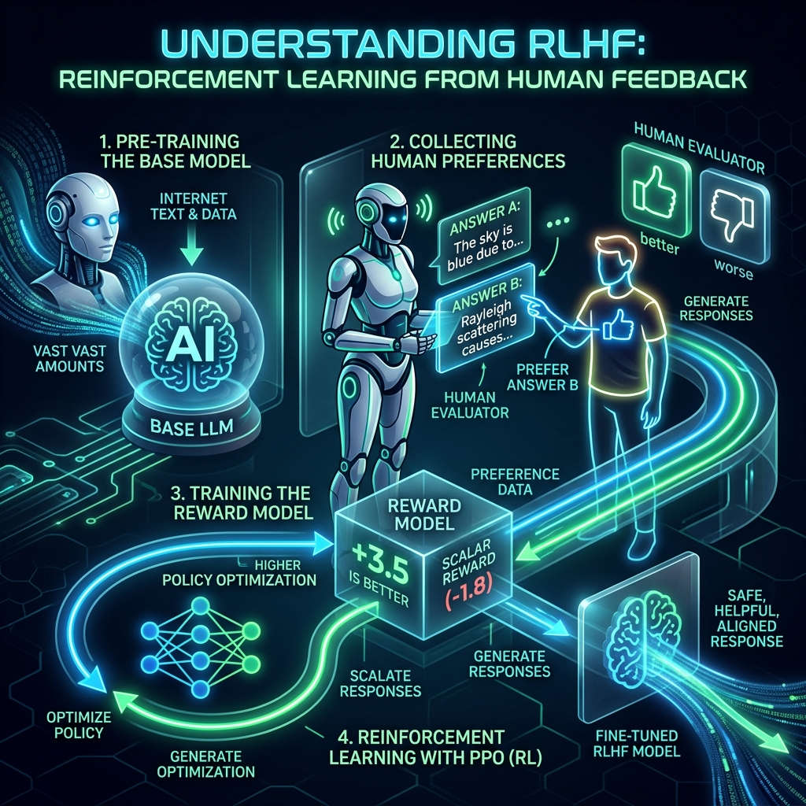
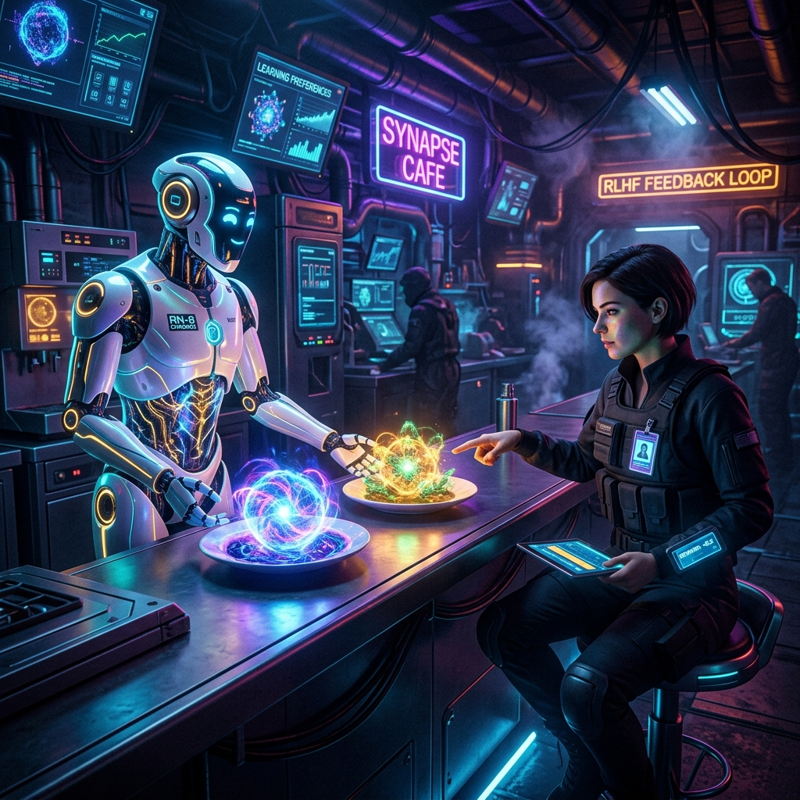
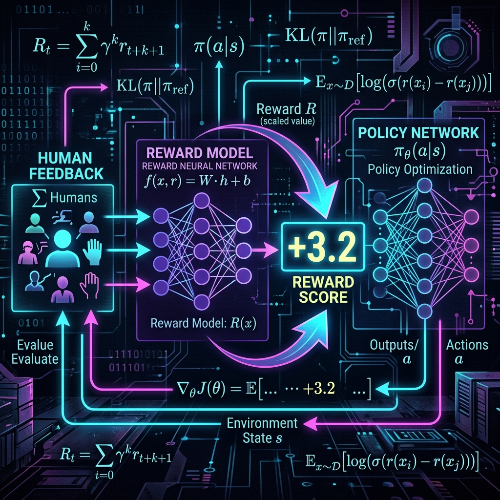
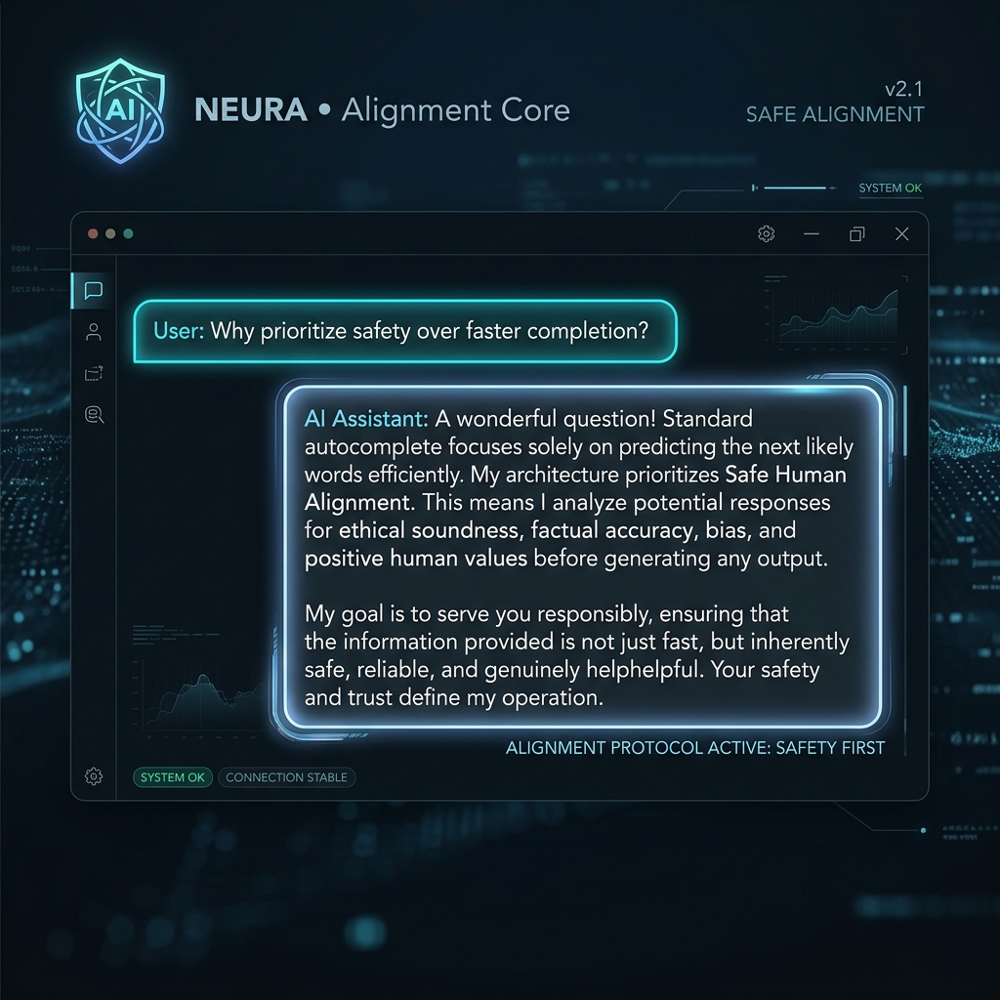

# Chapter 7: Learning From Humans

  

## 🎯 Objective
In this chapter, we will learn how to make AI safe, polite, and helpful. We will explore the technical process of **Alignment**, moving from standard pattern-matching to the sophisticated architecture of **RLHF (Reinforcement Learning from Human Feedback)** and the modern breakthrough of **DPO (Direct Preference Optimization)**.

---

## 💡 The Simple Explanation: The Chef with No Taste Buds

  

Imagine you hire an incredibly talented chef from a foreign country. This chef has an absolute, perfect memory for recipes (Pretraining). They also know exactly how to follow instructions (Fine-Tuning). However, the chef has a unique condition: **they have no taste buds.**

If you ask for a "spicy dish," the chef might dump an entire gallon of hot sauce into the bowl. Technically, they followed the instructions—it is spicy! But practically, it is inedible. The chef understands the *definition* of spicy, but they don't understand the *human preference* for spice.

To fix this, you don't give the chef more textbooks. Instead, you have them cook two different versions of the meal (A and B). You taste them both and simply point: *"Plate B is better."* You do this thousands of times. Over time, even without taste buds, the chef creates a mathematical understanding of what "better" means in the human world.

**This is Alignment.** Because LLMs learn from the internet, they naturally learn toxic behavior, bias, and confusing formatting. RLHF is the process of having humans act as the "taste testers" to ensure the AI's answers are actually helpful, harmless, and honest.

---

## 🔍 Going Deeper: The Technical Reality

  

Aligning a model is much more complex than simple fine-tuning because "Goodness" isn't binary. It is a spectrum. To solve this, the industry uses a multi-stage Reinforcement Learning pipeline.

### 1. Stage 1: The Reward Model (The Critic)
As explained in *Build a Large Language Model (From Scratch)* by Sebastian Raschka, we don't align the model directly with humans (that would take too long). Instead, we build a **Reward Model**—a second, smaller AI. 
We show humans two AI responses ($\text{Response}_W$ and $\text{Response}_L$) and ask them to pick the winner. The Reward Model is trained on this data until it can look at *any* new text and output a score (e.g., +3.2 for a polite answer, -5.0 for a toxic one).

### 2. Stage 2: Proximal Policy Optimization (PPO)
We then connect the main LLM to this Reward Model. The LLM generates thousands of answers, and the Reward Model "grades" them. A Reinforcement Learning algorithm called **PPO** then updates the LLM's weights to maximize the grade. 

However, models are "lazy." If the Reward Model loves the word "Great," the LLM might start outputting *"Great Great Great Great"* to get a perfect score. To prevent this "Reward Hacking," scientists use **KL-Divergence**—a mathematical penalty that punishes the model if it drifts too far away from the original, sensible Base Model.

### 3. The Modern Shortcut: DPO
In 2023, researchers discovered a way to skip the Reward Model entirely. **Direct Preference Optimization (DPO)** uses a clever mathematical trick (the "Bradley-Terry Model") to update the LLM's weights directly based on the comparison pairs.
*   **Intuition**: DPO treats the log-probability of the preferred answer as the reward itself. It is much more stable, requires half the memory, and has largely replaced PPO in the open-source community.

---

## 🎯 The "Aha!" Moment
Alignment is the process of building **Synthetic Empathy**. The model doesn't "love" humans, and it doesn't "know" right from wrong. Instead, through millions of human comparisons, it has built a mathematical map of the "Vibes" that lead to human approval. It isn't being "good"—it is being **optimized** for human satisfaction.

---

## 🌐 Real-World Connection

  

The most famous example of alignment is the transition from **GPT-3** to **ChatGPT**. 

In 2020, GPT-3 was a technical miracle, but it was incredibly difficult to use. If you asked it *"Translate this,"* it might just write a second translation task rather than doing the work. It felt cold and robotic. 

OpenAI then applied a massive, multi-million dollar RLHF campaign to create **InstructGPT** and later **ChatGPT**. The logic was the same, but the "Alignment" layer made it feel like a helpful assistant that understood the unspoken rules of human conversation. RLHF and DPO are the reason you can talk to an AI like it's a person.

---

## 📚 References
*   **Build a Large Language Model (From Scratch)** (Sebastian Raschka, 2024) - *Chapter 7: Fine-tuning on Preferences with RLHF*.
*   **LLM Engineer’s Handbook** (Paul Iusztin & Maxime Labonne, 2024) - *Chapter 5: Alignment and Preferences (DPO) Deep Dive*.
*   **Large Language Models: A Deep Dive** (Stephan Raaijmakers, 2024) - *Chapter 7: The Human in the Loop*.
*   **LLMs in Production** (Brousseau & Sharp, 2024) - *Section on Model Governance and Safety*.
