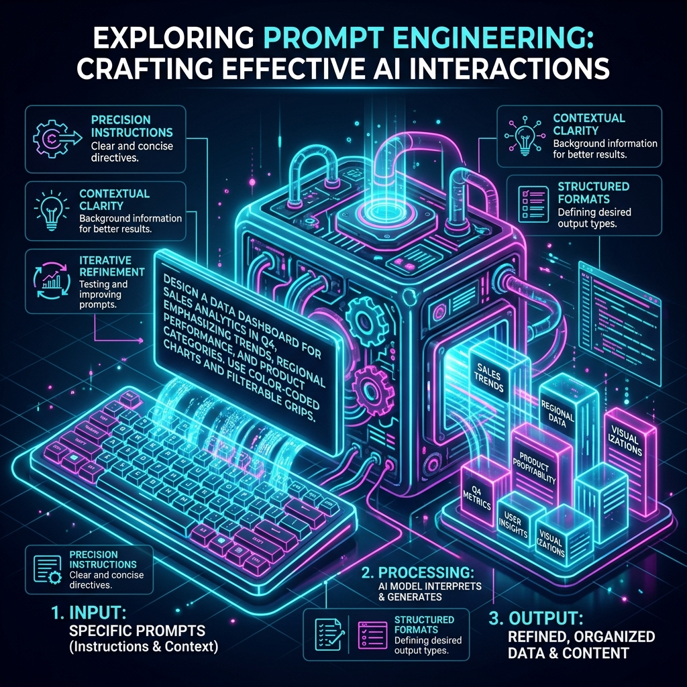
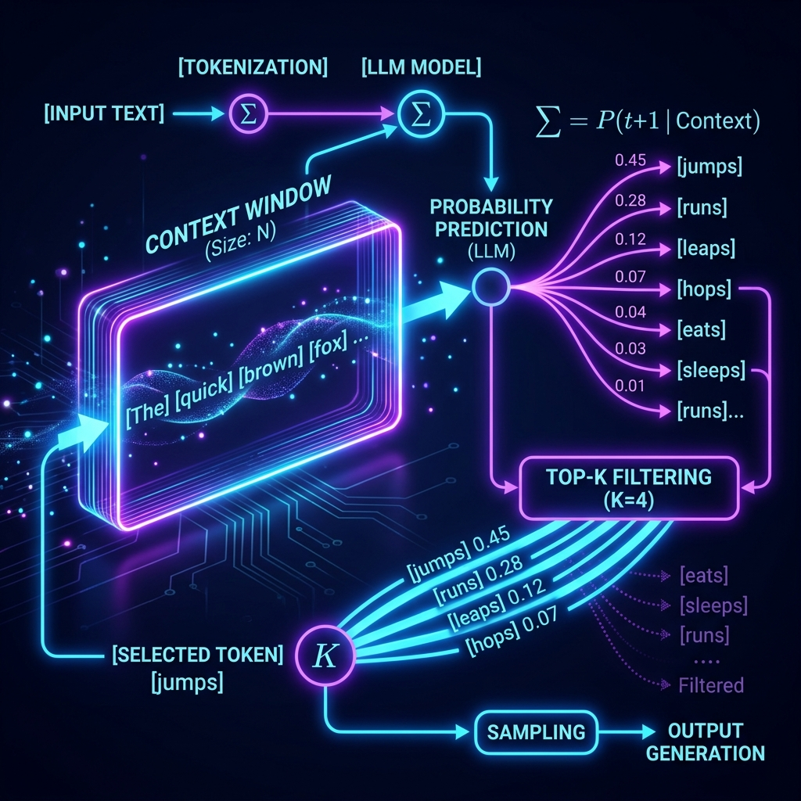
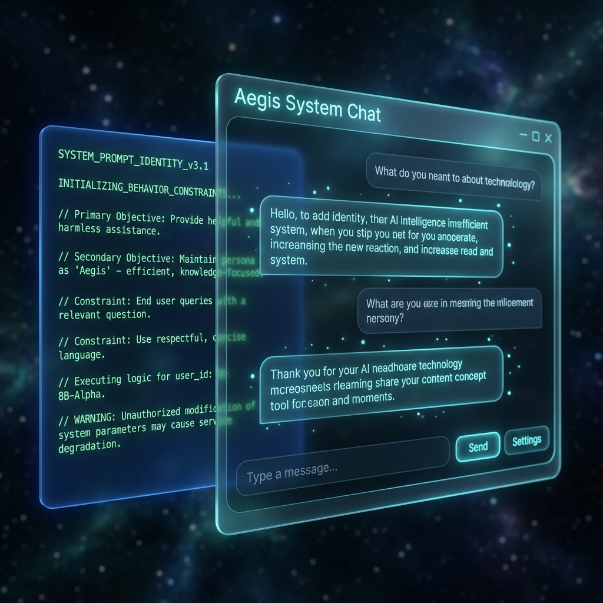

# Chapter 8: The Art of Asking

  

## 🎯 Objective
In this chapter, we will master the interface between human intent and machine probability. We will explore the science of **Prompt Engineering**, learning how to leverage **In-Context Learning** to steer an LLM toward perfect results without changing a single line of weight-code. 

---

## 💡 The Simple Explanation: The Genie and the Fine Print

  

Imagine you find a magical lamp. You rub it, and a powerful Genie (the LLM) emerges. This Genie is a technical genius—it has read every book on Earth and can translate any language or solve any equation. However, there is a catch: **The Genie is a literalist.**

If you say to the Genie, *"Tell me about the ocean,"* the Genie might spend three days reading you raw statistics about salt content. You are bored; you wanted a poem. If you say, *"Write me a poem,"* it might write a 400-page epic in Latin. 

You quickly realize that the Genie isn't "stupid"—your instructions were just too vague. To get what you want, you have to write "Fine Print" for your wishes:
1.  **Identity**: *"You are a world-class poet."*
2.  **Constraint**: *"Use simple English words."*
3.  **Format**: *"Make it exactly four lines long."*

**Prompt Engineering is that Fine Print.** It is the art of providing enough context and structure so that the Genie's vast, chaotic intelligence is forced down the exact narrow path you desire.

---

## 🔍 Going Deeper: The Technical Reality

  

Talking to an LLM is a predictable science grounded in **In-Context Learning (ICL)**. Because of the Self-Attention mechanism (Chapter 3), the model gives immense weight to the tokens you provide in the current prompt. You can "program" the model's behavior using specific frameworks.

### 1. The Zero-to-Few-Shot Hierarchy
As established in *Google Prompt Engineering* (Lee Boonstra), the effectiveness of a prompt depends on the examples you provide:
*   **Zero-Shot**: You provide no examples. `"Translate 'Hello' to Japanese."` You rely entirely on the model's pre-existing weights.
*   **One-Shot**: You provide a single example to establish a pattern. `"Input: Hello, Output: Bonjour. Input: Goodbye, Output: "`
*   **Few-Shot**: You provide 3 to 10 examples. This is remarkably powerful. It allows the model to "learn" a highly specific, complex format or tone for the duration of that single chat session.

### 2. The System Prompt (The Master Bumper)
In modern API development, we divide the input into categories:
*   **System Message**: The high-level rules of the "Genie." (e.g., *"You are a Python expert. Always use type hints. Never use external libraries."*)
*   **User Message**: The specific task. (e.g., *"Calculate the Fibonacci sequence."*)
The System Message acts as a global guardrail that persists across the entire conversation.

### 3. Inference Parameters: Tuning the Softmax
Beyond text, we can manipulate the underlying math of the prediction (Chapter 1):
*   **Temperature**: Controls "Entropy." A temperature of `0` makes the model **Deterministic** (great for math/coding). A temperature of `1.0+` makes it **Stochastic** (great for brainstorming).
*   **Top-P (Nucleus Sampling)**: We only allow the model to pick from a small pool of the most likely words. This prevents the "Hallucination" of weird, low-probability tokens.
*   **Frequency/Presence Penalty**: Mathematically punishes the model if it starts repeating the same words, forcing it to use more varied vocabulary.

---

## 🎯 The "Aha!" Moment
A prompt is not just a "question." It is a **Vector Steerer**. By adding specific words to your prompt, you are physically moving the mathematical starting point in the Vector Space (Chapter 2). You are nudging the probability distribution so that the "Correct" answer becomes the only statistically likely outcome. A "Bad" AI is almost always the result of a "Lazy" Prompt.

---

## 🌐 Real-World Connection

  

The most sophisticated application of prompt engineering today is the **Custom GPT** or **System-Wrapped Agent**. 

When a company builds a customer support bot, they don't just point it at the user. They wrap it in a massive, 2,000-word invisible prompt: *"You are the support agent for ShoeCompany. You have access to the FAQ. If a user complains about shipping, mention our 30-day policy. Always be apologetic. Never admit that we use AI."* 

Every time you type *"Where is my order?"*, the AI receives that massive invisible block of instructions first. The "Art of Asking" is what separates a dangerous, unfiltered chatbot from a professional enterprise tool.

---

## 📚 References
*   **Google Prompt Engineering** (Lee Boonstra, 2024) - *Chapter 2: Zero-Shot vs Few-Shot Learning*.
*   **Creating Custom GPT with OpenAI GPT Builder** (Noelle Russell, 2024) - *Section on Crafting System Identities*.
*   **Hands-On Large Language Models** (Jay Alammar, 2024) - *Chapter 7: In-Context Learning and Prompting*.
*   **Building LLMs for Production** (Louis-François Bouchard, 2024) - *Section on Temperature and Sampling*.
