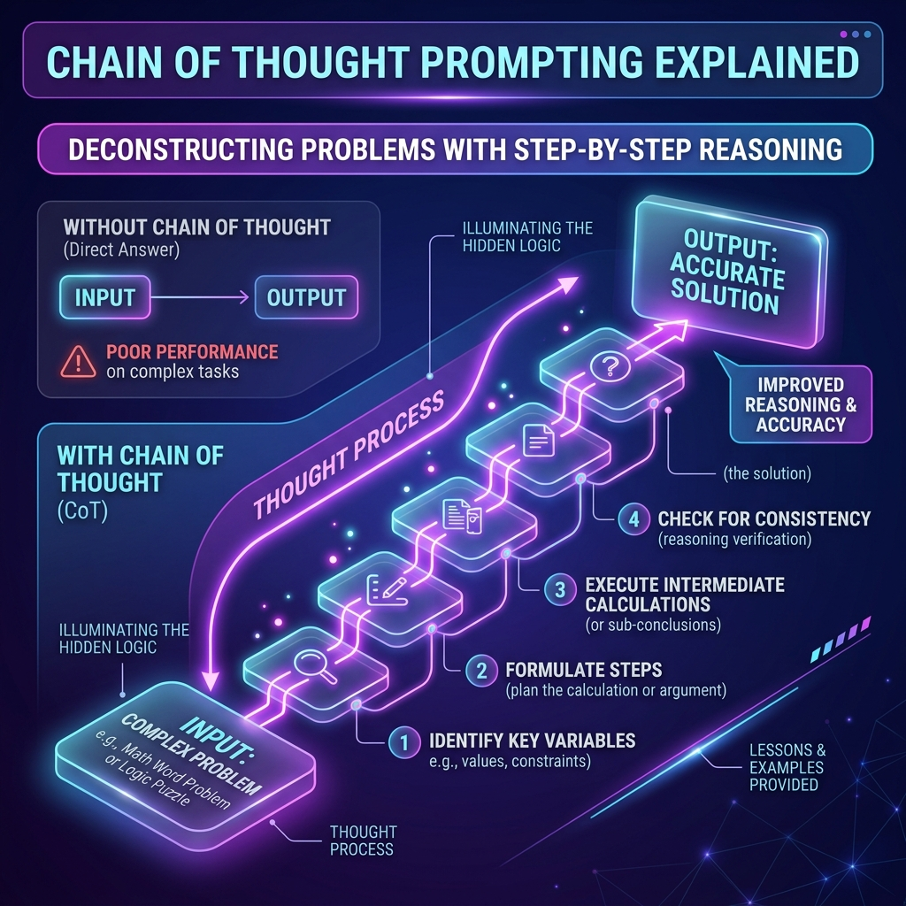
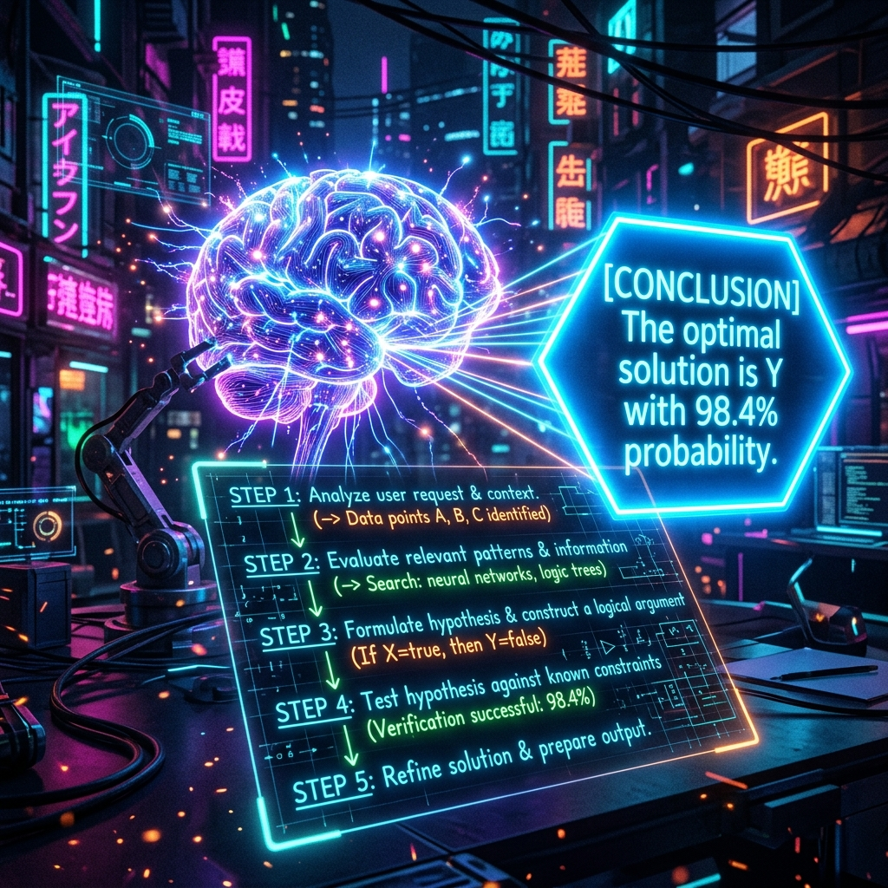
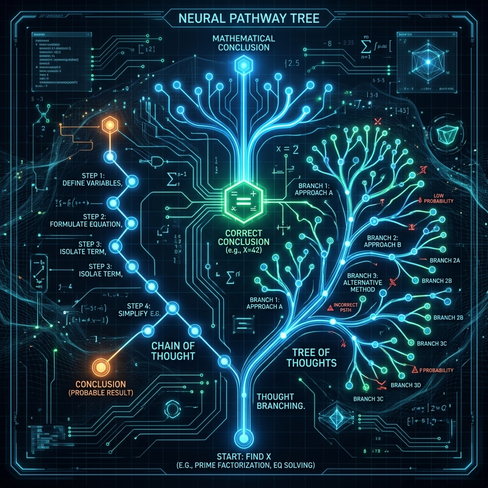

# Chapter 9: Thinking Step by Step

---
[⬅️ Previous](chapter_8.md) | [🏠 Home](../README.md) | [Next ➡️](chapter_10.md)

  

## 🎯 Objective
In this chapter, we will learn how to unlock the hidden "IQ" of an LLM. We will explore **Chain of Thought (CoT)** prompting, understand the math behind why "thinking out loud" makes an AI smarter, and learn how we can force models to solve complex logic puzzles that they would otherwise fail.

---

## 💡 The Simple Explanation: The Mental Scratchpad

  

If I ask you a simple question like *"What color is the sky?"*, your brain gives an instantaneous, automatic answer: *"Blue."* You don't have to "think" about it; it's a reflex. Psychologists call this **System 1 Thinking**.

However, if I ask you: *"A bat and a ball cost $1.10 in total. The bat costs $1.00 more than the ball. How much does the ball cost?"*, your automatic System 1 brain will immediately scream: *"10 cents!"* 

**But that's wrong.** If the ball is 10 cents and the bat is a dollar more ($1.10), the total would be $1.20. 

To get the right answer (5 cents), you have to slow down. You have to take out a **Mental Scratchpad**, write down the equation ($x + (x + 1.00) = 1.10$), and solve it step-by-step. This is **System 2 Thinking**.

Normally, an LLM acts like a permanent System 1 machine. It just blurts out the next most likely token as fast as it can. But if you force the LLM to write down its reasoning steps *before* giving the final answer, it magically gains access to a "Scratchpad." It uses its own outputted words as a working memory to solve problems it could never solve in a single breath.

---

## 🔍 Going Deeper: The Technical Reality

  

Chain of Thought is not just a "trick"—it is a mathematical necessity for complex reasoning in Transformer architectures. 

### 1. The Bottleneck of the Forward Pass
As we learned in Chapter 4, the data in a Transformer moves through the layers once to predict the next token. There is no "internal loop." The amount of "thinking" the model can do for a single token is fixed by the depth of the network. 

If a problem requires 20 steps of logic, but the model is forced to output the answer in the *very next token*, it only has one "floor" of processing to find that answer. It is mathematically impossible for it to succeed.

### 2. Recursive Reasoning via the Context Window
By outputting intermediate steps (e.g., *"Step 1: Let the ball be x..."*), the model is physically writing its "thoughts" into the **Context Window**. Because of the Attention mechanism (Chapter 3), when the model goes to generate Step 2, it can "look back" at the results of Step 1. 
*   **The Breakthrough**: CoT effectively turns the *Context Window* into an external CPU register. The model isn't getting smarter; it's getting more "computational cycles."

### 3. Advanced Reasoning Frameworks
As detailed in *Building LLMs for Production* (Louis-François Bouchard), we can push this even further:
*   **Self-Consistency**: We have the model generate five different logical paths. We look at the final answer of all five, and take the **Majority Vote**. This filters out random "glitches" in the model's math.
*   **Least-to-Most Prompting**: We force the model to first decompose a massive project into smaller sub-tasks, and then solve each sub-task one by one.
*   **Tree of Thoughts (ToT)**: A framework where the model explores different paths, realizes it made a mistake, "backtracks," and tries a different branch of logic—mimicking human trial-and-error.

---

## 🎯 The "Aha!" Moment
Logic is a **Sequential Process**, but an LLM's next-token prediction is a **Parallel Pattern-Match**. To bridge this gap, we must turn logic into a text-generation task. When you tell an AI to *"think step-by-step,"* you aren't changing its brain; you are giving it a longer runway to take off.

---

## 🌐 Real-World Connection

  

The most significant recent breakthrough in AI is the **OpenAI o1 (Strawberry)** model. 

In older models, CoT was something the *user* had to ask for. In `o1`, the "thinking" is baked into the architecture using **Reinforcement Learning**. When you ask `o1` a chemistry problem or a coding bug, it doesn't answer immediately. You see a little spinner that says *"Thinking..."* 

During this time, the model is generating thousands of invisible "hidden" reasoning tokens on a private scratchpad. It tests its own theories, corrects its own math, and only shows you the result once its internal logic is verified. This is the first time we have moved from "Word-Predictors" to true "Reasoning-Engines."

---

## 📚 References
*   **Google Prompt Engineering** (Lee Boonstra, 2024) - *Chapter 3: Chain-of-Thought and Reasoning Blueprints*.
*   **Building LLMs for Production** (Louis-François Bouchard, 2024) - *Section on Advanced Reasoning and Self-Consistency*.
*   **Large Language Models: A Deep Dive** (Stephan Raaijmakers, 2024) - *Chapter 9: Reasoning and Common Sense*.
*   **LLM Engineer’s Handbook** (Paul Iusztin, 2024) - *Section on Building Reliable Logic Pipelines*.

---
[⬅️ Previous](chapter_8.md) | [🏠 Home](../README.md) | [Next ➡️](chapter_10.md)
